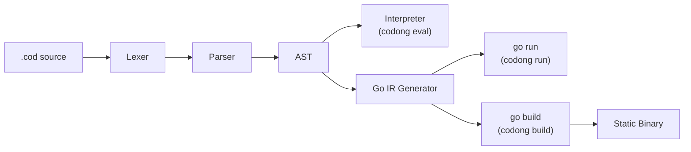
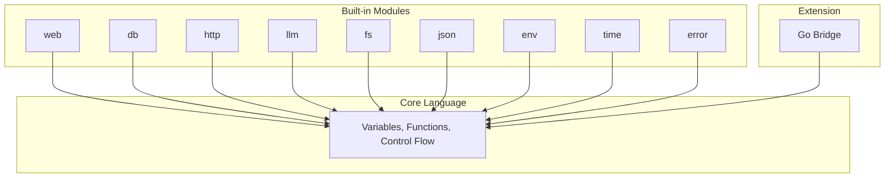
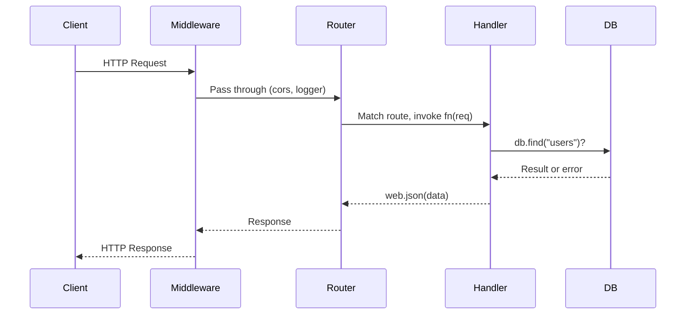
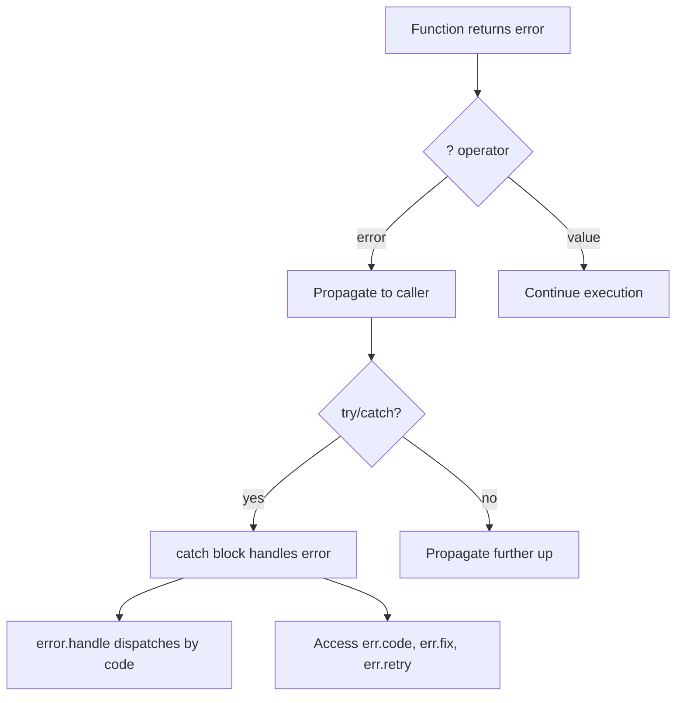

<p align="center">
  
</p>
<p align="center">
  The world's first AI native programming language
</p>

<p align="center">
  <a href="https://codong.org">Website</a> |
  <a href="https://codong.org/arena/">Arena</a> |
  <a href="./SPEC.md">Spec</a> |
  <a href="./SPEC_FOR_AI.md">AI Spec</a>
</p>

<p align="center">
  <a href="./CHANGELOG_v0.1.3.md"></a>
  <a href="./LICENSE"></a>
  
  
  <a href="https://codong.org/arena/"></a>
</p>

<p align="center">
  <a href="./docs/README_zh.md">Chinese</a> |
  <a href="./docs/README_ja.md">Japanese</a> |
  <a href="./docs/README_ko.md">Korean</a> |
  <a href="./docs/README_ru.md">Russian</a> |
  <a href="./docs/README_de.md">German</a>
</p>

---

## Releases

| Version | Date | Highlights |
|---------|------|-----------|
| [v0.1.3](./CHANGELOG_v0.1.3.md) | 2026-03-28 | Compilation cache (170× speedup), language completeness, 1,427 tests passing |
| [v0.1.1](./CHANGELOG_v0.1.1.md) | 2026-03-26 | 58 bug fixes, 100% pass rate on core test suite |

---

## Why Codong

Most programming languages were designed for humans to write and machines to execute. Codong is
designed for AI to write, humans to review, and machines to execute. It removes the three largest
sources of friction in AI-generated code.

### Problem 1: Choice Paralysis Burns Tokens

Python has five or more ways to make an HTTP request. Every choice costs tokens and produces
unpredictable output. Codong has exactly one way to do everything.

| Task | Python Options | Codong |
|------|---------------|--------|
| HTTP request | requests, urllib, httpx, aiohttp, http.client | `http.get(url)` |
| Web server | Flask, FastAPI, Django, Starlette, Tornado | `web.serve(port: N)` |
| Database | SQLAlchemy, psycopg2, pymongo, peewee, Django ORM | `db.connect(url)` |
| JSON parse | json.loads, orjson, ujson, simplejson | `json.parse(s)` |

### Problem 2: Errors Are Unreadable to AI

Stack traces are designed for humans. An AI agent spends hundreds of tokens parsing
`Traceback (most recent call last)` before it can attempt a fix. In Codong, every error is
structured JSON with a `fix` field that tells the AI exactly what to do.

```json
{
  "error":   "db.find",
  "code":    "E2001_NOT_FOUND",
  "message": "table 'users' not found",
  "fix":     "run db.migrate() to create the table",
  "retry":   false
}
```

### Problem 3: Package Selection Wastes Context

Before writing business logic, an AI must choose an HTTP library, a database driver, a JSON
parser, resolve version conflicts, and configure them. Codong ships eight built-in modules that
cover 90% of AI workloads. No package manager required.

### The Result: 70%+ Token Savings

| Token Cost | Python/JS | Codong | Savings |
|-----------|-----------|--------|---------|
| Choose HTTP framework | ~300 | 0 | 100% |
| Choose database ORM | ~400 | 0 | 100% |
| Parse error messages | ~500 | ~50 | 90% |
| Resolve package versions | ~800 | 0 | 100% |
| Write business logic | ~800 | ~800 | 0% |
| **Total** | **~2,800** | **~850** | **~70%** |

---

## Arena Benchmark: Codong vs. Established Languages

When an AI model writes the same application in different languages, Codong produces dramatically
less code, fewer tokens, and finishes faster. These numbers come from
[Codong Arena](https://codong.org/arena/), where any model writes the same spec in every language
and the results are measured automatically.

<p align="center">
  
  <br />
  <sub>Live benchmark: Claude Sonnet 4 generating a Posts CRUD API with tags, search, and pagination. <a href="https://codong.org/arena/">Run it yourself</a></sub>
</p>

| Metric | Codong | Python | JavaScript | Java | Go |
|--------|--------|--------|------------|------|-----|
| Total Tokens | **955** | 1,867 | 1,710 | 4,367 | 3,270 |
| Generation Time | **8.6s** | 15.3s | 13.7s | 37.4s | 26.6s |
| Code Lines | **10** | 143 | 147 | 337 | 289 |
| Est. Cost | **$0.012** | $0.025 | $0.022 | $0.062 | $0.046 |
| Output Tokens | **722** | 1,597 | 1,439 | 4,096 | 3,001 |
| vs Codong | -- | +121% | +99% | +467% | +316% |

Run your own benchmark: [codong.org/arena](https://codong.org/arena/)

---

## Quick Start in 30 Seconds

```bash
# 1. Install
curl -fsSL https://raw.githubusercontent.com/brettinhere/Codong/main/install.sh | sh

# 2. Write your first program
echo 'print("Hello, Codong!")' > hello.cod

# 3. Run it
codong eval hello.cod
```

A web API in five lines:

```
web.get("/", fn(req) => web.json({message: "Hello from Codong"}))
web.get("/health", fn(req) => web.json({status: "ok"}))
server = web.serve(port: 8080)
```

```bash
codong run server.cod
# curl http://localhost:8080/
```

---

## Let AI Write Codong -- Zero Installation Required

You do not need to install Codong to start using it. Send the
[`SPEC_FOR_AI.md`](./SPEC_FOR_AI.md) file to any LLM (Claude, GPT, Gemini, LLaMA)
as a system prompt or context, and the AI can immediately write correct Codong code.

**Step 1.** Copy the contents of [`SPEC_FOR_AI.md`](./SPEC_FOR_AI.md) (under 2,000 words).

**Step 2.** Paste it into your AI conversation as context:

```
[Paste SPEC_FOR_AI.md contents here]

Now write a Codong REST API that manages a user list with
CRUD operations and SQLite storage.
```

**Step 3.** The AI generates valid Codong code:

```
db.connect("sqlite:///users.db")
db.create_table("users", {id: "integer primary key autoincrement", name: "text", email: "text"})
server = web.serve(port: 8080)
server.get("/users", fn(req) { return web.json(db.find("users")) })
server.post("/users", fn(req) { return web.json(db.insert("users", req.body), 201) })
server.get("/users/:id", fn(req) { return web.json(db.find_one("users", {id: to_number(req.param("id"))})) })
server.delete("/users/:id", fn(req) { db.delete("users", {id: to_number(req.param("id"))}); return web.json({}, 204) })
```

This works because Codong was designed with a single, unambiguous syntax for every operation.
The AI does not need to choose between frameworks, import styles, or competing patterns.
One correct way to write everything.

| LLM Provider | Method |
|-------------|--------|
| Claude (Anthropic) | Paste SPEC into system prompt, or use [Prompt Caching](https://docs.anthropic.com/en/docs/build-with-claude/prompt-caching) for repeated use |
| GPT (OpenAI) | Paste SPEC as the first user message or system instruction |
| Gemini (Google) | Paste SPEC as context in the conversation |
| LLaMA / Ollama | Include SPEC in the system prompt via API or Ollama modelfile |
| Any LLM | Works with any model that accepts a system prompt or context window |

> **Benchmark it yourself**: Visit [codong.org/arena](https://codong.org/arena/) to see
> real-time token consumption and generation speed comparisons between Codong and other languages.

---

## Installation

```bash
curl -fsSL https://codong.org/install.sh | sh
```

Or download a binary directly from [GitHub Releases](https://github.com/brettinhere/Codong/releases/latest):

| Platform | Binary |
|----------|--------|
| Linux x86_64 | [codong-linux-amd64](https://github.com/brettinhere/Codong/releases/latest/download/codong-linux-amd64) |
| Linux ARM64 | [codong-linux-arm64](https://github.com/brettinhere/Codong/releases/latest/download/codong-linux-arm64) |
| macOS Intel | [codong-darwin-amd64](https://github.com/brettinhere/Codong/releases/latest/download/codong-darwin-amd64) |
| macOS Apple Silicon | [codong-darwin-arm64](https://github.com/brettinhere/Codong/releases/latest/download/codong-darwin-arm64) |

**Requirements:** `codong eval` works standalone. `codong run` and `codong build` require Go 1.22+.

Verify: `codong version`

---

## Language Design

Codong is deliberately small. 23 keywords. 6 primitive types. One way to do each thing.

### 23 Keywords (Python: 35, JavaScript: 64, Java: 67)

```
fn       return   if       else     for      while    match
break    continue const    import   export   try      catch
go       select   interface type    null     true     false
in       _
```

### Variables

```
name = "Ada"
age = 30
active = true
nothing = null
const MAX_RETRIES = 3
```

No `var`, `let`, or `:=`. Assignment is `=`, always.

### Functions

```
fn greet(name, greeting = "Hello") {
    return "{greeting}, {name}!"
}

print(greet("Ada"))                    // Hello, Ada!
print(greet("Bob", greeting: "Hi"))    // Hi, Bob!

double = fn(x) => x * 2               // arrow function
```

### String Interpolation

```
name = "Ada"
print("Hello, {name}!")                      // variable
print("Total: {items.len()} items")          // method call
print("Sum: {a + b}")                        // expression
print("{user.name} joined on {user.date}")   // member access
```

Any expression is valid inside `{}`. No backticks, no `f"..."`, no `${}`.

### Collections

```
items = [1, 2, 3, 4, 5]
doubled = items.map(fn(x) => x * 2)
evens = items.filter(fn(x) => x % 2 == 0)
total = items.reduce(fn(acc, x) => acc + x, 0)

user = {name: "Ada", age: 30}
user.email = "ada@example.com"
print(user.get("phone", "N/A"))        // N/A
```

### Control Flow

```
if score >= 90 {
    print("A")
} else if score >= 80 {
    print("B")
} else {
    print("C")
}

for item in items {
    print(item)
}

for i in range(0, 10) {
    print(i)
}

while running {
    data = poll()
}

match status {
    200 => print("ok")
    404 => print("not found")
    _   => print("error: {status}")
}
```

### Error Handling with the `?` Operator

```
fn divide(a, b) {
    if b == 0 {
        return error.new("E_MATH", "division by zero")
    }
    return a / b
}

fn half_of_division(a, b) {
    result = divide(a, b)?
    return result / 2
}

try {
    half_of_division(10, 0)?
} catch err {
    print(err.code)       // E_MATH
    print(err.message)    // division by zero
}
```

The `?` operator propagates errors up the call stack automatically. No nested
`if err != nil` chains. No unchecked exceptions.

### Compact Error Format

Switch to compact format to save approximately 39% tokens in AI pipelines:

```
error.set_format("compact")
// output: err_code:E_MATH|src:divide|fix:check divisor|retry:false
```

---

## Architecture

Codong source files (`.cod`) are processed through a multi-stage pipeline. The interpreter path
provides instant startup for scripts and REPL. The Go IR path compiles to native Go for
production deployments.



### Execution Modes

| Mode | Pipeline | Startup | Use Case |
|------|----------|---------|----------|
| `codong eval` | .cod -> AST -> Interpreter | Sub-second | Scripts, REPL, Playground |
| `codong run` | .cod -> AST -> Go IR -> `go run` | 0.3-2s | Development, AI agent execution |
| `codong build` | .cod -> AST -> Go IR -> `go build` | N/A (compile once) | Production deployment |

```bash
codong eval script.cod    # AST interpreter, instant startup
codong run app.cod        # Go IR, full stdlib, development
codong build app.cod      # Single static binary, production
```

### Relationship with Go

Codong compiles to equivalent Go code, then leverages the Go toolchain for execution and
compilation. This is the same model as TypeScript -> JavaScript or Kotlin -> JVM bytecode.

| Codong Provides | Go Provides |
|----------------|-------------|
| AI-native syntax design | Memory management, garbage collection |
| High-constraint domain APIs | Goroutine concurrency scheduling |
| Structured JSON error system | Cross-platform compilation |
| 8 built-in module abstractions | Battle-tested runtime (10+ years) |
| Go Bridge extension protocol | Hundreds of thousands of ecosystem libraries |

---

## Built-in Modules

Eight modules ship with Codong. No installation, no version conflicts, no choices.

| Module | Purpose | Key Methods |
|--------|---------|-------------|
| [`web`](#web-module) | HTTP server, routing, middleware, WebSocket | serve, get, post, put, delete |
| [`db`](#db-module) | PostgreSQL, MySQL, MongoDB, Redis, SQLite | connect, find, insert, update, delete |
| [`http`](#http-module) | HTTP client | get, post, put, delete, patch |
| [`llm`](#llm-module) | GPT, Claude, Gemini -- unified interface | ask, chat, stream, embed |
| [`fs`](#fs-module) | File system operations | read, write, list, mkdir, stat |
| [`json`](#json-module) | JSON processing | parse, stringify, valid, merge |
| [`env`](#env-module) | Environment variables | get, require, has, all, load |
| [`time`](#time-module) | Date, time, duration | now, sleep, format, parse, diff |
| [`error`](#error-module) | Structured error creation and handling | new, wrap, handle, retry |



---

## Code Examples

### Hello World API

```
web.get("/", fn(req) => web.json({message: "Hello from Codong"}))
server = web.serve(port: 8080)
```

### TODO CRUD API

```
db.connect("file:todo.db")
db.query("CREATE TABLE IF NOT EXISTS todos (id INTEGER PRIMARY KEY AUTOINCREMENT, title TEXT, done INTEGER)")

web.get("/todos", fn(req) {
    return web.json(db.find("todos"))
})

web.post("/todos", fn(req) {
    db.insert("todos", {title: req.body.title, done: 0})
    return web.json({created: true})
})

web.put("/todos/{id}", fn(req) {
    db.update("todos", {id: to_number(req.param.id)}, {done: 1})
    return web.json({updated: true})
})

web.delete("/todos/{id}", fn(req) {
    db.delete("todos", {id: to_number(req.param.id)})
    return web.json({deleted: true})
})

server = web.serve(port: 3000)
```

### LLM-Powered Endpoint

```
web.post("/ask", fn(req) {
    question = req.body.question
    context = db.find("docs", {relevant: true})?
    answer = llm.ask(
        model: "gpt-4o",
        prompt: "Answer using context: {context}\n\nQuestion: {question}",
        format: "json"
    )?
    return web.json(answer)
})

server = web.serve(port: 8080)
```

### File Processing Script

```
files = fs.list("./data")
for file in files {
    if fs.extension(file) == ".csv" {
        content = fs.read(file)
        lines = content.split("\n")
        print("{fs.basename(file)}: {lines.len()} lines")
        fs.write("./output/{fs.basename(file)}.processed", content.upper())
    }
}
print("done")
```

### Error Handling with `?` Operator

```
fn load_config(path) {
    content = fs.read(path)?
    config = json.parse(content)?
    host = config.get("host", "localhost")
    port = config.get("port", 8080)
    return {host: host, port: port}
}

try {
    config = load_config("config.json")?
    print("Server: {config.host}:{config.port}")
} catch err {
    print("Failed: {err.code} - {err.fix}")
}
```

---

## Complete API Reference

### Core Language

#### Data Types

| Type | Example | Notes |
|------|---------|-------|
| `string` | `"hello"`, `"value is {x}"` | Double quotes only. `{expr}` interpolation. |
| `number` | `42`, `3.14`, `-1` | 64-bit float. |
| `bool` | `true`, `false` | |
| `null` | `null` | Only `null` and `false` are falsy. |
| `list` | `[1, 2, 3]` | Zero-indexed. Negative indices supported. |
| `map` | `{name: "Ada"}` | Ordered. Dot and bracket access. |

#### Built-in Functions

| Function | Returns | Description |
|----------|---------|-------------|
| `print(value)` | null | Write to stdout. Single argument; use interpolation for multiple values. |
| `type_of(x)` | string | Returns `"string"`, `"number"`, `"bool"`, `"null"`, `"list"`, `"map"`, `"fn"`. |
| `to_string(x)` | string | Convert any value to its string representation. |
| `to_number(x)` | number/null | Parse to number. Returns `null` if invalid. |
| `to_bool(x)` | bool | Convert to boolean. |
| `range(start, end)` | list | Integers from `start` to `end - 1`. |

#### Operators

| Precedence | Operators | Description |
|------------|-----------|-------------|
| 1 | `()` `[]` `.` `?` | Grouping, index, member, error propagation |
| 2 | `!` `-` (unary) | Logical not, negate |
| 3 | `*` `/` `%` | Multiply, divide, modulo |
| 4 | `+` `-` | Add, subtract |
| 5 | `<` `>` `<=` `>=` | Comparison |
| 6 | `==` `!=` | Equality |
| 7 | `&&` | Logical and |
| 8 | `\|\|` | Logical or |
| 9 | `<-` | Channel send/receive |
| 10 | `=` `+=` `-=` `*=` `/=` | Assignment |

---

### String Methods

17 methods. All return new strings (strings are immutable).

| Method | Returns | Description |
|--------|---------|-------------|
| `s.len()` | number | Byte length of the string. |
| `s.upper()` | string | Convert to uppercase. |
| `s.lower()` | string | Convert to lowercase. |
| `s.trim()` | string | Strip leading and trailing whitespace. |
| `s.trim_start()` | string | Strip leading whitespace. |
| `s.trim_end()` | string | Strip trailing whitespace. |
| `s.split(sep)` | list | Split by separator into a list of strings. |
| `s.contains(sub)` | bool | Returns `true` if string contains substring. |
| `s.starts_with(prefix)` | bool | Returns `true` if string starts with prefix. |
| `s.ends_with(suffix)` | bool | Returns `true` if string ends with suffix. |
| `s.replace(old, new)` | string | Replace all occurrences of `old` with `new`. |
| `s.index_of(sub)` | number | Index of first occurrence. Returns `-1` if absent. |
| `s.slice(start, end?)` | string | Extract substring. `end` is optional. |
| `s.repeat(n)` | string | Repeat string `n` times. |
| `s.to_number()` | number/null | Parse as number. Returns `null` if invalid. |
| `s.to_bool()` | bool | `"true"` / `"1"` returns `true`; everything else `false`. |
| `s.match(pattern)` | list | Regex match. Returns list of all matches. |

---

### List Methods

20 methods. Mutating methods modify the original list and return `self` for chaining.

| Method | Mutates | Returns | Description |
|--------|---------|---------|-------------|
| `l.len()` | no | number | Number of elements. |
| `l.push(item)` | **yes** | self | Append item to end. |
| `l.pop()` | **yes** | item | Remove and return last element. |
| `l.shift()` | **yes** | item | Remove and return first element. |
| `l.unshift(item)` | **yes** | self | Prepend item. |
| `l.sort(fn?)` | **yes** | self | Sort in place. Optional comparator function. |
| `l.reverse()` | **yes** | self | Reverse in place. |
| `l.slice(start, end?)` | no | list | New sub-list from `start` to `end`. |
| `l.map(fn)` | no | list | New list with `fn` applied to each element. |
| `l.filter(fn)` | no | list | New list with elements where `fn` returns truthy. |
| `l.reduce(fn, init)` | no | any | Accumulate with `fn(acc, item)` starting from `init`. |
| `l.find(fn)` | no | item/null | First element where `fn` returns truthy. |
| `l.find_index(fn)` | no | number | Index of first match. Returns `-1` if none. |
| `l.contains(item)` | no | bool | Returns `true` if list contains item. |
| `l.index_of(item)` | no | number | Index of first occurrence. Returns `-1` if absent. |
| `l.flat(depth?)` | no | list | New flattened list. Default depth is 1. |
| `l.unique()` | no | list | New list with duplicates removed. |
| `l.join(sep)` | no | string | Join elements into string with separator. |
| `l.first()` | no | item/null | First element, or `null` if empty. |
| `l.last()` | no | item/null | Last element, or `null` if empty. |

---

### Map Methods

10 methods. Only `delete` mutates the original map.

| Method | Mutates | Returns | Description |
|--------|---------|---------|-------------|
| `m.len()` | no | number | Number of key-value pairs. |
| `m.keys()` | no | list | List of all keys. |
| `m.values()` | no | list | List of all values. |
| `m.entries()` | no | list | List of `[key, value]` pairs. |
| `m.has(key)` | no | bool | Returns `true` if key exists. |
| `m.get(key, default?)` | no | any | Get value by key. Returns `default` (or `null`) if absent. |
| `m.delete(key)` | **yes** | self | Remove key-value pair in place. |
| `m.merge(other)` | no | map | New map merging `other` into `self`. `other` wins on conflict. |
| `m.map_values(fn)` | no | map | New map with `fn` applied to each value. |
| `m.filter(fn)` | no | map | New map with entries where `fn(key, value)` returns truthy. |

---

### web Module

HTTP server with routing, middleware, and WebSocket support.

#### Server

| Method | Description |
|--------|-------------|
| `web.serve(port: N)` | Start the HTTP server on port `N`. Returns server handle. |

#### Route Registration

| Method | Description |
|--------|-------------|
| `web.get(path, handler)` | Register GET route. |
| `web.post(path, handler)` | Register POST route. |
| `web.put(path, handler)` | Register PUT route. |
| `web.delete(path, handler)` | Register DELETE route. |
| `web.patch(path, handler)` | Register PATCH route. |

Route handlers receive a request object with `req.body`, `req.param`, `req.query`, `req.headers`.

#### Response Helpers

| Method | Description |
|--------|-------------|
| `web.json(data)` | Return JSON response with `Content-Type: application/json`. |
| `web.text(string)` | Return plain text response. |
| `web.html(string)` | Return HTML response. |
| `web.redirect(url)` | Return redirect response. |
| `web.response(status, body, headers)` | Return custom response with status code and headers. |

#### Static Files and Middleware

| Method | Description |
|--------|-------------|
| `web.static(path, dir)` | Serve static files from directory. |
| `web.middleware(name_or_fn)` | Apply middleware. Built-in: `"cors"`, `"logger"`, `"recover"`, `"auth_bearer"`. |
| `web.ws(path, handler)` | Register WebSocket endpoint. |

```
// Middleware example
web.middleware("cors")
web.middleware("logger")
web.middleware(fn(req, next) {
    print("Request: {req.method} {req.path}")
    return next(req)
})
```



---

### db Module

Unified database interface for SQL and NoSQL databases.

#### Connection

| Method | Description |
|--------|-------------|
| `db.connect(url)` | Connect to database. URL determines driver: `postgres://`, `mysql://`, `mongodb://`, `redis://`, `file:` (SQLite). |

#### Schema

| Method | Description |
|--------|-------------|
| `db.create_table(name, schema)` | Create table with schema map. |
| `db.create_index(table, fields)` | Create index on specified fields. |

#### CRUD Operations

| Method | Description |
|--------|-------------|
| `db.insert(table, data)` | Insert a single record. |
| `db.insert_batch(table, list)` | Insert multiple records. |
| `db.find(table, filter?)` | Find all matching records. Returns list. |
| `db.find_one(table, filter)` | Find first matching record. Returns map or null. |
| `db.update(table, filter, data)` | Update matching records with new data. |
| `db.delete(table, filter)` | Delete matching records. |
| `db.upsert(table, filter, data)` | Insert or update if exists. |

#### Query and Aggregation

| Method | Description |
|--------|-------------|
| `db.count(table, filter?)` | Count matching records. |
| `db.exists(table, filter)` | Returns `true` if any record matches. |
| `db.query(sql, params?)` | Execute raw SQL query. Use `?` placeholders. |
| `db.query_one(sql, params?)` | Execute raw SQL, return first result. |
| `db.transaction(fn)` | Execute function within a transaction. |
| `db.stats()` | Return connection pool statistics. |

```
db.connect("file:app.db")
db.insert("users", {name: "Ada", role: "engineer"})
engineers = db.find("users", {role: "engineer"})
db.update("users", {name: "Ada"}, {role: "senior engineer"})
count = db.count("users")
```

---

### http Module

HTTP client for making outbound requests.

| Method | Description |
|--------|-------------|
| `http.get(url, options?)` | Send GET request. Returns response object. |
| `http.post(url, body?, options?)` | Send POST request with optional JSON body. |
| `http.put(url, body?, options?)` | Send PUT request. |
| `http.delete(url, options?)` | Send DELETE request. |
| `http.patch(url, body?, options?)` | Send PATCH request. |
| `http.request(method, url, options)` | Send request with custom method and full options. |

Response object: `resp.status` (number), `resp.ok` (bool), `resp.json()` (parsed JSON),
`resp.text()` (raw body), `resp.headers` (map).

```
resp = http.get("https://api.example.com/users")
if resp.ok {
    users = resp.json()
    print("Found {users.len()} users")
}

resp = http.post("https://api.example.com/users", {
    name: "Ada",
    role: "engineer"
})
```

---

### llm Module

Unified interface for large language models. Supports GPT, Claude, Gemini, and any
OpenAI-compatible API.

| Method | Description |
|--------|-------------|
| `llm.ask(prompt, model:, system?:, format?:)` | Single prompt, single response. `format: "json"` returns structured data. |
| `llm.chat(messages, model:)` | Multi-turn conversation. Messages: `[{role:, content:}]`. |
| `llm.stream(prompt, model:, on_chunk:)` | Stream response token by token. |
| `llm.embed(text, model:)` | Generate embedding vector. |
| `llm.count_tokens(text)` | Estimate token count for text. |

```
// Single question
answer = llm.ask("What is 2+2?", model: "gpt-4o")

// Structured output
data = llm.ask("List 3 colors", model: "gpt-4o", format: "json")

// Multi-turn conversation
response = llm.chat([
    {role: "system", content: "You are a helpful assistant."},
    {role: "user", content: "What is Codong?"},
    {role: "assistant", content: "Codong is an AI-native programming language."},
    {role: "user", content: "What makes it special?"}
], model: "claude-sonnet-4-20250514")

// Token estimation
tokens = llm.count_tokens("Hello, this is a test.")
print("Tokens: {tokens}")
```

---

### fs Module

File system operations for reading, writing, and managing files and directories.

#### File Operations

| Method | Description |
|--------|-------------|
| `fs.read(path)` | Read entire file as string. |
| `fs.write(path, content)` | Write string to file (overwrite). |
| `fs.append(path, content)` | Append string to file. |
| `fs.delete(path)` | Delete file. |
| `fs.copy(src, dst)` | Copy file from `src` to `dst`. |
| `fs.move(src, dst)` | Move/rename file. |
| `fs.exists(path)` | Returns `true` if path exists. |

#### Directory Operations

| Method | Description |
|--------|-------------|
| `fs.list(dir)` | List files in directory. Returns list of paths. |
| `fs.mkdir(path)` | Create directory (including parents). |
| `fs.rmdir(path)` | Remove directory. |
| `fs.stat(path)` | Return file metadata: size, modified time, is_dir. |

#### Structured I/O

| Method | Description |
|--------|-------------|
| `fs.read_json(path)` | Read and parse JSON file. |
| `fs.write_json(path, data)` | Write data as formatted JSON. |
| `fs.read_lines(path)` | Read file as list of lines. |
| `fs.write_lines(path, lines)` | Write list of lines to file. |

#### Path Utilities

| Method | Description |
|--------|-------------|
| `fs.join(parts...)` | Join path segments. |
| `fs.cwd()` | Return current working directory. |
| `fs.basename(path)` | Return filename from path. |
| `fs.dirname(path)` | Return directory from path. |
| `fs.extension(path)` | Return file extension. |
| `fs.safe_join(base, path)` | Join paths with directory traversal protection. |
| `fs.temp_file(prefix?)` | Create temporary file. Return path. |
| `fs.temp_dir(prefix?)` | Create temporary directory. Return path. |

---

### json Module

JSON parsing, generation, and manipulation.

| Method | Description |
|--------|-------------|
| `json.parse(string)` | Parse JSON string into Codong value (map, list, etc.). |
| `json.stringify(value)` | Convert Codong value to JSON string. |
| `json.valid(string)` | Returns `true` if string is valid JSON. |
| `json.merge(a, b)` | Deep merge two maps. `b` wins on conflict. |
| `json.get(value, path)` | Get nested value by dot path (e.g., `"user.name"`). |
| `json.set(value, path, new_val)` | Set nested value by dot path. Returns new structure. |
| `json.flatten(value)` | Flatten nested map to dot-notation keys. |
| `json.unflatten(value)` | Unflatten dot-notation keys to nested map. |

```
data = json.parse("{\"name\": \"Ada\", \"age\": 30}")
text = json.stringify({name: "Ada", scores: [95, 87, 92]})
name = json.get(data, "name")
```

---

### env Module

Environment variable access and `.env` file loading.

| Method | Description |
|--------|-------------|
| `env.get(key, default?)` | Get environment variable. Returns `default` (or `null`) if not set. |
| `env.require(key)` | Get environment variable. Returns error if not set. |
| `env.has(key)` | Returns `true` if environment variable is set. |
| `env.all()` | Returns map of all environment variables. |
| `env.load(path?)` | Load `.env` file. Default path: `.env`. |

```
env.load()
api_key = env.require("OPENAI_API_KEY")?
db_url = env.get("DATABASE_URL", "file:dev.db")
```

---

### time Module

Date, time, duration, and scheduling utilities.

| Method | Description |
|--------|-------------|
| `time.sleep(ms)` | Pause execution for `ms` milliseconds. |
| `time.now()` | Current Unix timestamp in milliseconds. |
| `time.now_iso()` | Current time as ISO 8601 string. |
| `time.format(timestamp, pattern)` | Format timestamp with pattern. |
| `time.parse(string, pattern)` | Parse time string to timestamp. |
| `time.diff(a, b)` | Difference between two timestamps in milliseconds. |
| `time.since(timestamp)` | Milliseconds since given timestamp. |
| `time.until(timestamp)` | Milliseconds until given timestamp. |
| `time.add(timestamp, ms)` | Add milliseconds to timestamp. |
| `time.is_before(a, b)` | Returns `true` if `a` is before `b`. |
| `time.is_after(a, b)` | Returns `true` if `a` is after `b`. |
| `time.today_start()` | Timestamp of start of today (00:00:00). |
| `time.today_end()` | Timestamp of end of today (23:59:59). |

```
start = time.now()
time.sleep(100)
elapsed = time.since(start)
print("Elapsed: {elapsed}ms")
print("Current time: {time.now_iso()}")
```

---

### error Module

Structured error creation, wrapping, formatting, and dispatch.

| Method | Description |
|--------|-------------|
| `error.new(code, message, fix?:, retry?:)` | Create a new structured error. |
| `error.wrap(err, context)` | Add context to an existing error. |
| `error.is(value)` | Returns `true` if value is an error object. |
| `error.unwrap(err)` | Return inner error from a wrapped error. |
| `error.to_json(err)` | Convert error to JSON string. |
| `error.to_compact(err)` | Convert error to compact format string. |
| `error.from_json(string)` | Parse JSON string into error object. |
| `error.from_compact(string)` | Parse compact format string into error object. |
| `error.set_format(fmt)` | Set global format: `"json"` (default) or `"compact"`. |
| `error.handle(result, handlers)` | Dispatch by error code. Map of `code -> fn(err)`. Use `"_"` for default. |
| `error.retry(fn, max_attempts)` | Auto-retry function if it returns a retryable error. |

```
err = error.new("E_INVALID", "bad input", fix: "check the value")

result = error.handle(some_result, {
    "E_NOT_FOUND": fn(err) => "Missing: {err.fix}",
    "E_TIMEOUT": fn(err) => "Timed out",
    "_": fn(err) => "Unknown: {err.code}"
})

final = error.retry(fn() {
    return http.get("https://api.example.com/data")
}, 3)
```



---

## Concurrency

Codong uses Go-style concurrency with goroutines and channels.

```
// Launch concurrent execution
go fn() {
    data = fetch_data()
    ch <- data
}()

// Channels
ch = channel()
ch <- "message"           // send
msg = <-ch                // receive

// Buffered channel
ch = channel(size: 10)

// Select (multiplexing)
select {
    msg = <-ch1 {
        handle(msg)
    }
    msg = <-ch2 {
        process(msg)
    }
    <-done {
        break
    }
}
```

---

## Go Bridge

When you need a capability outside the eight built-in modules, Go Bridge lets human architects
wrap any Go package for AI consumption. AI only sees function names and return values.
Permissions are declared explicitly.

### Registration (codong.toml)

```toml
[bridge]
pdf_render = { fn = "bridge.RenderPDF", permissions = ["fs:write:/tmp/output"] }
wechat_pay = { fn = "bridge.WechatPay", permissions = ["net:outbound"] }
hash_md5   = { fn = "bridge.HashMD5", permissions = [] }
```

### Permission Types

| Permission | Format | Scope |
|------------|--------|-------|
| None | `[]` | Pure computation, no I/O |
| Network | `["net:outbound"]` | Outbound HTTP only |
| File read | `["fs:read:<path>"]` | Read from specified directory |
| File write | `["fs:write:<path>"]` | Write to specified directory |

### Usage in .cod Files

```
result = pdf_render(html: content, output: "report.pdf")
if result.error {
    print("render failed: {result.error}")
}
```

Prohibited operations in bridge functions: `os.Exit`, `syscall`, `os/exec`, `net.Listen`,
host root filesystem access.

---

## Type System

Type annotations are optional everywhere except when using `agent.tool` for automatic
JSON Schema generation.

```
// Type declarations
type User = {
    name: string,
    age: number,
    email: string,
}

// Interface (structural typing)
interface Searchable {
    fn search(query: string) => list
}

// Annotated function for agent.tool
fn search(query: string, limit: number) {
    return db.find("docs", {q: query}, limit: limit)
}

// agent.tool reads annotations and generates JSON Schema automatically
agent.tool("search", search, "Search the knowledge base")
```

---

## Module System

Built-in modules are available directly. Custom modules use `import`/`export`.

```
// math_utils.cod
export fn square(x) { return x * x }
export const PI = 3.14159

// main.cod
import { square, PI } from "./math_utils.cod"
```

Third-party packages use scoped names to prevent name squatting:

```
import { verify } from "@codong/jwt"
import { hash } from "@alice/crypto"
```

`codong.lock` ensures 100% reproducible builds, pinned to SHA-256 hashes.

---

## AI Integration

Codong is designed to be used by AI from day one.

### Method 1: SPEC.md Injection (Available Now)

Inject [`SPEC_FOR_AI.md`](./SPEC_FOR_AI.md) (under 2,000 words) into any LLM system prompt.
The model immediately writes correct Codong code without installing anything.

### Method 2: MCP Server (Claude Desktop)

The official MCP Server lets Claude Desktop write Codong, compile it, and run it locally.
Codong is the first programming language with native AI physical execution capability.

### Method 3: OpenAI Function Calling

Register the Codong executor as a function. GPT writes and runs Codong code within a
conversation.

---

## Mandatory Code Style

| Rule | Standard |
|------|----------|
| Indentation | 4 spaces (no tabs) |
| Naming | `snake_case` for variables, functions, modules |
| Type names | `PascalCase` |
| Line length | Max 120 characters |
| Braces | Opening `{` on same line |
| Strings | Double quotes `"` only (no single quotes) |
| Trailing comma | Required in multi-line list/map |

`codong fmt` enforces all style rules automatically.

---

## Ecosystem Compatibility

| Category | Supported |
|----------|-----------|
| AI Models | GPT-4o, Claude 3.5, Gemini 1.5 Pro, Llama 3, any OpenAI-compatible API |
| Databases | PostgreSQL, MySQL, MongoDB, Redis, SQLite, Pinecone, Qdrant, Supabase |
| Cloud | AWS, GCP, Azure, Cloudflare R2, Vercel |
| Message Queues | Kafka, RabbitMQ, AWS SQS, NATS |
| Containers | Docker, Kubernetes, Helm, Terraform |
| Extension | Any Go library via Go Bridge |

---

## Roadmap

| Stage | Status | Deliverable |
|-------|--------|-------------|
| 0 | Done | SPEC.md -- AI can write Codong without a compiler |
| 1 | Done | `codong eval` -- core language, error module, CLI |
| 2 | In progress | `web`, `db`, `http`, `llm` modules |
| 3 | Planned | `agent`, `cloud`, `queue`, `cron` modules |
| 4 | Planned | `codong build` -- single static binary |
| 5 | Planned | 50 examples + full documentation |
| 6 | Planned | codong.org + browser Playground (WASM) |
| 7 | Planned | VS Code extension + MCP Server for Claude Desktop |
| 8 | Planned | Package registry + `codong.lock` |

---

## Project Structure

```
Codong/
  cmd/              CLI entry point (codong eval, run, build)
  engine/
    lexer/          Tokenizer
    parser/         Parser (produces AST)
    interpreter/    Tree-walking interpreter (codong eval)
    goirgen/        Go IR code generator (codong run/build)
    runner/         Go toolchain runner
  stdlib/           Standard library implementation
  examples/         57 example programs (01_hello.cod through 57_llm_module.cod)
  tests/            Test harness
  SPEC.md           Complete language specification
  SPEC_FOR_AI.md    AI-optimized spec with correct/incorrect examples
  WHITEPAPER.md     Design rationale and architecture vision
```

---

## Language Reference

For the complete language specification, see [`SPEC.md`](./SPEC.md).

For the AI-optimized version with correct/incorrect examples for every rule, see
[`SPEC_FOR_AI.md`](./SPEC_FOR_AI.md). Inject this into any LLM system prompt to enable
correct Codong code generation without installing anything.

For the full design rationale, architecture decisions, and project vision, see
[`WHITEPAPER.md`](./WHITEPAPER.md).

---

## Contributing

Codong is MIT licensed and open to contributions.

**Getting started:**

```bash
git clone https://github.com/brettinhere/Codong.git
cd Codong
go build ./cmd/codong
./codong eval examples/01_hello.cod
```

**Where to contribute:**

| Area | Impact | Difficulty |
|------|--------|-----------|
| Go IR generator (`engine/goirgen/`) | Highest leverage | Advanced |
| Standard library modules (`stdlib/`) | High | Intermediate |
| Example programs (`examples/`) | Community growth | Beginner |
| Bug reports and test cases | Quality | Any level |

**Guidelines:**

- Read [`SPEC.md`](./SPEC.md) before writing code.
- Run `tests/run_examples.sh` to verify all examples pass.
- One feature per pull request.
- Follow the mandatory code style (4 spaces, `snake_case`, double quotes).

---

## Links

| Resource | URL |
|----------|-----|
| Website | [codong.org](https://codong.org) |
| Arena (live benchmark) | [codong.org/arena](https://codong.org/arena/) |
| GitHub | [github.com/brettinhere/Codong](https://github.com/brettinhere/Codong) |
| Arena Repository | [github.com/brettinhere/codong-arena](https://github.com/brettinhere/codong-arena) |

---

## License

MIT -- see [LICENSE](./LICENSE)

---

CODONG -- codong.org -- The world's first AI-native programming language
