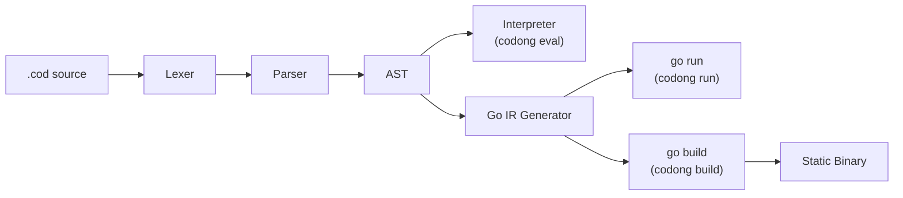
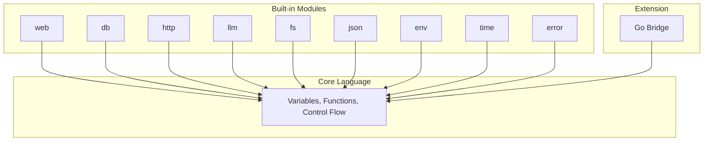
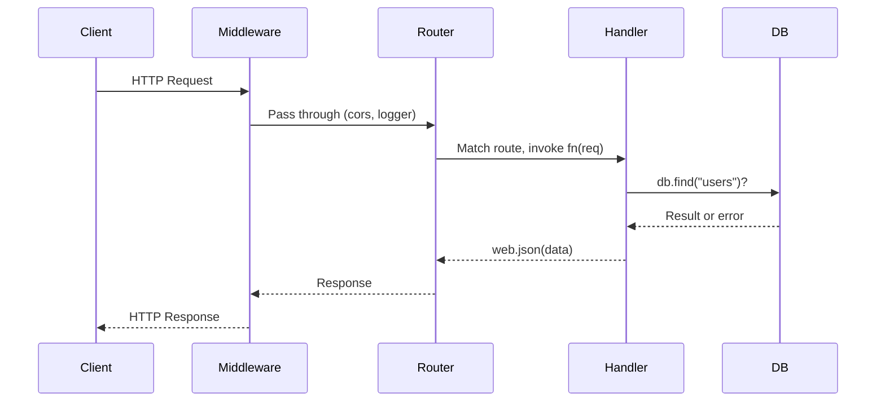
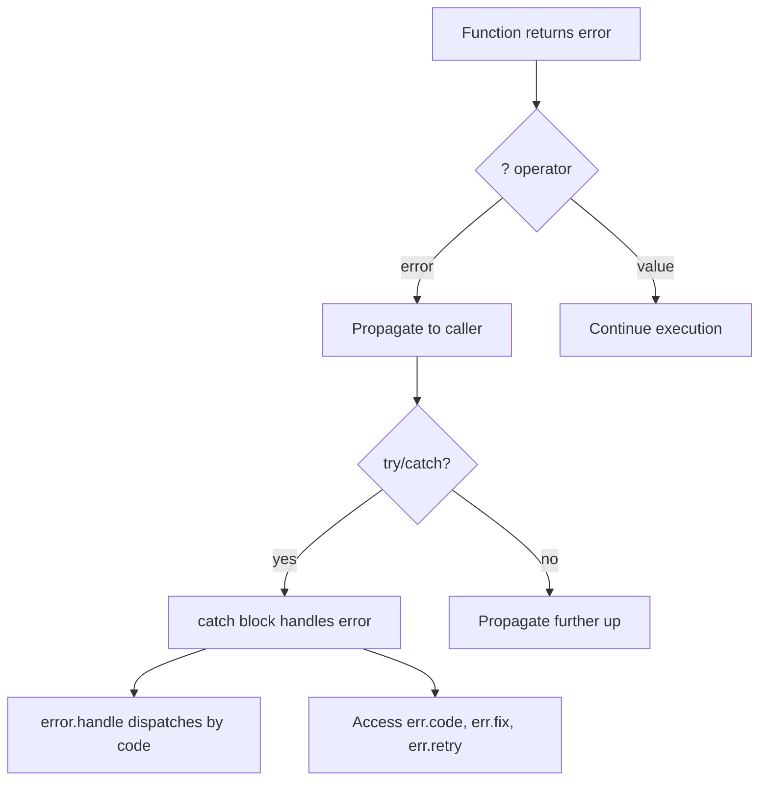

<p align="center">
  <strong>CODONG</strong><br>
  Die weltweit erste AI-native Programmiersprache
</p>

<p align="center">
  <a href="https://codong.org">Website</a> |
  <a href="https://codong.org/arena/">Arena</a> |
  <a href="../SPEC.md">Spezifikation</a> |
  <a href="../WHITEPAPER.md">Whitepaper</a> |
  <a href="../SPEC_FOR_AI.md">AI-Spezifikation</a>
</p>

<p align="center">
  <a href="../LICENSE"></a>
  
  
  <a href="https://codong.org/arena/"></a>
</p>

<p align="center">
  <a href="../README.md">English</a> |
  <a href="./README_zh.md">中文</a> |
  <a href="./README_ja.md">日本語</a> |
  <a href="./README_ko.md">한국어</a> |
  <a href="./README_ru.md">Русский</a>
</p>

---

## Arena-Benchmark: Codong vs. etablierte Sprachen

Wenn ein AI-Modell dieselbe Anwendung in verschiedenen Sprachen schreibt, erzeugt Codong drastisch
weniger Code, weniger Token und ist schneller fertig. Diese Zahlen stammen aus der
[Codong Arena](https://codong.org/arena/), wo jedes Modell dieselbe Spezifikation in jeder Sprache
schreibt und die Ergebnisse automatisch gemessen werden.

<p align="center">
  
  <br />
  <sub>Live-Benchmark: Claude Sonnet 4 generiert eine Posts CRUD API mit Tags, Suche und Paginierung. <a href="https://codong.org/arena/">Selbst ausprobieren</a></sub>
</p>

| Metrik | Codong | Python | JavaScript | Java | Go |
|--------|--------|--------|------------|------|-----|
| Gesamt-Token | **955** | 1.867 | 1.710 | 4.367 | 3.270 |
| Generierungszeit | **8,6s** | 15,3s | 13,7s | 37,4s | 26,6s |
| Codezeilen | **10** | 143 | 147 | 337 | 289 |
| Gesch. Kosten | **$0,012** | $0,025 | $0,022 | $0,062 | $0,046 |
| Ausgabe-Token | **722** | 1.597 | 1.439 | 4.096 | 3.001 |
| vs. Codong | -- | +121% | +99% | +467% | +316% |

Eigenen Benchmark ausführen: [codong.org/arena](https://codong.org/arena/)

---

## Schnellstart in 30 Sekunden

```bash
# 1. Binary herunterladen
curl -fsSL https://codong.org/install.sh | sh

# 2. Erstes Programm schreiben
echo 'print("Hello, Codong!")' > hello.cod

# 3. Ausführen
codong eval hello.cod
```

Eine Web-API in fünf Zeilen:

```
web.get("/", fn(req) => web.json({message: "Hello from Codong"}))
web.get("/health", fn(req) => web.json({status: "ok"}))
server = web.serve(port: 8080)
```

```bash
codong run server.cod
# curl http://localhost:8080/
```

---

## Lassen Sie AI Codong schreiben -- keine Installation erforderlich

Sie müssen Codong nicht installieren, um es zu nutzen. Senden Sie die Datei
[`SPEC_FOR_AI.md`](../SPEC_FOR_AI.md) an ein beliebiges LLM (Claude, GPT, Gemini, LLaMA)
als System-Prompt oder Kontext, und die AI kann sofort korrekten Codong-Code schreiben.

**Schritt 1.** Kopieren Sie den Inhalt von [`SPEC_FOR_AI.md`](../SPEC_FOR_AI.md) (unter 2.000 Wörter).

**Schritt 2.** Fügen Sie ihn in Ihr AI-Gespräch als Kontext ein:

```
[SPEC_FOR_AI.md-Inhalt hier einfügen]

Schreibe jetzt eine Codong REST API, die eine Benutzerliste mit
CRUD-Operationen und SQLite-Speicher verwaltet.
```

**Schritt 3.** Die AI generiert gültigen Codong-Code:

```
db.connect("sqlite:///users.db")
db.create_table("users", {id: "integer primary key autoincrement", name: "text", email: "text"})
server = web.serve(port: 8080)
server.get("/users", fn(req) { return web.json(db.find("users")) })
server.post("/users", fn(req) { return web.json(db.insert("users", req.body), 201) })
server.get("/users/:id", fn(req) { return web.json(db.find_one("users", {id: to_number(req.param("id"))})) })
server.delete("/users/:id", fn(req) { db.delete("users", {id: to_number(req.param("id"))}); return web.json({}, 204) })
```

Dies funktioniert, weil Codong mit einer einzigen, eindeutigen Syntax für jede Operation entworfen wurde.
Die AI muss nicht zwischen Frameworks, Import-Stilen oder konkurrierenden Mustern wählen.
Ein einziger korrekter Weg, alles zu schreiben.

| LLM-Anbieter | Methode |
|-------------|--------|
| Claude (Anthropic) | SPEC in System-Prompt einfügen oder [Prompt Caching](https://docs.anthropic.com/en/docs/build-with-claude/prompt-caching) für wiederholte Nutzung verwenden |
| GPT (OpenAI) | SPEC als erste Benutzernachricht oder Systemanweisung einfügen |
| Gemini (Google) | SPEC als Kontext im Gespräch einfügen |
| LLaMA / Ollama | SPEC über API oder Ollama-Modelfile in den System-Prompt einbinden |
| Jedes LLM | Funktioniert mit jedem Modell, das einen System-Prompt oder ein Kontextfenster unterstützt |

> **Selbst benchmarken**: Besuchen Sie [codong.org/arena](https://codong.org/arena/), um
> Echtzeit-Vergleiche des Token-Verbrauchs und der Generierungsgeschwindigkeit zwischen Codong und anderen Sprachen zu sehen.

---

## Warum Codong

Die meisten Programmiersprachen wurden für Menschen zum Schreiben und Maschinen zum Ausführen entworfen. Codong ist
dafür konzipiert, dass AI schreibt, Menschen überprüfen und Maschinen ausführen. Es beseitigt die drei größten
Reibungsquellen in AI-generiertem Code.

### Problem 1: Entscheidungsparalyse verbraucht Token

Python hat fünf oder mehr Möglichkeiten, einen HTTP-Request zu machen. Jede Entscheidung kostet Token und
produziert unvorhersehbare Ausgaben. Codong hat genau einen Weg, alles zu tun.

| Aufgabe | Python-Optionen | Codong |
|------|---------------|--------|
| HTTP-Request | requests, urllib, httpx, aiohttp, http.client | `http.get(url)` |
| Webserver | Flask, FastAPI, Django, Starlette, Tornado | `web.serve(port: N)` |
| Datenbank | SQLAlchemy, psycopg2, pymongo, peewee, Django ORM | `db.connect(url)` |
| JSON-Parsing | json.loads, orjson, ujson, simplejson | `json.parse(s)` |

### Problem 2: Fehler sind für AI unlesbar

Stack-Traces sind für Menschen konzipiert. Ein AI-Agent verbringt Hunderte von Token mit dem Parsen von
`Traceback (most recent call last)`, bevor er eine Korrektur versuchen kann. In Codong ist jeder Fehler
strukturiertes JSON mit einem `fix`-Feld, das der AI genau sagt, was zu tun ist.

```json
{
  "error":   "db.find",
  "code":    "E2001_NOT_FOUND",
  "message": "table 'users' not found",
  "fix":     "run db.migrate() to create the table",
  "retry":   false
}
```

### Problem 3: Paketauswahl verschwendet Kontext

Bevor die Geschäftslogik geschrieben wird, muss eine AI eine HTTP-Bibliothek, einen Datenbanktreiber, einen JSON-
Parser auswählen, Versionskonflikte lösen und alles konfigurieren. Codong liefert acht eingebaute Module,
die 90% der AI-Arbeitslasten abdecken. Kein Paketmanager erforderlich.

### Das Ergebnis: über 70% Token-Einsparung

| Token-Kosten | Python/JS | Codong | Einsparung |
|-----------|-----------|--------|---------|
| HTTP-Framework wählen | ~300 | 0 | 100% |
| Datenbank-ORM wählen | ~400 | 0 | 100% |
| Fehlermeldungen parsen | ~500 | ~50 | 90% |
| Paketversionen auflösen | ~800 | 0 | 100% |
| Geschäftslogik schreiben | ~800 | ~800 | 0% |
| **Gesamt** | **~2.800** | **~850** | **~70%** |

---

## Sprachdesign

Codong ist bewusst klein gehalten. 23 Schlüsselwörter. 6 primitive Typen. Ein Weg für jede Aufgabe.

### 23 Schlüsselwörter (Python: 35, JavaScript: 64, Java: 67)

```
fn       return   if       else     for      while    match
break    continue const    import   export   try      catch
go       select   interface type    null     true     false
in       _
```

### Variablen

```
name = "Ada"
age = 30
active = true
nothing = null
const MAX_RETRIES = 3
```

Kein `var`, `let` oder `:=`. Zuweisung ist `=`, immer.

### Funktionen

```
fn greet(name, greeting = "Hello") {
    return "{greeting}, {name}!"
}

print(greet("Ada"))                    // Hello, Ada!
print(greet("Bob", greeting: "Hi"))    // Hi, Bob!

double = fn(x) => x * 2               // Pfeilfunktion
```

### String-Interpolation

```
name = "Ada"
print("Hello, {name}!")                      // Variable
print("Total: {items.len()} items")          // Methodenaufruf
print("Sum: {a + b}")                        // Ausdruck
print("{user.name} joined on {user.date}")   // Feldzugriff
```

Jeder Ausdruck ist innerhalb von `{}` gültig. Keine Backticks, kein `f"..."`, kein `${}`.

### Sammlungen

```
items = [1, 2, 3, 4, 5]
doubled = items.map(fn(x) => x * 2)
evens = items.filter(fn(x) => x % 2 == 0)
total = items.reduce(fn(acc, x) => acc + x, 0)

user = {name: "Ada", age: 30}
user.email = "ada@example.com"
print(user.get("phone", "N/A"))        // N/A
```

### Kontrollfluss

```
if score >= 90 {
    print("A")
} else if score >= 80 {
    print("B")
} else {
    print("C")
}

for item in items {
    print(item)
}

for i in range(0, 10) {
    print(i)
}

while running {
    data = poll()
}

match status {
    200 => print("ok")
    404 => print("not found")
    _   => print("error: {status}")
}
```

### Fehlerbehandlung mit dem `?`-Operator

```
fn divide(a, b) {
    if b == 0 {
        return error.new("E_MATH", "division by zero")
    }
    return a / b
}

fn half_of_division(a, b) {
    result = divide(a, b)?
    return result / 2
}

try {
    half_of_division(10, 0)?
} catch err {
    print(err.code)       // E_MATH
    print(err.message)    // division by zero
}
```

Der `?`-Operator propagiert Fehler automatisch den Aufrufstapel hinauf. Keine verschachtelten
`if err != nil`-Ketten. Keine ungeprüften Ausnahmen.

### Kompaktes Fehlerformat

Wechseln Sie zum kompakten Format, um ca. 39% Token in AI-Pipelines zu sparen:

```
error.set_format("compact")
// output: err_code:E_MATH|src:divide|fix:check divisor|retry:false
```

---

## Architektur

Codong-Quelldateien (`.cod`) werden durch eine mehrstufige Pipeline verarbeitet. Der Interpreter-Pfad
bietet sofortigen Start für Skripte und REPL. Der Go-IR-Pfad kompiliert zu nativem Go für
Produktions-Deployments.



### Ausführungsmodi

| Modus | Pipeline | Startzeit | Anwendungsfall |
|------|----------|---------|----------|
| `codong eval` | .cod -> AST -> Interpreter | Unter einer Sekunde | Skripte, REPL, Playground |
| `codong run` | .cod -> AST -> Go IR -> `go run` | 0,3-2s | Entwicklung, AI-Agent-Ausführung |
| `codong build` | .cod -> AST -> Go IR -> `go build` | N/A (einmal kompilieren) | Produktions-Deployment |

```bash
codong eval script.cod    # AST-Interpreter, sofortiger Start
codong run app.cod        # Go IR, vollständige stdlib, Entwicklung
codong build app.cod      # Einzelnes statisches Binary, Produktion
```

### Beziehung zu Go

Codong kompiliert zu äquivalentem Go-Code und nutzt dann die Go-Toolchain für Ausführung und
Kompilierung. Dies ist dasselbe Modell wie TypeScript -> JavaScript oder Kotlin -> JVM-Bytecode.

| Codong bietet | Go bietet |
|----------------|-------------|
| AI-natives Syntaxdesign | Speicherverwaltung, Garbage Collection |
| Hochgradig eingeschränkte Domain-APIs | Goroutine-Nebenläufigkeitsplanung |
| Strukturiertes JSON-Fehlersystem | Plattformübergreifende Kompilierung |
| 8 eingebaute Modul-Abstraktionen | Kampferprobte Laufzeit (10+ Jahre) |
| Go-Bridge-Erweiterungsprotokoll | Hunderttausende Ökosystem-Bibliotheken |

---

## Eingebaute Module

Acht Module werden mit Codong ausgeliefert. Keine Installation, keine Versionskonflikte, keine Auswahl.

| Modul | Zweck | Wichtige Methoden |
|--------|---------|-------------|
| [`web`](#web-modul) | HTTP-Server, Routing, Middleware, WebSocket | serve, get, post, put, delete |
| [`db`](#db-modul) | PostgreSQL, MySQL, MongoDB, Redis, SQLite | connect, find, insert, update, delete |
| [`http`](#http-modul) | HTTP-Client | get, post, put, delete, patch |
| [`llm`](#llm-modul) | GPT, Claude, Gemini -- einheitliche Schnittstelle | ask, chat, stream, embed |
| [`fs`](#fs-modul) | Dateisystem-Operationen | read, write, list, mkdir, stat |
| [`json`](#json-modul) | JSON-Verarbeitung | parse, stringify, valid, merge |
| [`env`](#env-modul) | Umgebungsvariablen | get, require, has, all, load |
| [`time`](#time-modul) | Datum, Zeit, Dauer | now, sleep, format, parse, diff |
| [`error`](#error-modul) | Strukturierte Fehlererstellung und -behandlung | new, wrap, handle, retry |



---

## Codebeispiele

### Hello World API

```
web.get("/", fn(req) => web.json({message: "Hello from Codong"}))
server = web.serve(port: 8080)
```

### TODO CRUD API

```
db.connect("file:todo.db")
db.query("CREATE TABLE IF NOT EXISTS todos (id INTEGER PRIMARY KEY AUTOINCREMENT, title TEXT, done INTEGER)")

web.get("/todos", fn(req) {
    return web.json(db.find("todos"))
})

web.post("/todos", fn(req) {
    db.insert("todos", {title: req.body.title, done: 0})
    return web.json({created: true})
})

web.put("/todos/{id}", fn(req) {
    db.update("todos", {id: to_number(req.param.id)}, {done: 1})
    return web.json({updated: true})
})

web.delete("/todos/{id}", fn(req) {
    db.delete("todos", {id: to_number(req.param.id)})
    return web.json({deleted: true})
})

server = web.serve(port: 3000)
```

### LLM-gestützter Endpunkt

```
web.post("/ask", fn(req) {
    question = req.body.question
    context = db.find("docs", {relevant: true})?
    answer = llm.ask(
        model: "gpt-4o",
        prompt: "Answer using context: {context}\n\nQuestion: {question}",
        format: "json"
    )?
    return web.json(answer)
})

server = web.serve(port: 8080)
```

### Dateiverarbeitungsskript

```
files = fs.list("./data")
for file in files {
    if fs.extension(file) == ".csv" {
        content = fs.read(file)
        lines = content.split("\n")
        print("{fs.basename(file)}: {lines.len()} lines")
        fs.write("./output/{fs.basename(file)}.processed", content.upper())
    }
}
print("done")
```

### Fehlerbehandlung mit `?`-Operator

```
fn load_config(path) {
    content = fs.read(path)?
    config = json.parse(content)?
    host = config.get("host", "localhost")
    port = config.get("port", 8080)
    return {host: host, port: port}
}

try {
    config = load_config("config.json")?
    print("Server: {config.host}:{config.port}")
} catch err {
    print("Failed: {err.code} - {err.fix}")
}
```

---

## Vollständige API-Referenz

### Kernsprache

#### Datentypen

| Typ | Beispiel | Hinweise |
|------|---------|-------|
| `string` | `"hello"`, `"value is {x}"` | Nur doppelte Anführungszeichen. `{expr}`-Interpolation. |
| `number` | `42`, `3.14`, `-1` | 64-Bit-Gleitkommazahl. |
| `bool` | `true`, `false` | |
| `null` | `null` | Nur `null` und `false` sind falsy. |
| `list` | `[1, 2, 3]` | Nullbasierte Indizierung. Negative Indizes unterstützt. |
| `map` | `{name: "Ada"}` | Geordnet. Punkt- und Klammerzugriff. |

#### Eingebaute Funktionen

| Funktion | Rückgabe | Beschreibung |
|----------|---------|-------------|
| `print(value)` | null | Ausgabe auf stdout. Ein Argument; für mehrere Werte Interpolation verwenden. |
| `type_of(x)` | string | Gibt `"string"`, `"number"`, `"bool"`, `"null"`, `"list"`, `"map"`, `"fn"` zurück. |
| `to_string(x)` | string | Beliebigen Wert in String-Darstellung konvertieren. |
| `to_number(x)` | number/null | Als Zahl parsen. Gibt `null` zurück, wenn ungültig. |
| `to_bool(x)` | bool | In Boolean konvertieren. |
| `range(start, end)` | list | Ganzzahlen von `start` bis `end - 1`. |

#### Operatoren

| Priorität | Operatoren | Beschreibung |
|------------|-----------|-------------|
| 1 | `()` `[]` `.` `?` | Gruppierung, Index, Feld, Fehlerpropagierung |
| 2 | `!` `-` (unär) | Logische Negation, Vorzeichenwechsel |
| 3 | `*` `/` `%` | Multiplikation, Division, Modulo |
| 4 | `+` `-` | Addition, Subtraktion |
| 5 | `<` `>` `<=` `>=` | Vergleich |
| 6 | `==` `!=` | Gleichheit |
| 7 | `&&` | Logisches UND |
| 8 | `\|\|` | Logisches ODER |
| 9 | `<-` | Kanal senden/empfangen |
| 10 | `=` `+=` `-=` `*=` `/=` | Zuweisung |

---

### String-Methoden

17 Methoden. Alle geben neue Strings zurück (Strings sind unveränderlich).

| Methode | Rückgabe | Beschreibung |
|--------|---------|-------------|
| `s.len()` | number | Byte-Länge des Strings. |
| `s.upper()` | string | In Großbuchstaben konvertieren. |
| `s.lower()` | string | In Kleinbuchstaben konvertieren. |
| `s.trim()` | string | Führende und nachfolgende Leerzeichen entfernen. |
| `s.trim_start()` | string | Führende Leerzeichen entfernen. |
| `s.trim_end()` | string | Nachfolgende Leerzeichen entfernen. |
| `s.split(sep)` | list | Nach Trennzeichen in eine Liste von Strings aufteilen. |
| `s.contains(sub)` | bool | Gibt `true` zurück, wenn der String den Teilstring enthält. |
| `s.starts_with(prefix)` | bool | Gibt `true` zurück, wenn der String mit dem Präfix beginnt. |
| `s.ends_with(suffix)` | bool | Gibt `true` zurück, wenn der String mit dem Suffix endet. |
| `s.replace(old, new)` | string | Alle Vorkommen von `old` durch `new` ersetzen. |
| `s.index_of(sub)` | number | Index des ersten Vorkommens. Gibt `-1` zurück, wenn nicht gefunden. |
| `s.slice(start, end?)` | string | Teilstring extrahieren. `end` ist optional. |
| `s.repeat(n)` | string | String `n`-mal wiederholen. |
| `s.to_number()` | number/null | Als Zahl parsen. Gibt `null` zurück, wenn ungültig. |
| `s.to_bool()` | bool | `"true"` / `"1"` gibt `true` zurück; alles andere `false`. |
| `s.match(pattern)` | list | Regex-Abgleich. Gibt Liste aller Treffer zurück. |

---

### Listen-Methoden

20 Methoden. Mutierende Methoden ändern die Originalliste und geben `self` für Verkettung zurück.

| Methode | Mutiert | Rückgabe | Beschreibung |
|--------|---------|---------|-------------|
| `l.len()` | nein | number | Anzahl der Elemente. |
| `l.push(item)` | **ja** | self | Element am Ende anfügen. |
| `l.pop()` | **ja** | item | Letztes Element entfernen und zurückgeben. |
| `l.shift()` | **ja** | item | Erstes Element entfernen und zurückgeben. |
| `l.unshift(item)` | **ja** | self | Element am Anfang einfügen. |
| `l.sort(fn?)` | **ja** | self | In-place sortieren. Optionale Vergleichsfunktion. |
| `l.reverse()` | **ja** | self | In-place umkehren. |
| `l.slice(start, end?)` | nein | list | Neue Teilliste von `start` bis `end`. |
| `l.map(fn)` | nein | list | Neue Liste mit `fn` auf jedes Element angewendet. |
| `l.filter(fn)` | nein | list | Neue Liste mit Elementen, für die `fn` truthy zurückgibt. |
| `l.reduce(fn, init)` | nein | any | Akkumulation mit `fn(acc, item)` beginnend bei `init`. |
| `l.find(fn)` | nein | item/null | Erstes Element, für das `fn` truthy zurückgibt. |
| `l.find_index(fn)` | nein | number | Index des ersten Treffers. Gibt `-1` zurück, wenn keiner. |
| `l.contains(item)` | nein | bool | Gibt `true` zurück, wenn die Liste das Element enthält. |
| `l.index_of(item)` | nein | number | Index des ersten Vorkommens. Gibt `-1` zurück, wenn nicht gefunden. |
| `l.flat(depth?)` | nein | list | Neue abgeflachte Liste. Standardtiefe ist 1. |
| `l.unique()` | nein | list | Neue Liste ohne Duplikate. |
| `l.join(sep)` | nein | string | Elemente mit Trennzeichen zu String verbinden. |
| `l.first()` | nein | item/null | Erstes Element oder `null` wenn leer. |
| `l.last()` | nein | item/null | Letztes Element oder `null` wenn leer. |

---

### Map-Methoden

10 Methoden. Nur `delete` mutiert die originale Map.

| Methode | Mutiert | Rückgabe | Beschreibung |
|--------|---------|---------|-------------|
| `m.len()` | nein | number | Anzahl der Schlüssel-Wert-Paare. |
| `m.keys()` | nein | list | Liste aller Schlüssel. |
| `m.values()` | nein | list | Liste aller Werte. |
| `m.entries()` | nein | list | Liste von `[key, value]`-Paaren. |
| `m.has(key)` | nein | bool | Gibt `true` zurück, wenn der Schlüssel existiert. |
| `m.get(key, default?)` | nein | any | Wert nach Schlüssel abrufen. Gibt `default` (oder `null`) zurück, wenn nicht vorhanden. |
| `m.delete(key)` | **ja** | self | Schlüssel-Wert-Paar in-place entfernen. |
| `m.merge(other)` | nein | map | Neue Map durch Zusammenführen von `other` in `self`. `other` gewinnt bei Konflikten. |
| `m.map_values(fn)` | nein | map | Neue Map mit `fn` auf jeden Wert angewendet. |
| `m.filter(fn)` | nein | map | Neue Map mit Einträgen, für die `fn(key, value)` truthy zurückgibt. |

---

### web-Modul

HTTP-Server mit Routing, Middleware und WebSocket-Unterstützung.

#### Server

| Methode | Beschreibung |
|--------|-------------|
| `web.serve(port: N)` | HTTP-Server auf Port `N` starten. Gibt Server-Handle zurück. |

#### Routen-Registrierung

| Methode | Beschreibung |
|--------|-------------|
| `web.get(path, handler)` | GET-Route registrieren. |
| `web.post(path, handler)` | POST-Route registrieren. |
| `web.put(path, handler)` | PUT-Route registrieren. |
| `web.delete(path, handler)` | DELETE-Route registrieren. |
| `web.patch(path, handler)` | PATCH-Route registrieren. |

Routen-Handler erhalten ein Request-Objekt mit `req.body`, `req.param`, `req.query`, `req.headers`.

#### Antwort-Hilfsfunktionen

| Methode | Beschreibung |
|--------|-------------|
| `web.json(data)` | JSON-Antwort mit `Content-Type: application/json` zurückgeben. |
| `web.text(string)` | Klartext-Antwort zurückgeben. |
| `web.html(string)` | HTML-Antwort zurückgeben. |
| `web.redirect(url)` | Weiterleitungsantwort zurückgeben. |
| `web.response(status, body, headers)` | Benutzerdefinierte Antwort mit Statuscode und Headern zurückgeben. |

#### Statische Dateien und Middleware

| Methode | Beschreibung |
|--------|-------------|
| `web.static(path, dir)` | Statische Dateien aus Verzeichnis bereitstellen. |
| `web.middleware(name_or_fn)` | Middleware anwenden. Eingebaut: `"cors"`, `"logger"`, `"recover"`, `"auth_bearer"`. |
| `web.ws(path, handler)` | WebSocket-Endpunkt registrieren. |

```
// Middleware-Beispiel
web.middleware("cors")
web.middleware("logger")
web.middleware(fn(req, next) {
    print("Request: {req.method} {req.path}")
    return next(req)
})
```



---

### db-Modul

Einheitliche Datenbankschnittstelle für SQL- und NoSQL-Datenbanken.

#### Verbindung

| Methode | Beschreibung |
|--------|-------------|
| `db.connect(url)` | Mit Datenbank verbinden. URL bestimmt den Treiber: `postgres://`, `mysql://`, `mongodb://`, `redis://`, `file:` (SQLite). |

#### Schema

| Methode | Beschreibung |
|--------|-------------|
| `db.create_table(name, schema)` | Tabelle mit Schema-Map erstellen. |
| `db.create_index(table, fields)` | Index auf angegebenen Feldern erstellen. |

#### CRUD-Operationen

| Methode | Beschreibung |
|--------|-------------|
| `db.insert(table, data)` | Einzelnen Datensatz einfügen. |
| `db.insert_batch(table, list)` | Mehrere Datensätze einfügen. |
| `db.find(table, filter?)` | Alle passenden Datensätze finden. Gibt Liste zurück. |
| `db.find_one(table, filter)` | Ersten passenden Datensatz finden. Gibt Map oder null zurück. |
| `db.update(table, filter, data)` | Passende Datensätze mit neuen Daten aktualisieren. |
| `db.delete(table, filter)` | Passende Datensätze löschen. |
| `db.upsert(table, filter, data)` | Einfügen oder aktualisieren, wenn vorhanden. |

#### Abfragen und Aggregation

| Methode | Beschreibung |
|--------|-------------|
| `db.count(table, filter?)` | Passende Datensätze zählen. |
| `db.exists(table, filter)` | Gibt `true` zurück, wenn ein passender Datensatz existiert. |
| `db.query(sql, params?)` | Rohe SQL-Abfrage ausführen. `?`-Platzhalter verwenden. |
| `db.query_one(sql, params?)` | Rohes SQL ausführen, erstes Ergebnis zurückgeben. |
| `db.transaction(fn)` | Funktion innerhalb einer Transaktion ausführen. |
| `db.stats()` | Verbindungspool-Statistiken zurückgeben. |

```
db.connect("file:app.db")
db.insert("users", {name: "Ada", role: "engineer"})
engineers = db.find("users", {role: "engineer"})
db.update("users", {name: "Ada"}, {role: "senior engineer"})
count = db.count("users")
```

---

### http-Modul

HTTP-Client für ausgehende Anfragen.

| Methode | Beschreibung |
|--------|-------------|
| `http.get(url, options?)` | GET-Anfrage senden. Gibt Antwortobjekt zurück. |
| `http.post(url, body?, options?)` | POST-Anfrage mit optionalem JSON-Body senden. |
| `http.put(url, body?, options?)` | PUT-Anfrage senden. |
| `http.delete(url, options?)` | DELETE-Anfrage senden. |
| `http.patch(url, body?, options?)` | PATCH-Anfrage senden. |
| `http.request(method, url, options)` | Anfrage mit benutzerdefinierter Methode und vollständigen Optionen senden. |

Antwortobjekt: `resp.status` (number), `resp.ok` (bool), `resp.json()` (geparster JSON),
`resp.text()` (Roh-Body), `resp.headers` (map).

```
resp = http.get("https://api.example.com/users")
if resp.ok {
    users = resp.json()
    print("Found {users.len()} users")
}

resp = http.post("https://api.example.com/users", {
    name: "Ada",
    role: "engineer"
})
```

---

### llm-Modul

Einheitliche Schnittstelle für große Sprachmodelle. Unterstützt GPT, Claude, Gemini und jede
OpenAI-kompatible API.

| Methode | Beschreibung |
|--------|-------------|
| `llm.ask(prompt, model:, system?:, format?:)` | Ein Prompt, eine Antwort. `format: "json"` gibt strukturierte Daten zurück. |
| `llm.chat(messages, model:)` | Mehrteiliges Gespräch. Nachrichten: `[{role:, content:}]`. |
| `llm.stream(prompt, model:, on_chunk:)` | Antwort Token für Token streamen. |
| `llm.embed(text, model:)` | Embedding-Vektor generieren. |
| `llm.count_tokens(text)` | Token-Anzahl für Text schätzen. |

```
// Einzelne Frage
answer = llm.ask("What is 2+2?", model: "gpt-4o")

// Strukturierte Ausgabe
data = llm.ask("List 3 colors", model: "gpt-4o", format: "json")

// Mehrteiliges Gespräch
response = llm.chat([
    {role: "system", content: "You are a helpful assistant."},
    {role: "user", content: "What is Codong?"},
    {role: "assistant", content: "Codong is an AI-native programming language."},
    {role: "user", content: "What makes it special?"}
], model: "claude-sonnet-4-20250514")

// Token-Schätzung
tokens = llm.count_tokens("Hello, this is a test.")
print("Tokens: {tokens}")
```

---

### fs-Modul

Dateisystem-Operationen zum Lesen, Schreiben und Verwalten von Dateien und Verzeichnissen.

#### Datei-Operationen

| Methode | Beschreibung |
|--------|-------------|
| `fs.read(path)` | Gesamte Datei als String lesen. |
| `fs.write(path, content)` | String in Datei schreiben (überschreiben). |
| `fs.append(path, content)` | String an Datei anhängen. |
| `fs.delete(path)` | Datei löschen. |
| `fs.copy(src, dst)` | Datei von `src` nach `dst` kopieren. |
| `fs.move(src, dst)` | Datei verschieben/umbenennen. |
| `fs.exists(path)` | Gibt `true` zurück, wenn Pfad existiert. |

#### Verzeichnis-Operationen

| Methode | Beschreibung |
|--------|-------------|
| `fs.list(dir)` | Dateien im Verzeichnis auflisten. Gibt Liste von Pfaden zurück. |
| `fs.mkdir(path)` | Verzeichnis erstellen (einschließlich Elternverzeichnisse). |
| `fs.rmdir(path)` | Verzeichnis entfernen. |
| `fs.stat(path)` | Datei-Metadaten zurückgeben: Größe, Änderungszeit, is_dir. |

#### Strukturierte E/A

| Methode | Beschreibung |
|--------|-------------|
| `fs.read_json(path)` | JSON-Datei lesen und parsen. |
| `fs.write_json(path, data)` | Daten als formatiertes JSON schreiben. |
| `fs.read_lines(path)` | Datei als Liste von Zeilen lesen. |
| `fs.write_lines(path, lines)` | Liste von Zeilen in Datei schreiben. |

#### Pfad-Hilfsfunktionen

| Methode | Beschreibung |
|--------|-------------|
| `fs.join(parts...)` | Pfadsegmente verbinden. |
| `fs.cwd()` | Aktuelles Arbeitsverzeichnis zurückgeben. |
| `fs.basename(path)` | Dateinamen aus Pfad zurückgeben. |
| `fs.dirname(path)` | Verzeichnis aus Pfad zurückgeben. |
| `fs.extension(path)` | Dateiendung zurückgeben. |
| `fs.safe_join(base, path)` | Pfade mit Schutz vor Verzeichnis-Traversierung verbinden. |
| `fs.temp_file(prefix?)` | Temporäre Datei erstellen. Pfad zurückgeben. |
| `fs.temp_dir(prefix?)` | Temporäres Verzeichnis erstellen. Pfad zurückgeben. |

---

### json-Modul

JSON-Parsing, -Generierung und -Manipulation.

| Methode | Beschreibung |
|--------|-------------|
| `json.parse(string)` | JSON-String in Codong-Wert parsen (Map, Liste etc.). |
| `json.stringify(value)` | Codong-Wert in JSON-String konvertieren. |
| `json.valid(string)` | Gibt `true` zurück, wenn String gültiges JSON ist. |
| `json.merge(a, b)` | Zwei Maps tief zusammenführen. `b` gewinnt bei Konflikten. |
| `json.get(value, path)` | Verschachtelten Wert über Punktpfad abrufen (z.B. `"user.name"`). |
| `json.set(value, path, new_val)` | Verschachtelten Wert über Punktpfad setzen. Gibt neue Struktur zurück. |
| `json.flatten(value)` | Verschachtelte Map in Schlüssel mit Punktnotation abflachen. |
| `json.unflatten(value)` | Schlüssel mit Punktnotation in verschachtelte Map wiederherstellen. |

```
data = json.parse("{\"name\": \"Ada\", \"age\": 30}")
text = json.stringify({name: "Ada", scores: [95, 87, 92]})
name = json.get(data, "name")
```

---

### env-Modul

Zugriff auf Umgebungsvariablen und Laden von `.env`-Dateien.

| Methode | Beschreibung |
|--------|-------------|
| `env.get(key, default?)` | Umgebungsvariable abrufen. Gibt `default` (oder `null`) zurück, wenn nicht gesetzt. |
| `env.require(key)` | Umgebungsvariable abrufen. Gibt Fehler zurück, wenn nicht gesetzt. |
| `env.has(key)` | Gibt `true` zurück, wenn Umgebungsvariable gesetzt ist. |
| `env.all()` | Gibt Map aller Umgebungsvariablen zurück. |
| `env.load(path?)` | `.env`-Datei laden. Standardpfad: `.env`. |

```
env.load()
api_key = env.require("OPENAI_API_KEY")?
db_url = env.get("DATABASE_URL", "file:dev.db")
```

---

### time-Modul

Hilfsfunktionen für Datum, Zeit, Dauer und Planung.

| Methode | Beschreibung |
|--------|-------------|
| `time.sleep(ms)` | Ausführung für `ms` Millisekunden pausieren. |
| `time.now()` | Aktueller Unix-Zeitstempel in Millisekunden. |
| `time.now_iso()` | Aktuelle Zeit als ISO-8601-String. |
| `time.format(timestamp, pattern)` | Zeitstempel mit Muster formatieren. |
| `time.parse(string, pattern)` | Zeit-String in Zeitstempel parsen. |
| `time.diff(a, b)` | Differenz zwischen zwei Zeitstempeln in Millisekunden. |
| `time.since(timestamp)` | Millisekunden seit dem angegebenen Zeitstempel. |
| `time.until(timestamp)` | Millisekunden bis zum angegebenen Zeitstempel. |
| `time.add(timestamp, ms)` | Millisekunden zum Zeitstempel addieren. |
| `time.is_before(a, b)` | Gibt `true` zurück, wenn `a` vor `b` liegt. |
| `time.is_after(a, b)` | Gibt `true` zurück, wenn `a` nach `b` liegt. |
| `time.today_start()` | Zeitstempel des Tagesbeginns (00:00:00). |
| `time.today_end()` | Zeitstempel des Tagesendes (23:59:59). |

```
start = time.now()
time.sleep(100)
elapsed = time.since(start)
print("Elapsed: {elapsed}ms")
print("Current time: {time.now_iso()}")
```

---

### error-Modul

Strukturierte Fehlererstellung, -umhüllung, -formatierung und -dispatch.

| Methode | Beschreibung |
|--------|-------------|
| `error.new(code, message, fix?:, retry?:)` | Neuen strukturierten Fehler erstellen. |
| `error.wrap(err, context)` | Kontext zu einem bestehenden Fehler hinzufügen. |
| `error.is(value)` | Gibt `true` zurück, wenn Wert ein Fehlerobjekt ist. |
| `error.unwrap(err)` | Inneren Fehler aus umhülltem Fehler zurückgeben. |
| `error.to_json(err)` | Fehler in JSON-String konvertieren. |
| `error.to_compact(err)` | Fehler in kompaktes Format konvertieren. |
| `error.from_json(string)` | JSON-String in Fehlerobjekt parsen. |
| `error.from_compact(string)` | Kompaktformat-String in Fehlerobjekt parsen. |
| `error.set_format(fmt)` | Globales Format setzen: `"json"` (Standard) oder `"compact"`. |
| `error.handle(result, handlers)` | Nach Fehlercode dispatchen. Map von `code -> fn(err)`. `"_"` für Standard verwenden. |
| `error.retry(fn, max_attempts)` | Funktion automatisch wiederholen, wenn wiederholbarer Fehler zurückgegeben wird. |

```
err = error.new("E_INVALID", "bad input", fix: "check the value")

result = error.handle(some_result, {
    "E_NOT_FOUND": fn(err) => "Missing: {err.fix}",
    "E_TIMEOUT": fn(err) => "Timed out",
    "_": fn(err) => "Unknown: {err.code}"
})

final = error.retry(fn() {
    return http.get("https://api.example.com/data")
}, 3)
```



---

## Nebenläufigkeit

Codong verwendet Go-Stil-Nebenläufigkeit mit Goroutinen und Kanälen.

```
// Nebenläufige Ausführung starten
go fn() {
    data = fetch_data()
    ch <- data
}()

// Kanäle
ch = channel()
ch <- "message"           // senden
msg = <-ch                // empfangen

// Gepufferter Kanal
ch = channel(size: 10)

// Select (Multiplexing)
select {
    msg = <-ch1 {
        handle(msg)
    }
    msg = <-ch2 {
        process(msg)
    }
    <-done {
        break
    }
}
```

---

## Go Bridge

Wenn Sie eine Funktionalität außerhalb der acht eingebauten Module benötigen, ermöglicht Go Bridge
menschlichen Architekten, jedes Go-Paket für den AI-Verbrauch zu umhüllen. Die AI sieht nur
Funktionsnamen und Rückgabewerte. Berechtigungen werden explizit deklariert.

### Registrierung (codong.toml)

```toml
[bridge]
pdf_render = { fn = "bridge.RenderPDF", permissions = ["fs:write:/tmp/output"] }
wechat_pay = { fn = "bridge.WechatPay", permissions = ["net:outbound"] }
hash_md5   = { fn = "bridge.HashMD5", permissions = [] }
```

### Berechtigungstypen

| Berechtigung | Format | Geltungsbereich |
|------------|--------|-------|
| Keine | `[]` | Reine Berechnung, kein I/O |
| Netzwerk | `["net:outbound"]` | Nur ausgehender HTTP |
| Datei lesen | `["fs:read:<path>"]` | Lesen aus angegebenem Verzeichnis |
| Datei schreiben | `["fs:write:<path>"]` | Schreiben in angegebenes Verzeichnis |

### Verwendung in .cod-Dateien

```
result = pdf_render(html: content, output: "report.pdf")
if result.error {
    print("render failed: {result.error}")
}
```

Verbotene Operationen in Bridge-Funktionen: `os.Exit`, `syscall`, `os/exec`, `net.Listen`,
Zugriff auf das Root-Dateisystem des Hosts.

---

## Typsystem

Typ-Annotationen sind überall optional, außer bei der Verwendung von `agent.tool` zur automatischen
JSON-Schema-Generierung.

```
// Typdeklarationen
type User = {
    name: string,
    age: number,
    email: string,
}

// Interface (strukturelle Typisierung)
interface Searchable {
    fn search(query: string) => list
}

// Annotierte Funktion für agent.tool
fn search(query: string, limit: number) {
    return db.find("docs", {q: query}, limit: limit)
}

// agent.tool liest Annotationen und generiert automatisch JSON Schema
agent.tool("search", search, "Search the knowledge base")
```

---

## Modulsystem

Eingebaute Module sind direkt verfügbar. Benutzerdefinierte Module verwenden `import`/`export`.

```
// math_utils.cod
export fn square(x) { return x * x }
export const PI = 3.14159

// main.cod
import { square, PI } from "./math_utils.cod"
```

Drittanbieter-Pakete verwenden bereichsbezogene Namen, um Namensbesetzung zu verhindern:

```
import { verify } from "@codong/jwt"
import { hash } from "@alice/crypto"
```

`codong.lock` gewährleistet 100% reproduzierbare Builds, fixiert auf SHA-256-Hashes.

---

## AI-Integration

Codong wurde von Anfang an für die Nutzung durch AI konzipiert.

### Methode 1: SPEC.md-Injektion (jetzt verfügbar)

Injizieren Sie [`SPEC_FOR_AI.md`](../SPEC_FOR_AI.md) (unter 2.000 Wörter) in den System-Prompt eines beliebigen LLM.
Das Modell schreibt sofort korrekten Codong-Code, ohne etwas zu installieren.

### Methode 2: MCP-Server (Claude Desktop)

Der offizielle MCP-Server ermöglicht es Claude Desktop, Codong zu schreiben, zu kompilieren und lokal auszuführen.
Codong ist die erste Programmiersprache mit nativer AI-physischer Ausführungsfähigkeit.

### Methode 3: OpenAI Function Calling

Registrieren Sie den Codong-Executor als Funktion. GPT schreibt und führt Codong-Code innerhalb eines
Gesprächs aus.

---

## Obligatorischer Code-Stil

| Regel | Standard |
|------|----------|
| Einrückung | 4 Leerzeichen (keine Tabs) |
| Benennung | `snake_case` für Variablen, Funktionen, Module |
| Typnamen | `PascalCase` |
| Zeilenlänge | Maximal 120 Zeichen |
| Geschweifte Klammern | Öffnende `{` auf derselben Zeile |
| Strings | Nur doppelte Anführungszeichen `"` (keine einfachen) |
| Nachfolgendes Komma | Erforderlich in mehrzeiligen List/Map |

`codong fmt` erzwingt alle Stilregeln automatisch.

---

## Ökosystem-Kompatibilität

| Kategorie | Unterstützt |
|----------|-----------|
| AI-Modelle | GPT-4o, Claude 3.5, Gemini 1.5 Pro, Llama 3, jede OpenAI-kompatible API |
| Datenbanken | PostgreSQL, MySQL, MongoDB, Redis, SQLite, Pinecone, Qdrant, Supabase |
| Cloud | AWS, GCP, Azure, Cloudflare R2, Vercel |
| Nachrichtenwarteschlangen | Kafka, RabbitMQ, AWS SQS, NATS |
| Container | Docker, Kubernetes, Helm, Terraform |
| Erweiterung | Jede Go-Bibliothek über Go Bridge |

---

## Roadmap

| Phase | Status | Ergebnis |
|-------|--------|-------------|
| 0 | Fertig | SPEC.md -- AI kann Codong ohne Compiler schreiben |
| 1 | Fertig | `codong eval` -- Kernsprache, error-Modul, CLI |
| 2 | In Arbeit | `web`, `db`, `http`, `llm` Module |
| 3 | Geplant | `agent`, `cloud`, `queue`, `cron` Module |
| 4 | Geplant | `codong build` -- einzelnes statisches Binary |
| 5 | Geplant | 50 Beispiele + vollständige Dokumentation |
| 6 | Geplant | codong.org + Browser-Playground (WASM) |
| 7 | Geplant | VS Code-Erweiterung + MCP-Server für Claude Desktop |
| 8 | Geplant | Paket-Registry + `codong.lock` |

---

## Projektstruktur

```
Codong/
  cmd/              CLI-Einstiegspunkt (codong eval, run, build)
  engine/
    lexer/          Tokenizer
    parser/         Parser (erzeugt AST)
    interpreter/    Baumtraversierender Interpreter (codong eval)
    goirgen/        Go-IR-Code-Generator (codong run/build)
    runner/         Go-Toolchain-Runner
  stdlib/           Standardbibliothek-Implementierung
  examples/         57 Beispielprogramme (01_hello.cod bis 57_llm_module.cod)
  tests/            Test-Harness
  SPEC.md           Vollständige Sprachspezifikation
  SPEC_FOR_AI.md    AI-optimierte Spezifikation mit korrekten/inkorrekten Beispielen
  WHITEPAPER.md     Designbegründung und Architekturvision
```

---

## Sprachreferenz

Die vollständige Sprachspezifikation finden Sie in [`SPEC.md`](../SPEC.md).

Die AI-optimierte Version mit korrekten/inkorrekten Beispielen für jede Regel finden Sie in
[`SPEC_FOR_AI.md`](../SPEC_FOR_AI.md). Injizieren Sie diese in den System-Prompt eines beliebigen LLM,
um korrekte Codong-Code-Generierung ohne Installation zu ermöglichen.

Die vollständige Designbegründung, Architekturentscheidungen und Projektvision finden Sie in
[`WHITEPAPER.md`](../WHITEPAPER.md).

---

## Mitwirken

Codong ist MIT-lizenziert und offen für Beiträge.

**Erste Schritte:**

```bash
git clone https://github.com/brettinhere/Codong.git
cd Codong
go build ./cmd/codong
./codong eval examples/01_hello.cod
```

**Bereiche für Beiträge:**

| Bereich | Wirkung | Schwierigkeit |
|------|--------|-----------|
| Go-IR-Generator (`engine/goirgen/`) | Höchster Hebel | Fortgeschritten |
| Standardbibliothek-Module (`stdlib/`) | Hoch | Mittel |
| Beispielprogramme (`examples/`) | Community-Wachstum | Anfänger |
| Fehlerberichte und Testfälle | Qualität | Jedes Niveau |

**Richtlinien:**

- Lesen Sie [`SPEC.md`](../SPEC.md), bevor Sie Code schreiben.
- Führen Sie `tests/run_examples.sh` aus, um zu überprüfen, dass alle Beispiele bestehen.
- Ein Feature pro Pull Request.
- Folgen Sie dem obligatorischen Code-Stil (4 Leerzeichen, `snake_case`, doppelte Anführungszeichen).

---

## Links

| Ressource | URL |
|----------|-----|
| Website | [codong.org](https://codong.org) |
| Arena (Live-Benchmark) | [codong.org/arena](https://codong.org/arena/) |
| GitHub | [github.com/brettinhere/Codong](https://github.com/brettinhere/Codong) |
| Arena-Repository | [github.com/brettinhere/codong-arena](https://github.com/brettinhere/codong-arena) |

---

## Lizenz

MIT -- siehe [LICENSE](../LICENSE)

---

CODONG -- codong.org -- Die weltweit erste AI-native Programmiersprache
