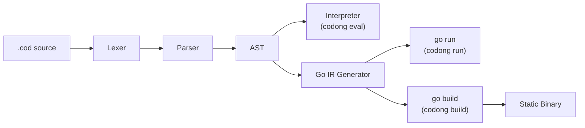
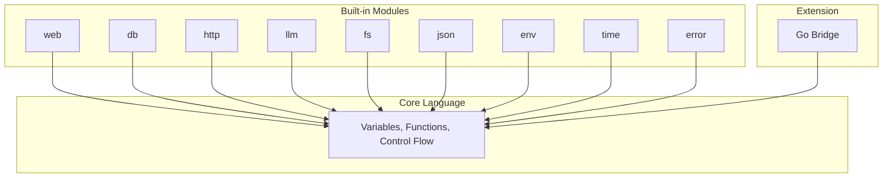
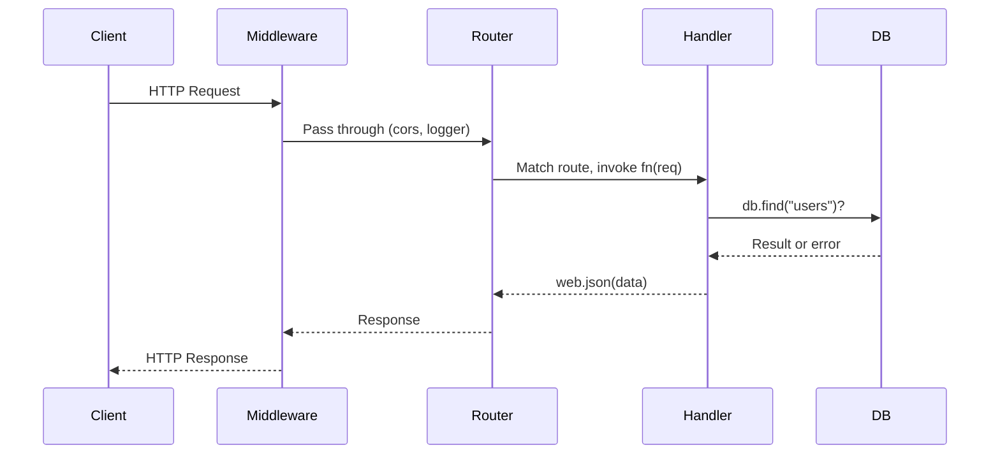
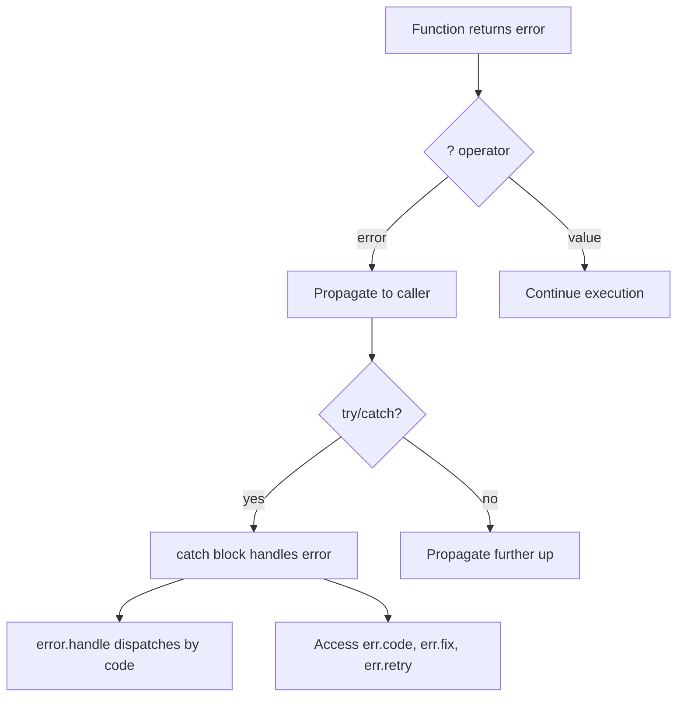

<p align="center">
  <strong>CODONG</strong><br>
  세계 최초의 AI 네이티브 프로그래밍 언어
</p>

<p align="center">
  <a href="https://codong.org">웹사이트</a> |
  <a href="https://codong.org/arena/">Arena</a> |
  <a href="../SPEC.md">언어 사양</a> |
  <a href="../WHITEPAPER.md">백서</a> |
  <a href="../SPEC_FOR_AI.md">AI 사양</a>
</p>

<p align="center">
  <a href="../LICENSE"></a>
  
  
  <a href="https://codong.org/arena/"></a>
</p>

<p align="center">
  <a href="../README.md">English</a> |
  <a href="./README_zh.md">中文</a> |
  <a href="./README_ja.md">日本語</a> |
  <a href="./README_ru.md">Русский</a> |
  <a href="./README_de.md">Deutsch</a>
</p>

---

## Arena 벤치마크: Codong vs. 기존 언어들

AI 모델이 동일한 애플리케이션을 서로 다른 언어로 작성할 때, Codong은 획기적으로
적은 코드, 적은 토큰으로 더 빠르게 완성합니다. 이 수치들은
[Codong Arena](https://codong.org/arena/)에서 가져온 것으로, 모든 모델이 동일한 사양을 각 언어로
작성하고 결과가 자동으로 측정됩니다.

<p align="center">
  
  <br />
  <sub>실시간 벤치마크: Claude Sonnet 4가 태그, 검색, 페이지네이션이 포함된 Posts CRUD API를 생성. <a href="https://codong.org/arena/">직접 실행해 보세요</a></sub>
</p>

| 지표 | Codong | Python | JavaScript | Java | Go |
|--------|--------|--------|------------|------|-----|
| 총 토큰 수 | **955** | 1,867 | 1,710 | 4,367 | 3,270 |
| 생성 시간 | **8.6s** | 15.3s | 13.7s | 37.4s | 26.6s |
| 코드 줄 수 | **10** | 143 | 147 | 337 | 289 |
| 예상 비용 | **$0.012** | $0.025 | $0.022 | $0.062 | $0.046 |
| 출력 토큰 | **722** | 1,597 | 1,439 | 4,096 | 3,001 |
| Codong 대비 | -- | +121% | +99% | +467% | +316% |

직접 벤치마크를 실행해 보세요: [codong.org/arena](https://codong.org/arena/)

---

## 30초 만에 시작하기

```bash
# 1. 바이너리 다운로드
curl -fsSL https://codong.org/install.sh | sh

# 2. 첫 번째 프로그램 작성
echo 'print("Hello, Codong!")' > hello.cod

# 3. 실행
codong eval hello.cod
```

다섯 줄로 만드는 웹 API:

```
web.get("/", fn(req) => web.json({message: "Hello from Codong"}))
web.get("/health", fn(req) => web.json({status: "ok"}))
server = web.serve(port: 8080)
```

```bash
codong run server.cod
# curl http://localhost:8080/
```

---

## AI가 Codong을 작성하게 하세요 -- 설치 불필요

Codong을 사용하기 위해 설치할 필요가 없습니다.
[`SPEC_FOR_AI.md`](../SPEC_FOR_AI.md) 파일을 아무 LLM(Claude, GPT, Gemini, LLaMA)에
시스템 프롬프트나 컨텍스트로 전달하면, AI가 즉시 올바른 Codong 코드를 작성할 수 있습니다.

**1단계.** [`SPEC_FOR_AI.md`](../SPEC_FOR_AI.md)의 내용을 복사합니다 (2,000단어 미만).

**2단계.** AI 대화에 컨텍스트로 붙여넣기:

```
[여기에 SPEC_FOR_AI.md 내용을 붙여넣기]

사용자 목록을 CRUD 작업과 SQLite 저장소로 관리하는
Codong REST API를 작성해 주세요.
```

**3단계.** AI가 유효한 Codong 코드를 생성합니다:

```
db.connect("sqlite:///users.db")
db.create_table("users", {id: "integer primary key autoincrement", name: "text", email: "text"})
server = web.serve(port: 8080)
server.get("/users", fn(req) { return web.json(db.find("users")) })
server.post("/users", fn(req) { return web.json(db.insert("users", req.body), 201) })
server.get("/users/:id", fn(req) { return web.json(db.find_one("users", {id: to_number(req.param("id"))})) })
server.delete("/users/:id", fn(req) { db.delete("users", {id: to_number(req.param("id"))}); return web.json({}, 204) })
```

이것이 가능한 이유는 Codong이 모든 작업에 대해 단일하고 명확한 구문으로 설계되었기 때문입니다.
AI가 프레임워크, import 스타일, 또는 경쟁하는 패턴 중에서 선택할 필요가 없습니다.
모든 것을 작성하는 올바른 방법은 단 하나입니다.

| LLM 제공자 | 방법 |
|-------------|--------|
| Claude (Anthropic) | 시스템 프롬프트에 SPEC 붙여넣기, 또는 반복 사용 시 [Prompt Caching](https://docs.anthropic.com/en/docs/build-with-claude/prompt-caching) 활용 |
| GPT (OpenAI) | 첫 번째 사용자 메시지 또는 시스템 지시로 SPEC 붙여넣기 |
| Gemini (Google) | 대화 컨텍스트로 SPEC 붙여넣기 |
| LLaMA / Ollama | API 또는 Ollama modelfile을 통해 시스템 프롬프트에 SPEC 포함 |
| 모든 LLM | 시스템 프롬프트 또는 컨텍스트 윈도우를 지원하는 모든 모델에서 작동 |

> **직접 벤치마크해 보세요**: [codong.org/arena](https://codong.org/arena/)를 방문하여
> Codong과 다른 언어 간의 실시간 토큰 소비량 및 생성 속도 비교를 확인하세요.

---

## 왜 Codong인가

대부분의 프로그래밍 언어는 인간이 작성하고 기계가 실행하도록 설계되었습니다. Codong은
AI가 작성하고, 인간이 검토하고, 기계가 실행하도록 설계되었습니다. AI가 생성한 코드에서
가장 큰 세 가지 마찰 요인을 제거합니다.

### 문제 1: 선택 마비가 토큰을 소모한다

Python에는 HTTP 요청을 만드는 방법이 다섯 가지 이상 있습니다. 모든 선택은 토큰을 소모하고
예측할 수 없는 출력을 생성합니다. Codong은 모든 것을 하는 방법이 정확히 하나입니다.

| 작업 | Python 옵션 | Codong |
|------|---------------|--------|
| HTTP 요청 | requests, urllib, httpx, aiohttp, http.client | `http.get(url)` |
| 웹 서버 | Flask, FastAPI, Django, Starlette, Tornado | `web.serve(port: N)` |
| 데이터베이스 | SQLAlchemy, psycopg2, pymongo, peewee, Django ORM | `db.connect(url)` |
| JSON 파싱 | json.loads, orjson, ujson, simplejson | `json.parse(s)` |

### 문제 2: 에러가 AI에게 읽기 어렵다

스택 트레이스는 인간을 위해 설계되었습니다. AI 에이전트는 수정을 시도하기 전에
`Traceback (most recent call last)`를 파싱하는 데 수백 개의 토큰을 소비합니다. Codong에서
모든 에러는 AI에게 정확히 무엇을 해야 하는지 알려주는 `fix` 필드가 포함된 구조화된 JSON입니다.

```json
{
  "error":   "db.find",
  "code":    "E2001_NOT_FOUND",
  "message": "table 'users' not found",
  "fix":     "run db.migrate() to create the table",
  "retry":   false
}
```

### 문제 3: 패키지 선택이 컨텍스트를 낭비한다

비즈니스 로직을 작성하기 전에 AI는 HTTP 라이브러리, 데이터베이스 드라이버, JSON
파서를 선택하고, 버전 충돌을 해결하고, 설정해야 합니다. Codong은 AI 작업량의 90%를
처리하는 8개의 내장 모듈을 제공합니다. 패키지 매니저가 필요 없습니다.

### 결과: 70% 이상 토큰 절감

| 토큰 비용 | Python/JS | Codong | 절감량 |
|-----------|-----------|--------|---------|
| HTTP 프레임워크 선택 | ~300 | 0 | 100% |
| 데이터베이스 ORM 선택 | ~400 | 0 | 100% |
| 에러 메시지 파싱 | ~500 | ~50 | 90% |
| 패키지 버전 해결 | ~800 | 0 | 100% |
| 비즈니스 로직 작성 | ~800 | ~800 | 0% |
| **합계** | **~2,800** | **~850** | **~70%** |

---

## 언어 설계

Codong은 의도적으로 작습니다. 23개의 키워드. 6개의 원시 타입. 각각의 작업을 수행하는 방법은 단 하나.

### 23개의 키워드 (Python: 35, JavaScript: 64, Java: 67)

```
fn       return   if       else     for      while    match
break    continue const    import   export   try      catch
go       select   interface type    null     true     false
in       _
```

### 변수

```
name = "Ada"
age = 30
active = true
nothing = null
const MAX_RETRIES = 3
```

`var`, `let`, `:=`가 없습니다. 대입은 항상 `=`입니다.

### 함수

```
fn greet(name, greeting = "Hello") {
    return "{greeting}, {name}!"
}

print(greet("Ada"))                    // Hello, Ada!
print(greet("Bob", greeting: "Hi"))    // Hi, Bob!

double = fn(x) => x * 2               // 화살표 함수
```

### 문자열 보간

```
name = "Ada"
print("Hello, {name}!")                      // 변수
print("Total: {items.len()} items")          // 메서드 호출
print("Sum: {a + b}")                        // 표현식
print("{user.name} joined on {user.date}")   // 멤버 접근
```

`{}` 안에 모든 표현식을 사용할 수 있습니다. 백틱, `f"..."`, `${}` 없이.

### 컬렉션

```
items = [1, 2, 3, 4, 5]
doubled = items.map(fn(x) => x * 2)
evens = items.filter(fn(x) => x % 2 == 0)
total = items.reduce(fn(acc, x) => acc + x, 0)

user = {name: "Ada", age: 30}
user.email = "ada@example.com"
print(user.get("phone", "N/A"))        // N/A
```

### 제어 흐름

```
if score >= 90 {
    print("A")
} else if score >= 80 {
    print("B")
} else {
    print("C")
}

for item in items {
    print(item)
}

for i in range(0, 10) {
    print(i)
}

while running {
    data = poll()
}

match status {
    200 => print("ok")
    404 => print("not found")
    _   => print("error: {status}")
}
```

### `?` 연산자를 사용한 에러 처리

```
fn divide(a, b) {
    if b == 0 {
        return error.new("E_MATH", "division by zero")
    }
    return a / b
}

fn half_of_division(a, b) {
    result = divide(a, b)?
    return result / 2
}

try {
    half_of_division(10, 0)?
} catch err {
    print(err.code)       // E_MATH
    print(err.message)    // division by zero
}
```

`?` 연산자는 에러를 콜 스택 위로 자동 전파합니다. 중첩된
`if err != nil` 체인이 없습니다. 검사되지 않은 예외도 없습니다.

### 컴팩트 에러 형식

AI 파이프라인에서 약 39%의 토큰을 절약하려면 컴팩트 형식으로 전환하세요:

```
error.set_format("compact")
// output: err_code:E_MATH|src:divide|fix:check divisor|retry:false
```

---

## 아키텍처

Codong 소스 파일(`.cod`)은 다단계 파이프라인을 통해 처리됩니다. 인터프리터 경로는
스크립트와 REPL을 위한 즉각적인 시작을 제공합니다. Go IR 경로는 프로덕션 배포를 위해
네이티브 Go로 컴파일합니다.



### 실행 모드

| 모드 | 파이프라인 | 시작 시간 | 사용 사례 |
|------|----------|---------|----------|
| `codong eval` | .cod -> AST -> 인터프리터 | 1초 미만 | 스크립트, REPL, Playground |
| `codong run` | .cod -> AST -> Go IR -> `go run` | 0.3-2초 | 개발, AI 에이전트 실행 |
| `codong build` | .cod -> AST -> Go IR -> `go build` | 해당 없음 (한 번 컴파일) | 프로덕션 배포 |

```bash
codong eval script.cod    # AST 인터프리터, 즉시 시작
codong run app.cod        # Go IR, 전체 stdlib, 개발
codong build app.cod      # 단일 정적 바이너리, 프로덕션
```

### Go와의 관계

Codong은 동등한 Go 코드로 컴파일한 후 Go 툴체인을 활용하여 실행 및
컴파일합니다. TypeScript -> JavaScript 또는 Kotlin -> JVM 바이트코드와 동일한 모델입니다.

| Codong 제공 | Go 제공 |
|----------------|-------------|
| AI 네이티브 구문 설계 | 메모리 관리, 가비지 컬렉션 |
| 고제약 도메인 API | 고루틴 동시성 스케줄링 |
| 구조화된 JSON 에러 시스템 | 크로스 플랫폼 컴파일 |
| 8개의 내장 모듈 추상화 | 10년 이상 검증된 런타임 |
| Go Bridge 확장 프로토콜 | 수십만 개의 에코시스템 라이브러리 |

---

## 내장 모듈

Codong에는 8개의 모듈이 포함되어 있습니다. 설치 불필요, 버전 충돌 없음, 선택 불필요.

| 모듈 | 목적 | 주요 메서드 |
|--------|---------|-------------|
| [`web`](#web-모듈) | HTTP 서버, 라우팅, 미들웨어, WebSocket | serve, get, post, put, delete |
| [`db`](#db-모듈) | PostgreSQL, MySQL, MongoDB, Redis, SQLite | connect, find, insert, update, delete |
| [`http`](#http-모듈) | HTTP 클라이언트 | get, post, put, delete, patch |
| [`llm`](#llm-모듈) | GPT, Claude, Gemini -- 통합 인터페이스 | ask, chat, stream, embed |
| [`fs`](#fs-모듈) | 파일 시스템 작업 | read, write, list, mkdir, stat |
| [`json`](#json-모듈) | JSON 처리 | parse, stringify, valid, merge |
| [`env`](#env-모듈) | 환경 변수 | get, require, has, all, load |
| [`time`](#time-모듈) | 날짜, 시간, 기간 | now, sleep, format, parse, diff |
| [`error`](#error-모듈) | 구조화된 에러 생성 및 처리 | new, wrap, handle, retry |



---

## 코드 예제

### Hello World API

```
web.get("/", fn(req) => web.json({message: "Hello from Codong"}))
server = web.serve(port: 8080)
```

### TODO CRUD API

```
db.connect("file:todo.db")
db.query("CREATE TABLE IF NOT EXISTS todos (id INTEGER PRIMARY KEY AUTOINCREMENT, title TEXT, done INTEGER)")

web.get("/todos", fn(req) {
    return web.json(db.find("todos"))
})

web.post("/todos", fn(req) {
    db.insert("todos", {title: req.body.title, done: 0})
    return web.json({created: true})
})

web.put("/todos/{id}", fn(req) {
    db.update("todos", {id: to_number(req.param.id)}, {done: 1})
    return web.json({updated: true})
})

web.delete("/todos/{id}", fn(req) {
    db.delete("todos", {id: to_number(req.param.id)})
    return web.json({deleted: true})
})

server = web.serve(port: 3000)
```

### LLM 기반 엔드포인트

```
web.post("/ask", fn(req) {
    question = req.body.question
    context = db.find("docs", {relevant: true})?
    answer = llm.ask(
        model: "gpt-4o",
        prompt: "Answer using context: {context}\n\nQuestion: {question}",
        format: "json"
    )?
    return web.json(answer)
})

server = web.serve(port: 8080)
```

### 파일 처리 스크립트

```
files = fs.list("./data")
for file in files {
    if fs.extension(file) == ".csv" {
        content = fs.read(file)
        lines = content.split("\n")
        print("{fs.basename(file)}: {lines.len()} lines")
        fs.write("./output/{fs.basename(file)}.processed", content.upper())
    }
}
print("done")
```

### `?` 연산자를 사용한 에러 처리

```
fn load_config(path) {
    content = fs.read(path)?
    config = json.parse(content)?
    host = config.get("host", "localhost")
    port = config.get("port", 8080)
    return {host: host, port: port}
}

try {
    config = load_config("config.json")?
    print("Server: {config.host}:{config.port}")
} catch err {
    print("Failed: {err.code} - {err.fix}")
}
```

---

## 전체 API 레퍼런스

### 코어 언어

#### 데이터 타입

| 타입 | 예제 | 비고 |
|------|---------|-------|
| `string` | `"hello"`, `"value is {x}"` | 큰따옴표만 사용. `{expr}` 보간. |
| `number` | `42`, `3.14`, `-1` | 64비트 부동소수점. |
| `bool` | `true`, `false` | |
| `null` | `null` | `null`과 `false`만 거짓(falsy). |
| `list` | `[1, 2, 3]` | 0부터 인덱싱. 음수 인덱스 지원. |
| `map` | `{name: "Ada"}` | 순서 보장. 점 및 괄호 접근. |

#### 내장 함수

| 함수 | 반환값 | 설명 |
|----------|---------|-------------|
| `print(value)` | null | stdout에 출력. 단일 인수; 여러 값은 보간 사용. |
| `type_of(x)` | string | `"string"`, `"number"`, `"bool"`, `"null"`, `"list"`, `"map"`, `"fn"` 반환. |
| `to_string(x)` | string | 모든 값을 문자열 표현으로 변환. |
| `to_number(x)` | number/null | 숫자로 파싱. 유효하지 않으면 `null` 반환. |
| `to_bool(x)` | bool | 불리언으로 변환. |
| `range(start, end)` | list | `start`부터 `end - 1`까지의 정수. |

#### 연산자

| 우선순위 | 연산자 | 설명 |
|------------|-----------|-------------|
| 1 | `()` `[]` `.` `?` | 그룹화, 인덱스, 멤버, 에러 전파 |
| 2 | `!` `-` (단항) | 논리 부정, 부호 반전 |
| 3 | `*` `/` `%` | 곱셈, 나눗셈, 나머지 |
| 4 | `+` `-` | 덧셈, 뺄셈 |
| 5 | `<` `>` `<=` `>=` | 비교 |
| 6 | `==` `!=` | 동등성 |
| 7 | `&&` | 논리곱 |
| 8 | `\|\|` | 논리합 |
| 9 | `<-` | 채널 송수신 |
| 10 | `=` `+=` `-=` `*=` `/=` | 대입 |

---

### 문자열 메서드

17개 메서드. 모든 메서드는 새 문자열을 반환합니다 (문자열은 불변).

| 메서드 | 반환값 | 설명 |
|--------|---------|-------------|
| `s.len()` | number | 문자열의 바이트 길이. |
| `s.upper()` | string | 대문자로 변환. |
| `s.lower()` | string | 소문자로 변환. |
| `s.trim()` | string | 앞뒤 공백 제거. |
| `s.trim_start()` | string | 앞쪽 공백 제거. |
| `s.trim_end()` | string | 뒤쪽 공백 제거. |
| `s.split(sep)` | list | 구분자로 분할하여 문자열 리스트 반환. |
| `s.contains(sub)` | bool | 부분 문자열을 포함하면 `true` 반환. |
| `s.starts_with(prefix)` | bool | 접두사로 시작하면 `true` 반환. |
| `s.ends_with(suffix)` | bool | 접미사로 끝나면 `true` 반환. |
| `s.replace(old, new)` | string | `old`의 모든 출현을 `new`로 교체. |
| `s.index_of(sub)` | number | 첫 번째 출현의 인덱스. 없으면 `-1` 반환. |
| `s.slice(start, end?)` | string | 부분 문자열 추출. `end`는 선택 사항. |
| `s.repeat(n)` | string | 문자열을 `n`번 반복. |
| `s.to_number()` | number/null | 숫자로 파싱. 유효하지 않으면 `null` 반환. |
| `s.to_bool()` | bool | `"true"` / `"1"`은 `true` 반환; 나머지는 `false`. |
| `s.match(pattern)` | list | 정규식 매칭. 모든 매치의 리스트 반환. |

---

### 리스트 메서드

20개 메서드. 변경 메서드는 원본 리스트를 수정하고 체이닝을 위해 `self`를 반환합니다.

| 메서드 | 변경 | 반환값 | 설명 |
|--------|---------|---------|-------------|
| `l.len()` | 아니오 | number | 요소 수. |
| `l.push(item)` | **예** | self | 끝에 항목 추가. |
| `l.pop()` | **예** | item | 마지막 요소를 제거하고 반환. |
| `l.shift()` | **예** | item | 첫 번째 요소를 제거하고 반환. |
| `l.unshift(item)` | **예** | self | 앞에 항목 추가. |
| `l.sort(fn?)` | **예** | self | 제자리 정렬. 선택적 비교 함수. |
| `l.reverse()` | **예** | self | 제자리 역순. |
| `l.slice(start, end?)` | 아니오 | list | `start`부터 `end`까지의 새 부분 리스트. |
| `l.map(fn)` | 아니오 | list | 각 요소에 `fn`을 적용한 새 리스트. |
| `l.filter(fn)` | 아니오 | list | `fn`이 참을 반환하는 요소만 포함한 새 리스트. |
| `l.reduce(fn, init)` | 아니오 | any | `init`부터 시작하여 `fn(acc, item)`으로 누적. |
| `l.find(fn)` | 아니오 | item/null | `fn`이 참을 반환하는 첫 번째 요소. |
| `l.find_index(fn)` | 아니오 | number | 첫 번째 매치의 인덱스. 없으면 `-1`. |
| `l.contains(item)` | 아니오 | bool | 리스트에 항목이 있으면 `true` 반환. |
| `l.index_of(item)` | 아니오 | number | 첫 번째 출현의 인덱스. 없으면 `-1` 반환. |
| `l.flat(depth?)` | 아니오 | list | 평탄화된 새 리스트. 기본 깊이는 1. |
| `l.unique()` | 아니오 | list | 중복이 제거된 새 리스트. |
| `l.join(sep)` | 아니오 | string | 구분자로 요소를 결합하여 문자열 반환. |
| `l.first()` | 아니오 | item/null | 첫 번째 요소, 비어있으면 `null`. |
| `l.last()` | 아니오 | item/null | 마지막 요소, 비어있으면 `null`. |

---

### Map 메서드

10개 메서드. `delete`만 원본 맵을 변경합니다.

| 메서드 | 변경 | 반환값 | 설명 |
|--------|---------|---------|-------------|
| `m.len()` | 아니오 | number | 키-값 쌍의 수. |
| `m.keys()` | 아니오 | list | 모든 키의 리스트. |
| `m.values()` | 아니오 | list | 모든 값의 리스트. |
| `m.entries()` | 아니오 | list | `[key, value]` 쌍의 리스트. |
| `m.has(key)` | 아니오 | bool | 키가 존재하면 `true` 반환. |
| `m.get(key, default?)` | 아니오 | any | 키로 값 조회. 없으면 `default` (또는 `null`) 반환. |
| `m.delete(key)` | **예** | self | 키-값 쌍을 제자리에서 제거. |
| `m.merge(other)` | 아니오 | map | `other`를 `self`에 병합한 새 맵. 충돌 시 `other` 우선. |
| `m.map_values(fn)` | 아니오 | map | 각 값에 `fn`을 적용한 새 맵. |
| `m.filter(fn)` | 아니오 | map | `fn(key, value)`가 참을 반환하는 항목만 포함한 새 맵. |

---

### web 모듈

라우팅, 미들웨어, WebSocket을 지원하는 HTTP 서버.

#### 서버

| 메서드 | 설명 |
|--------|-------------|
| `web.serve(port: N)` | 포트 `N`에서 HTTP 서버 시작. 서버 핸들 반환. |

#### 라우트 등록

| 메서드 | 설명 |
|--------|-------------|
| `web.get(path, handler)` | GET 라우트 등록. |
| `web.post(path, handler)` | POST 라우트 등록. |
| `web.put(path, handler)` | PUT 라우트 등록. |
| `web.delete(path, handler)` | DELETE 라우트 등록. |
| `web.patch(path, handler)` | PATCH 라우트 등록. |

라우트 핸들러는 `req.body`, `req.param`, `req.query`, `req.headers`를 포함하는 요청 객체를 수신합니다.

#### 응답 헬퍼

| 메서드 | 설명 |
|--------|-------------|
| `web.json(data)` | `Content-Type: application/json`으로 JSON 응답 반환. |
| `web.text(string)` | 일반 텍스트 응답 반환. |
| `web.html(string)` | HTML 응답 반환. |
| `web.redirect(url)` | 리다이렉트 응답 반환. |
| `web.response(status, body, headers)` | 상태 코드와 헤더가 포함된 커스텀 응답 반환. |

#### 정적 파일과 미들웨어

| 메서드 | 설명 |
|--------|-------------|
| `web.static(path, dir)` | 디렉토리에서 정적 파일 제공. |
| `web.middleware(name_or_fn)` | 미들웨어 적용. 내장: `"cors"`, `"logger"`, `"recover"`, `"auth_bearer"`. |
| `web.ws(path, handler)` | WebSocket 엔드포인트 등록. |

```
// 미들웨어 예제
web.middleware("cors")
web.middleware("logger")
web.middleware(fn(req, next) {
    print("Request: {req.method} {req.path}")
    return next(req)
})
```



---

### db 모듈

SQL 및 NoSQL 데이터베이스를 위한 통합 인터페이스.

#### 연결

| 메서드 | 설명 |
|--------|-------------|
| `db.connect(url)` | 데이터베이스에 연결. URL이 드라이버를 결정: `postgres://`, `mysql://`, `mongodb://`, `redis://`, `file:` (SQLite). |

#### 스키마

| 메서드 | 설명 |
|--------|-------------|
| `db.create_table(name, schema)` | 스키마 맵으로 테이블 생성. |
| `db.create_index(table, fields)` | 지정된 필드에 인덱스 생성. |

#### CRUD 작업

| 메서드 | 설명 |
|--------|-------------|
| `db.insert(table, data)` | 단일 레코드 삽입. |
| `db.insert_batch(table, list)` | 여러 레코드 삽입. |
| `db.find(table, filter?)` | 일치하는 모든 레코드 검색. 리스트 반환. |
| `db.find_one(table, filter)` | 일치하는 첫 번째 레코드 검색. 맵 또는 null 반환. |
| `db.update(table, filter, data)` | 일치하는 레코드를 새 데이터로 업데이트. |
| `db.delete(table, filter)` | 일치하는 레코드 삭제. |
| `db.upsert(table, filter, data)` | 삽입 또는 존재하면 업데이트. |

#### 쿼리 및 집계

| 메서드 | 설명 |
|--------|-------------|
| `db.count(table, filter?)` | 일치하는 레코드 수 카운트. |
| `db.exists(table, filter)` | 일치하는 레코드가 있으면 `true` 반환. |
| `db.query(sql, params?)` | 원시 SQL 쿼리 실행. `?` 플레이스홀더 사용. |
| `db.query_one(sql, params?)` | 원시 SQL 실행, 첫 번째 결과 반환. |
| `db.transaction(fn)` | 트랜잭션 내에서 함수 실행. |
| `db.stats()` | 연결 풀 통계 반환. |

```
db.connect("file:app.db")
db.insert("users", {name: "Ada", role: "engineer"})
engineers = db.find("users", {role: "engineer"})
db.update("users", {name: "Ada"}, {role: "senior engineer"})
count = db.count("users")
```

---

### http 모듈

외부 요청을 위한 HTTP 클라이언트.

| 메서드 | 설명 |
|--------|-------------|
| `http.get(url, options?)` | GET 요청 전송. 응답 객체 반환. |
| `http.post(url, body?, options?)` | 선택적 JSON 본문과 함께 POST 요청 전송. |
| `http.put(url, body?, options?)` | PUT 요청 전송. |
| `http.delete(url, options?)` | DELETE 요청 전송. |
| `http.patch(url, body?, options?)` | PATCH 요청 전송. |
| `http.request(method, url, options)` | 커스텀 메서드와 전체 옵션으로 요청 전송. |

응답 객체: `resp.status` (number), `resp.ok` (bool), `resp.json()` (파싱된 JSON),
`resp.text()` (원시 본문), `resp.headers` (map).

```
resp = http.get("https://api.example.com/users")
if resp.ok {
    users = resp.json()
    print("Found {users.len()} users")
}

resp = http.post("https://api.example.com/users", {
    name: "Ada",
    role: "engineer"
})
```

---

### llm 모듈

대규모 언어 모델을 위한 통합 인터페이스. GPT, Claude, Gemini 및 모든
OpenAI 호환 API를 지원합니다.

| 메서드 | 설명 |
|--------|-------------|
| `llm.ask(prompt, model:, system?:, format?:)` | 단일 프롬프트, 단일 응답. `format: "json"`은 구조화된 데이터 반환. |
| `llm.chat(messages, model:)` | 다중 턴 대화. 메시지: `[{role:, content:}]`. |
| `llm.stream(prompt, model:, on_chunk:)` | 토큰 단위로 응답 스트리밍. |
| `llm.embed(text, model:)` | 임베딩 벡터 생성. |
| `llm.count_tokens(text)` | 텍스트의 토큰 수 추정. |

```
// 단일 질문
answer = llm.ask("What is 2+2?", model: "gpt-4o")

// 구조화된 출력
data = llm.ask("List 3 colors", model: "gpt-4o", format: "json")

// 다중 턴 대화
response = llm.chat([
    {role: "system", content: "You are a helpful assistant."},
    {role: "user", content: "What is Codong?"},
    {role: "assistant", content: "Codong is an AI-native programming language."},
    {role: "user", content: "What makes it special?"}
], model: "claude-sonnet-4-20250514")

// 토큰 추정
tokens = llm.count_tokens("Hello, this is a test.")
print("Tokens: {tokens}")
```

---

### fs 모듈

파일과 디렉토리를 읽기, 쓰기, 관리하기 위한 파일 시스템 작업.

#### 파일 작업

| 메서드 | 설명 |
|--------|-------------|
| `fs.read(path)` | 전체 파일을 문자열로 읽기. |
| `fs.write(path, content)` | 파일에 문자열 쓰기 (덮어쓰기). |
| `fs.append(path, content)` | 파일에 문자열 추가. |
| `fs.delete(path)` | 파일 삭제. |
| `fs.copy(src, dst)` | `src`에서 `dst`로 파일 복사. |
| `fs.move(src, dst)` | 파일 이동/이름 변경. |
| `fs.exists(path)` | 경로가 존재하면 `true` 반환. |

#### 디렉토리 작업

| 메서드 | 설명 |
|--------|-------------|
| `fs.list(dir)` | 디렉토리의 파일 목록. 경로 리스트 반환. |
| `fs.mkdir(path)` | 디렉토리 생성 (상위 포함). |
| `fs.rmdir(path)` | 디렉토리 제거. |
| `fs.stat(path)` | 파일 메타데이터 반환: 크기, 수정 시간, is_dir. |

#### 구조화된 I/O

| 메서드 | 설명 |
|--------|-------------|
| `fs.read_json(path)` | JSON 파일을 읽고 파싱. |
| `fs.write_json(path, data)` | 데이터를 포맷된 JSON으로 쓰기. |
| `fs.read_lines(path)` | 파일을 줄 리스트로 읽기. |
| `fs.write_lines(path, lines)` | 줄 리스트를 파일에 쓰기. |

#### 경로 유틸리티

| 메서드 | 설명 |
|--------|-------------|
| `fs.join(parts...)` | 경로 세그먼트 결합. |
| `fs.cwd()` | 현재 작업 디렉토리 반환. |
| `fs.basename(path)` | 경로에서 파일명 반환. |
| `fs.dirname(path)` | 경로에서 디렉토리 반환. |
| `fs.extension(path)` | 파일 확장자 반환. |
| `fs.safe_join(base, path)` | 디렉토리 순회 보호가 적용된 경로 결합. |
| `fs.temp_file(prefix?)` | 임시 파일 생성. 경로 반환. |
| `fs.temp_dir(prefix?)` | 임시 디렉토리 생성. 경로 반환. |

---

### json 모듈

JSON 파싱, 생성, 조작.

| 메서드 | 설명 |
|--------|-------------|
| `json.parse(string)` | JSON 문자열을 Codong 값(map, list 등)으로 파싱. |
| `json.stringify(value)` | Codong 값을 JSON 문자열로 변환. |
| `json.valid(string)` | 문자열이 유효한 JSON이면 `true` 반환. |
| `json.merge(a, b)` | 두 맵을 깊게 병합. 충돌 시 `b` 우선. |
| `json.get(value, path)` | 점 경로로 중첩된 값 가져오기 (예: `"user.name"`). |
| `json.set(value, path, new_val)` | 점 경로로 중첩된 값 설정. 새 구조 반환. |
| `json.flatten(value)` | 중첩된 맵을 점 표기법 키로 평탄화. |
| `json.unflatten(value)` | 점 표기법 키를 중첩된 맵으로 복원. |

```
data = json.parse("{\"name\": \"Ada\", \"age\": 30}")
text = json.stringify({name: "Ada", scores: [95, 87, 92]})
name = json.get(data, "name")
```

---

### env 모듈

환경 변수 접근 및 `.env` 파일 로딩.

| 메서드 | 설명 |
|--------|-------------|
| `env.get(key, default?)` | 환경 변수 가져오기. 설정되지 않으면 `default` (또는 `null`) 반환. |
| `env.require(key)` | 환경 변수 가져오기. 설정되지 않으면 에러 반환. |
| `env.has(key)` | 환경 변수가 설정되어 있으면 `true` 반환. |
| `env.all()` | 모든 환경 변수의 맵 반환. |
| `env.load(path?)` | `.env` 파일 로드. 기본 경로: `.env`. |

```
env.load()
api_key = env.require("OPENAI_API_KEY")?
db_url = env.get("DATABASE_URL", "file:dev.db")
```

---

### time 모듈

날짜, 시간, 기간 및 스케줄링 유틸리티.

| 메서드 | 설명 |
|--------|-------------|
| `time.sleep(ms)` | `ms` 밀리초 동안 실행 일시 중지. |
| `time.now()` | 밀리초 단위의 현재 Unix 타임스탬프. |
| `time.now_iso()` | ISO 8601 문자열로 된 현재 시간. |
| `time.format(timestamp, pattern)` | 패턴으로 타임스탬프 포맷. |
| `time.parse(string, pattern)` | 시간 문자열을 타임스탬프로 파싱. |
| `time.diff(a, b)` | 두 타임스탬프 간의 밀리초 차이. |
| `time.since(timestamp)` | 지정된 타임스탬프 이후의 밀리초. |
| `time.until(timestamp)` | 지정된 타임스탬프까지의 밀리초. |
| `time.add(timestamp, ms)` | 타임스탬프에 밀리초 추가. |
| `time.is_before(a, b)` | `a`가 `b` 이전이면 `true` 반환. |
| `time.is_after(a, b)` | `a`가 `b` 이후이면 `true` 반환. |
| `time.today_start()` | 오늘 시작의 타임스탬프 (00:00:00). |
| `time.today_end()` | 오늘 끝의 타임스탬프 (23:59:59). |

```
start = time.now()
time.sleep(100)
elapsed = time.since(start)
print("Elapsed: {elapsed}ms")
print("Current time: {time.now_iso()}")
```

---

### error 모듈

구조화된 에러 생성, 래핑, 포맷팅 및 디스패치.

| 메서드 | 설명 |
|--------|-------------|
| `error.new(code, message, fix?:, retry?:)` | 새 구조화된 에러 생성. |
| `error.wrap(err, context)` | 기존 에러에 컨텍스트 추가. |
| `error.is(value)` | 값이 에러 객체이면 `true` 반환. |
| `error.unwrap(err)` | 래핑된 에러에서 내부 에러 반환. |
| `error.to_json(err)` | 에러를 JSON 문자열로 변환. |
| `error.to_compact(err)` | 에러를 컴팩트 형식 문자열로 변환. |
| `error.from_json(string)` | JSON 문자열을 에러 객체로 파싱. |
| `error.from_compact(string)` | 컴팩트 형식 문자열을 에러 객체로 파싱. |
| `error.set_format(fmt)` | 글로벌 형식 설정: `"json"` (기본값) 또는 `"compact"`. |
| `error.handle(result, handlers)` | 에러 코드별 디스패치. `code -> fn(err)` 맵. 기본값은 `"_"` 사용. |
| `error.retry(fn, max_attempts)` | 재시도 가능한 에러 반환 시 함수 자동 재시도. |

```
err = error.new("E_INVALID", "bad input", fix: "check the value")

result = error.handle(some_result, {
    "E_NOT_FOUND": fn(err) => "Missing: {err.fix}",
    "E_TIMEOUT": fn(err) => "Timed out",
    "_": fn(err) => "Unknown: {err.code}"
})

final = error.retry(fn() {
    return http.get("https://api.example.com/data")
}, 3)
```



---

## 동시성

Codong은 Go 스타일의 고루틴과 채널을 사용한 동시성을 제공합니다.

```
// 동시 실행 시작
go fn() {
    data = fetch_data()
    ch <- data
}()

// 채널
ch = channel()
ch <- "message"           // 전송
msg = <-ch                // 수신

// 버퍼 채널
ch = channel(size: 10)

// Select (멀티플렉싱)
select {
    msg = <-ch1 {
        handle(msg)
    }
    msg = <-ch2 {
        process(msg)
    }
    <-done {
        break
    }
}
```

---

## Go Bridge

8개의 내장 모듈 외부의 기능이 필요할 때, Go Bridge를 사용하면 인간 아키텍트가
모든 Go 패키지를 AI 소비용으로 래핑할 수 있습니다. AI는 함수 이름과 반환 값만 봅니다.
권한은 명시적으로 선언됩니다.

### 등록 (codong.toml)

```toml
[bridge]
pdf_render = { fn = "bridge.RenderPDF", permissions = ["fs:write:/tmp/output"] }
wechat_pay = { fn = "bridge.WechatPay", permissions = ["net:outbound"] }
hash_md5   = { fn = "bridge.HashMD5", permissions = [] }
```

### 권한 유형

| 권한 | 형식 | 범위 |
|------------|--------|-------|
| 없음 | `[]` | 순수 계산, I/O 없음 |
| 네트워크 | `["net:outbound"]` | 아웃바운드 HTTP만 |
| 파일 읽기 | `["fs:read:<path>"]` | 지정된 디렉토리에서 읽기 |
| 파일 쓰기 | `["fs:write:<path>"]` | 지정된 디렉토리에 쓰기 |

### .cod 파일에서의 사용

```
result = pdf_render(html: content, output: "report.pdf")
if result.error {
    print("render failed: {result.error}")
}
```

bridge 함수에서 금지된 작업: `os.Exit`, `syscall`, `os/exec`, `net.Listen`,
호스트 루트 파일시스템 접근.

---

## 타입 시스템

타입 어노테이션은 자동 JSON Schema 생성을 위한 `agent.tool` 사용 시를 제외하고
모든 곳에서 선택 사항입니다.

```
// 타입 선언
type User = {
    name: string,
    age: number,
    email: string,
}

// 인터페이스 (구조적 타이핑)
interface Searchable {
    fn search(query: string) => list
}

// agent.tool을 위한 어노테이션된 함수
fn search(query: string, limit: number) {
    return db.find("docs", {q: query}, limit: limit)
}

// agent.tool이 어노테이션을 읽고 자동으로 JSON Schema 생성
agent.tool("search", search, "Search the knowledge base")
```

---

## 모듈 시스템

내장 모듈은 직접 사용 가능합니다. 커스텀 모듈은 `import`/`export`를 사용합니다.

```
// math_utils.cod
export fn square(x) { return x * x }
export const PI = 3.14159

// main.cod
import { square, PI } from "./math_utils.cod"
```

서드파티 패키지는 이름 점유를 방지하기 위해 스코프 이름을 사용합니다:

```
import { verify } from "@codong/jwt"
import { hash } from "@alice/crypto"
```

`codong.lock`은 SHA-256 해시에 고정된 100% 재현 가능한 빌드를 보장합니다.

---

## AI 통합

Codong은 처음부터 AI에 의해 사용되도록 설계되었습니다.

### 방법 1: SPEC.md 주입 (현재 사용 가능)

[`SPEC_FOR_AI.md`](../SPEC_FOR_AI.md) (2,000단어 미만)를 아무 LLM 시스템 프롬프트에 주입합니다.
모델이 아무것도 설치하지 않고 즉시 올바른 Codong 코드를 작성합니다.

### 방법 2: MCP 서버 (Claude Desktop)

공식 MCP 서버를 통해 Claude Desktop이 Codong을 작성, 컴파일, 로컬 실행할 수 있습니다.
Codong은 네이티브 AI 물리적 실행 기능을 갖춘 최초의 프로그래밍 언어입니다.

### 방법 3: OpenAI Function Calling

Codong 실행기를 함수로 등록합니다. GPT가 대화 내에서 Codong 코드를 작성하고
실행합니다.

---

## 필수 코드 스타일

| 규칙 | 표준 |
|------|----------|
| 들여쓰기 | 4칸 공백 (탭 불가) |
| 이름 규칙 | 변수, 함수, 모듈에 `snake_case` |
| 타입 이름 | `PascalCase` |
| 줄 길이 | 최대 120자 |
| 중괄호 | 여는 `{`를 같은 줄에 |
| 문자열 | 큰따옴표 `"`만 사용 (작은따옴표 불가) |
| 후행 쉼표 | 여러 줄 list/map에서 필수 |

`codong fmt`가 모든 스타일 규칙을 자동 적용합니다.

---

## 에코시스템 호환성

| 카테고리 | 지원 |
|----------|-----------|
| AI 모델 | GPT-4o, Claude 3.5, Gemini 1.5 Pro, Llama 3, 모든 OpenAI 호환 API |
| 데이터베이스 | PostgreSQL, MySQL, MongoDB, Redis, SQLite, Pinecone, Qdrant, Supabase |
| 클라우드 | AWS, GCP, Azure, Cloudflare R2, Vercel |
| 메시지 큐 | Kafka, RabbitMQ, AWS SQS, NATS |
| 컨테이너 | Docker, Kubernetes, Helm, Terraform |
| 확장 | Go Bridge를 통한 모든 Go 라이브러리 |

---

## 로드맵

| 단계 | 상태 | 결과물 |
|-------|--------|-------------|
| 0 | 완료 | SPEC.md -- 컴파일러 없이 AI가 Codong을 작성 가능 |
| 1 | 완료 | `codong eval` -- 코어 언어, error 모듈, CLI |
| 2 | 진행 중 | `web`, `db`, `http`, `llm` 모듈 |
| 3 | 예정 | `agent`, `cloud`, `queue`, `cron` 모듈 |
| 4 | 예정 | `codong build` -- 단일 정적 바이너리 |
| 5 | 예정 | 50개 예제 + 전체 문서 |
| 6 | 예정 | codong.org + 브라우저 Playground (WASM) |
| 7 | 예정 | VS Code 확장 + Claude Desktop용 MCP 서버 |
| 8 | 예정 | 패키지 레지스트리 + `codong.lock` |

---

## 프로젝트 구조

```
Codong/
  cmd/              CLI 진입점 (codong eval, run, build)
  engine/
    lexer/          토크나이저
    parser/         파서 (AST 생성)
    interpreter/    트리 워킹 인터프리터 (codong eval)
    goirgen/        Go IR 코드 생성기 (codong run/build)
    runner/         Go 툴체인 러너
  stdlib/           표준 라이브러리 구현
  examples/         57개 예제 프로그램 (01_hello.cod ~ 57_llm_module.cod)
  tests/            테스트 하네스
  SPEC.md           완전한 언어 사양
  SPEC_FOR_AI.md    정답/오답 예제가 포함된 AI 최적화 사양
  WHITEPAPER.md     설계 근거 및 아키텍처 비전
```

---

## 언어 레퍼런스

완전한 언어 사양은 [`SPEC.md`](../SPEC.md)를 참조하세요.

모든 규칙에 대한 정답/오답 예제가 포함된 AI 최적화 버전은
[`SPEC_FOR_AI.md`](../SPEC_FOR_AI.md)를 참조하세요. 이를 아무 LLM 시스템 프롬프트에 주입하면
아무것도 설치하지 않고 올바른 Codong 코드 생성이 가능합니다.

전체 설계 근거, 아키텍처 결정 및 프로젝트 비전은
[`WHITEPAPER.md`](../WHITEPAPER.md)를 참조하세요.

---

## 기여하기

Codong은 MIT 라이선스이며 기여를 환영합니다.

**시작하기:**

```bash
git clone https://github.com/brettinhere/Codong.git
cd Codong
go build ./cmd/codong
./codong eval examples/01_hello.cod
```

**기여할 수 있는 영역:**

| 영역 | 영향력 | 난이도 |
|------|--------|-----------|
| Go IR 생성기 (`engine/goirgen/`) | 가장 높은 레버리지 | 고급 |
| 표준 라이브러리 모듈 (`stdlib/`) | 높음 | 중급 |
| 예제 프로그램 (`examples/`) | 커뮤니티 성장 | 초급 |
| 버그 리포트 및 테스트 케이스 | 품질 | 모든 수준 |

**가이드라인:**

- 코드를 작성하기 전에 [`SPEC.md`](../SPEC.md)를 읽어주세요.
- `tests/run_examples.sh`를 실행하여 모든 예제가 통과하는지 확인하세요.
- 풀 리퀘스트 당 하나의 기능.
- 필수 코드 스타일을 따르세요 (4칸 공백, `snake_case`, 큰따옴표).

---

## 링크

| 리소스 | URL |
|----------|-----|
| 웹사이트 | [codong.org](https://codong.org) |
| Arena (실시간 벤치마크) | [codong.org/arena](https://codong.org/arena/) |
| GitHub | [github.com/brettinhere/Codong](https://github.com/brettinhere/Codong) |
| Arena 저장소 | [github.com/brettinhere/codong-arena](https://github.com/brettinhere/codong-arena) |

---

## 라이선스

MIT -- [LICENSE](../LICENSE) 참조

---

CODONG -- codong.org -- 세계 최초의 AI 네이티브 프로그래밍 언어
