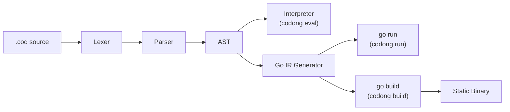
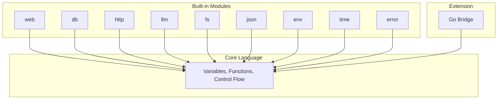
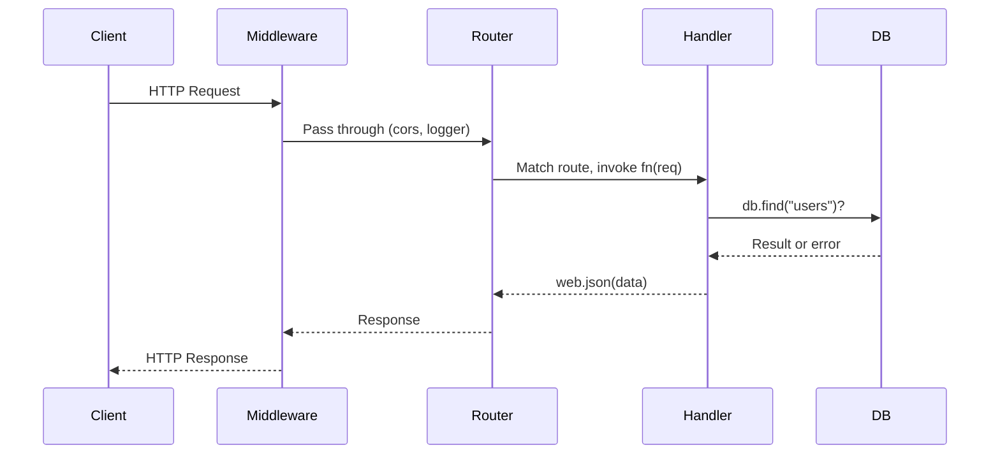
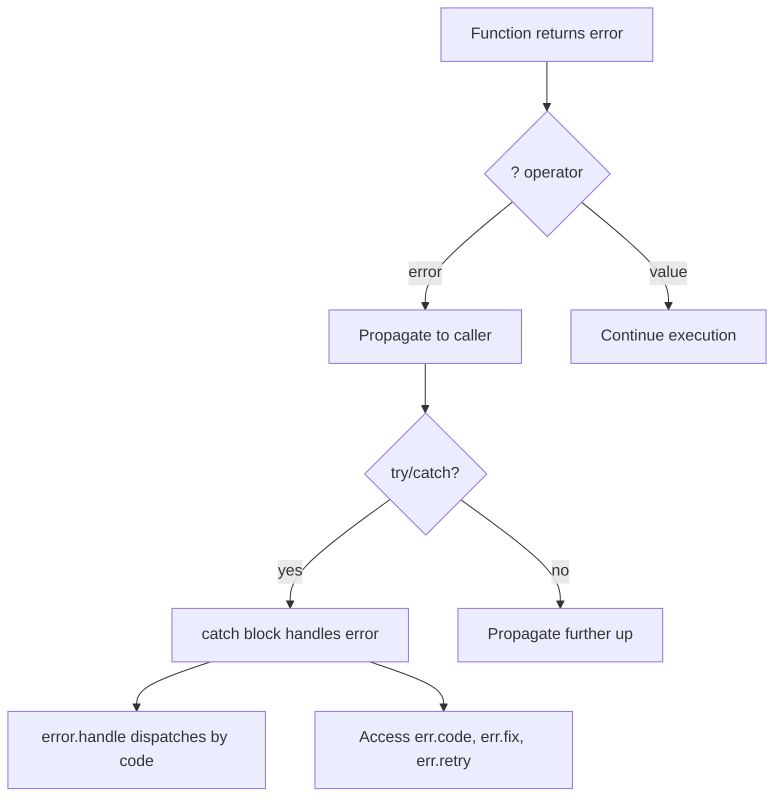

<p align="center">
  <strong>CODONG</strong><br>
  Первый в мире AI-нативный язык программирования
</p>

<p align="center">
  <a href="https://codong.org">Сайт</a> |
  <a href="https://codong.org/arena/">Arena</a> |
  <a href="../SPEC.md">Спецификация</a> |
  <a href="../WHITEPAPER.md">Белая книга</a> |
  <a href="../SPEC_FOR_AI.md">AI спецификация</a>
</p>

<p align="center">
  <a href="../LICENSE"></a>
  
  
  <a href="https://codong.org/arena/"></a>
</p>

<p align="center">
  <a href="../README.md">English</a> |
  <a href="./README_zh.md">中文</a> |
  <a href="./README_ja.md">日本語</a> |
  <a href="./README_ko.md">한국어</a> |
  <a href="./README_de.md">Deutsch</a>
</p>

---

## Бенчмарк Arena: Codong vs. устоявшиеся языки

Когда AI-модель пишет одно и то же приложение на разных языках, Codong генерирует значительно
меньше кода, меньше токенов и завершает работу быстрее. Эти данные получены из
[Codong Arena](https://codong.org/arena/), где любая модель пишет одну и ту же спецификацию на каждом языке,
а результаты измеряются автоматически.

<p align="center">
  
  <br />
  <sub>Живой бенчмарк: Claude Sonnet 4 генерирует Posts CRUD API с тегами, поиском и пагинацией. <a href="https://codong.org/arena/">Запустите сами</a></sub>
</p>

| Метрика | Codong | Python | JavaScript | Java | Go |
|--------|--------|--------|------------|------|-----|
| Всего токенов | **955** | 1,867 | 1,710 | 4,367 | 3,270 |
| Время генерации | **8.6s** | 15.3s | 13.7s | 37.4s | 26.6s |
| Строк кода | **10** | 143 | 147 | 337 | 289 |
| Примерная стоимость | **$0.012** | $0.025 | $0.022 | $0.062 | $0.046 |
| Выходные токены | **722** | 1,597 | 1,439 | 4,096 | 3,001 |
| По сравнению с Codong | -- | +121% | +99% | +467% | +316% |

Запустите собственный бенчмарк: [codong.org/arena](https://codong.org/arena/)

---

## Быстрый старт за 30 секунд

```bash
# 1. Скачайте бинарный файл
curl -fsSL https://codong.org/install.sh | sh

# 2. Напишите первую программу
echo 'print("Hello, Codong!")' > hello.cod

# 3. Запустите
codong eval hello.cod
```

Веб API в пяти строках:

```
web.get("/", fn(req) => web.json({message: "Hello from Codong"}))
web.get("/health", fn(req) => web.json({status: "ok"}))
server = web.serve(port: 8080)
```

```bash
codong run server.cod
# curl http://localhost:8080/
```

---

## Пусть AI пишет Codong -- установка не требуется

Для начала работы с Codong не нужно ничего устанавливать. Отправьте файл
[`SPEC_FOR_AI.md`](../SPEC_FOR_AI.md) в любую LLM (Claude, GPT, Gemini, LLaMA)
в качестве системного промпта или контекста, и AI сможет немедленно писать корректный код на Codong.

**Шаг 1.** Скопируйте содержимое [`SPEC_FOR_AI.md`](../SPEC_FOR_AI.md) (менее 2 000 слов).

**Шаг 2.** Вставьте его в диалог с AI в качестве контекста:

```
[Вставьте содержимое SPEC_FOR_AI.md сюда]

Теперь напишите Codong REST API, который управляет списком пользователей
с CRUD-операциями и хранением в SQLite.
```

**Шаг 3.** AI генерирует валидный код на Codong:

```
db.connect("sqlite:///users.db")
db.create_table("users", {id: "integer primary key autoincrement", name: "text", email: "text"})
server = web.serve(port: 8080)
server.get("/users", fn(req) { return web.json(db.find("users")) })
server.post("/users", fn(req) { return web.json(db.insert("users", req.body), 201) })
server.get("/users/:id", fn(req) { return web.json(db.find_one("users", {id: to_number(req.param("id"))})) })
server.delete("/users/:id", fn(req) { db.delete("users", {id: to_number(req.param("id"))}); return web.json({}, 204) })
```

Это работает, потому что Codong был спроектирован с единым, однозначным синтаксисом для каждой операции.
AI не нужно выбирать между фреймворками, стилями импорта или конкурирующими паттернами.
Один правильный способ написать всё.

| Провайдер LLM | Метод |
|-------------|--------|
| Claude (Anthropic) | Вставьте SPEC в системный промпт или используйте [Prompt Caching](https://docs.anthropic.com/en/docs/build-with-claude/prompt-caching) для повторного использования |
| GPT (OpenAI) | Вставьте SPEC как первое сообщение пользователя или системную инструкцию |
| Gemini (Google) | Вставьте SPEC как контекст в диалоге |
| LLaMA / Ollama | Включите SPEC в системный промпт через API или Ollama modelfile |
| Любая LLM | Работает с любой моделью, поддерживающей системный промпт или контекстное окно |

> **Проверьте сами**: Посетите [codong.org/arena](https://codong.org/arena/), чтобы увидеть
> сравнение потребления токенов и скорости генерации между Codong и другими языками в реальном времени.

---

## Почему Codong

Большинство языков программирования были разработаны для того, чтобы люди писали, а машины исполняли. Codong
спроектирован для того, чтобы AI писал, люди проверяли, а машины исполняли. Он устраняет три самых
крупных источника трения в коде, сгенерированном AI.

### Проблема 1: Паралич выбора сжигает токены

В Python есть пять или более способов сделать HTTP-запрос. Каждый выбор стоит токенов и
производит непредсказуемый результат. В Codong есть ровно один способ сделать всё.

| Задача | Варианты Python | Codong |
|------|---------------|--------|
| HTTP-запрос | requests, urllib, httpx, aiohttp, http.client | `http.get(url)` |
| Веб-сервер | Flask, FastAPI, Django, Starlette, Tornado | `web.serve(port: N)` |
| База данных | SQLAlchemy, psycopg2, pymongo, peewee, Django ORM | `db.connect(url)` |
| Парсинг JSON | json.loads, orjson, ujson, simplejson | `json.parse(s)` |

### Проблема 2: Ошибки нечитаемы для AI

Стек-трейсы спроектированы для людей. AI-агент тратит сотни токенов на парсинг
`Traceback (most recent call last)`, прежде чем попытаться исправить ошибку. В Codong каждая ошибка —
это структурированный JSON с полем `fix`, которое указывает AI, что именно делать.

```json
{
  "error":   "db.find",
  "code":    "E2001_NOT_FOUND",
  "message": "table 'users' not found",
  "fix":     "run db.migrate() to create the table",
  "retry":   false
}
```

### Проблема 3: Выбор пакетов тратит контекст

Прежде чем написать бизнес-логику, AI должен выбрать HTTP-библиотеку, драйвер базы данных, JSON-
парсер, разрешить конфликты версий и настроить их. Codong поставляется с восемью встроенными модулями,
покрывающими 90% рабочих нагрузок AI. Менеджер пакетов не требуется.

### Результат: более 70% экономии токенов

| Затраты токенов | Python/JS | Codong | Экономия |
|-----------|-----------|--------|---------|
| Выбор HTTP-фреймворка | ~300 | 0 | 100% |
| Выбор ORM для БД | ~400 | 0 | 100% |
| Парсинг сообщений об ошибках | ~500 | ~50 | 90% |
| Разрешение версий пакетов | ~800 | 0 | 100% |
| Написание бизнес-логики | ~800 | ~800 | 0% |
| **Итого** | **~2,800** | **~850** | **~70%** |

---

## Дизайн языка

Codong намеренно минималистичен. 23 ключевых слова. 6 примитивных типов. Один способ сделать каждую вещь.

### 23 ключевых слова (Python: 35, JavaScript: 64, Java: 67)

```
fn       return   if       else     for      while    match
break    continue const    import   export   try      catch
go       select   interface type    null     true     false
in       _
```

### Переменные

```
name = "Ada"
age = 30
active = true
nothing = null
const MAX_RETRIES = 3
```

Нет `var`, `let` или `:=`. Присваивание — это `=`, всегда.

### Функции

```
fn greet(name, greeting = "Hello") {
    return "{greeting}, {name}!"
}

print(greet("Ada"))                    // Hello, Ada!
print(greet("Bob", greeting: "Hi"))    // Hi, Bob!

double = fn(x) => x * 2               // стрелочная функция
```

### Интерполяция строк

```
name = "Ada"
print("Hello, {name}!")                      // переменная
print("Total: {items.len()} items")          // вызов метода
print("Sum: {a + b}")                        // выражение
print("{user.name} joined on {user.date}")   // доступ к полю
```

Любое выражение допустимо внутри `{}`. Без обратных кавычек, без `f"..."`, без `${}`.

### Коллекции

```
items = [1, 2, 3, 4, 5]
doubled = items.map(fn(x) => x * 2)
evens = items.filter(fn(x) => x % 2 == 0)
total = items.reduce(fn(acc, x) => acc + x, 0)

user = {name: "Ada", age: 30}
user.email = "ada@example.com"
print(user.get("phone", "N/A"))        // N/A
```

### Управление потоком

```
if score >= 90 {
    print("A")
} else if score >= 80 {
    print("B")
} else {
    print("C")
}

for item in items {
    print(item)
}

for i in range(0, 10) {
    print(i)
}

while running {
    data = poll()
}

match status {
    200 => print("ok")
    404 => print("not found")
    _   => print("error: {status}")
}
```

### Обработка ошибок с оператором `?`

```
fn divide(a, b) {
    if b == 0 {
        return error.new("E_MATH", "division by zero")
    }
    return a / b
}

fn half_of_division(a, b) {
    result = divide(a, b)?
    return result / 2
}

try {
    half_of_division(10, 0)?
} catch err {
    print(err.code)       // E_MATH
    print(err.message)    // division by zero
}
```

Оператор `?` автоматически передаёт ошибки вверх по стеку вызовов. Никаких вложенных
цепочек `if err != nil`. Никаких непроверенных исключений.

### Компактный формат ошибок

Переключитесь на компактный формат для экономии около 39% токенов в AI-конвейерах:

```
error.set_format("compact")
// output: err_code:E_MATH|src:divide|fix:check divisor|retry:false
```

---

## Архитектура

Исходные файлы Codong (`.cod`) обрабатываются через многоступенчатый конвейер. Путь интерпретатора
обеспечивает мгновенный запуск для скриптов и REPL. Путь Go IR компилирует в нативный Go для
продакшен-развёртывания.



### Режимы выполнения

| Режим | Конвейер | Запуск | Применение |
|------|----------|---------|----------|
| `codong eval` | .cod -> AST -> Интерпретатор | Менее секунды | Скрипты, REPL, Playground |
| `codong run` | .cod -> AST -> Go IR -> `go run` | 0.3-2 сек | Разработка, выполнение AI-агентом |
| `codong build` | .cod -> AST -> Go IR -> `go build` | Н/Д (компиляция единожды) | Продакшен-развёртывание |

```bash
codong eval script.cod    # AST-интерпретатор, мгновенный запуск
codong run app.cod        # Go IR, полная stdlib, разработка
codong build app.cod      # Единый статический бинарник, продакшен
```

### Связь с Go

Codong компилируется в эквивалентный код Go, а затем использует Go-тулчейн для выполнения и
компиляции. Это та же модель, что TypeScript -> JavaScript или Kotlin -> байткод JVM.

| Codong предоставляет | Go предоставляет |
|----------------|-------------|
| AI-нативный дизайн синтаксиса | Управление памятью, сборка мусора |
| Высокоуровневые доменные API | Конкурентность на горутинах |
| Структурированная система ошибок JSON | Кроссплатформенная компиляция |
| 8 встроенных модулей-абстракций | Проверенный рантайм (10+ лет) |
| Протокол расширения Go Bridge | Сотни тысяч библиотек экосистемы |

---

## Встроенные модули

Восемь модулей поставляются с Codong. Без установки, без конфликтов версий, без выбора.

| Модуль | Назначение | Ключевые методы |
|--------|---------|-------------|
| [`web`](#модуль-web) | HTTP-сервер, маршрутизация, middleware, WebSocket | serve, get, post, put, delete |
| [`db`](#модуль-db) | PostgreSQL, MySQL, MongoDB, Redis, SQLite | connect, find, insert, update, delete |
| [`http`](#модуль-http) | HTTP-клиент | get, post, put, delete, patch |
| [`llm`](#модуль-llm) | GPT, Claude, Gemini — единый интерфейс | ask, chat, stream, embed |
| [`fs`](#модуль-fs) | Операции с файловой системой | read, write, list, mkdir, stat |
| [`json`](#модуль-json) | Обработка JSON | parse, stringify, valid, merge |
| [`env`](#модуль-env) | Переменные окружения | get, require, has, all, load |
| [`time`](#модуль-time) | Дата, время, длительность | now, sleep, format, parse, diff |
| [`error`](#модуль-error) | Создание и обработка структурированных ошибок | new, wrap, handle, retry |



---

## Примеры кода

### Hello World API

```
web.get("/", fn(req) => web.json({message: "Hello from Codong"}))
server = web.serve(port: 8080)
```

### TODO CRUD API

```
db.connect("file:todo.db")
db.query("CREATE TABLE IF NOT EXISTS todos (id INTEGER PRIMARY KEY AUTOINCREMENT, title TEXT, done INTEGER)")

web.get("/todos", fn(req) {
    return web.json(db.find("todos"))
})

web.post("/todos", fn(req) {
    db.insert("todos", {title: req.body.title, done: 0})
    return web.json({created: true})
})

web.put("/todos/{id}", fn(req) {
    db.update("todos", {id: to_number(req.param.id)}, {done: 1})
    return web.json({updated: true})
})

web.delete("/todos/{id}", fn(req) {
    db.delete("todos", {id: to_number(req.param.id)})
    return web.json({deleted: true})
})

server = web.serve(port: 3000)
```

### Эндпоинт с LLM

```
web.post("/ask", fn(req) {
    question = req.body.question
    context = db.find("docs", {relevant: true})?
    answer = llm.ask(
        model: "gpt-4o",
        prompt: "Answer using context: {context}\n\nQuestion: {question}",
        format: "json"
    )?
    return web.json(answer)
})

server = web.serve(port: 8080)
```

### Скрипт обработки файлов

```
files = fs.list("./data")
for file in files {
    if fs.extension(file) == ".csv" {
        content = fs.read(file)
        lines = content.split("\n")
        print("{fs.basename(file)}: {lines.len()} lines")
        fs.write("./output/{fs.basename(file)}.processed", content.upper())
    }
}
print("done")
```

### Обработка ошибок с оператором `?`

```
fn load_config(path) {
    content = fs.read(path)?
    config = json.parse(content)?
    host = config.get("host", "localhost")
    port = config.get("port", 8080)
    return {host: host, port: port}
}

try {
    config = load_config("config.json")?
    print("Server: {config.host}:{config.port}")
} catch err {
    print("Failed: {err.code} - {err.fix}")
}
```

---

## Полный справочник API

### Ядро языка

#### Типы данных

| Тип | Пример | Примечания |
|------|---------|-------|
| `string` | `"hello"`, `"value is {x}"` | Только двойные кавычки. Интерполяция `{expr}`. |
| `number` | `42`, `3.14`, `-1` | 64-битное число с плавающей точкой. |
| `bool` | `true`, `false` | |
| `null` | `null` | Только `null` и `false` являются ложными. |
| `list` | `[1, 2, 3]` | Индексация с нуля. Поддержка отрицательных индексов. |
| `map` | `{name: "Ada"}` | Упорядоченная. Доступ через точку и скобки. |

#### Встроенные функции

| Функция | Возвращает | Описание |
|----------|---------|-------------|
| `print(value)` | null | Вывод в stdout. Один аргумент; для нескольких значений используйте интерполяцию. |
| `type_of(x)` | string | Возвращает `"string"`, `"number"`, `"bool"`, `"null"`, `"list"`, `"map"`, `"fn"`. |
| `to_string(x)` | string | Преобразование любого значения в строковое представление. |
| `to_number(x)` | number/null | Парсинг в число. Возвращает `null`, если невалидно. |
| `to_bool(x)` | bool | Преобразование в логическое значение. |
| `range(start, end)` | list | Целые числа от `start` до `end - 1`. |

#### Операторы

| Приоритет | Операторы | Описание |
|------------|-----------|-------------|
| 1 | `()` `[]` `.` `?` | Группировка, индекс, поле, распространение ошибок |
| 2 | `!` `-` (унарный) | Логическое отрицание, смена знака |
| 3 | `*` `/` `%` | Умножение, деление, остаток |
| 4 | `+` `-` | Сложение, вычитание |
| 5 | `<` `>` `<=` `>=` | Сравнение |
| 6 | `==` `!=` | Равенство |
| 7 | `&&` | Логическое И |
| 8 | `\|\|` | Логическое ИЛИ |
| 9 | `<-` | Отправка/получение через канал |
| 10 | `=` `+=` `-=` `*=` `/=` | Присваивание |

---

### Методы строк

17 методов. Все возвращают новые строки (строки неизменяемы).

| Метод | Возвращает | Описание |
|--------|---------|-------------|
| `s.len()` | number | Длина строки в байтах. |
| `s.upper()` | string | Преобразование в верхний регистр. |
| `s.lower()` | string | Преобразование в нижний регистр. |
| `s.trim()` | string | Удаление начальных и конечных пробелов. |
| `s.trim_start()` | string | Удаление начальных пробелов. |
| `s.trim_end()` | string | Удаление конечных пробелов. |
| `s.split(sep)` | list | Разделение по разделителю в список строк. |
| `s.contains(sub)` | bool | Возвращает `true`, если строка содержит подстроку. |
| `s.starts_with(prefix)` | bool | Возвращает `true`, если строка начинается с префикса. |
| `s.ends_with(suffix)` | bool | Возвращает `true`, если строка заканчивается суффиксом. |
| `s.replace(old, new)` | string | Замена всех вхождений `old` на `new`. |
| `s.index_of(sub)` | number | Индекс первого вхождения. Возвращает `-1`, если не найдено. |
| `s.slice(start, end?)` | string | Извлечение подстроки. `end` необязателен. |
| `s.repeat(n)` | string | Повторение строки `n` раз. |
| `s.to_number()` | number/null | Парсинг как число. Возвращает `null`, если невалидно. |
| `s.to_bool()` | bool | `"true"` / `"1"` возвращает `true`; всё остальное — `false`. |
| `s.match(pattern)` | list | Regex-сопоставление. Возвращает список всех совпадений. |

---

### Методы списков

20 методов. Мутирующие методы изменяют исходный список и возвращают `self` для цепочки.

| Метод | Мутирует | Возвращает | Описание |
|--------|---------|---------|-------------|
| `l.len()` | нет | number | Количество элементов. |
| `l.push(item)` | **да** | self | Добавление элемента в конец. |
| `l.pop()` | **да** | item | Удаление и возврат последнего элемента. |
| `l.shift()` | **да** | item | Удаление и возврат первого элемента. |
| `l.unshift(item)` | **да** | self | Добавление элемента в начало. |
| `l.sort(fn?)` | **да** | self | Сортировка на месте. Необязательная функция сравнения. |
| `l.reverse()` | **да** | self | Обращение на месте. |
| `l.slice(start, end?)` | нет | list | Новый подсписок от `start` до `end`. |
| `l.map(fn)` | нет | list | Новый список с `fn`, применённой к каждому элементу. |
| `l.filter(fn)` | нет | list | Новый список с элементами, для которых `fn` возвращает истину. |
| `l.reduce(fn, init)` | нет | any | Накопление с `fn(acc, item)`, начиная с `init`. |
| `l.find(fn)` | нет | item/null | Первый элемент, для которого `fn` возвращает истину. |
| `l.find_index(fn)` | нет | number | Индекс первого совпадения. Возвращает `-1`, если не найдено. |
| `l.contains(item)` | нет | bool | Возвращает `true`, если список содержит элемент. |
| `l.index_of(item)` | нет | number | Индекс первого вхождения. Возвращает `-1`, если не найдено. |
| `l.flat(depth?)` | нет | list | Новый выровненный список. Глубина по умолчанию — 1. |
| `l.unique()` | нет | list | Новый список без дубликатов. |
| `l.join(sep)` | нет | string | Объединение элементов в строку с разделителем. |
| `l.first()` | нет | item/null | Первый элемент или `null`, если пуст. |
| `l.last()` | нет | item/null | Последний элемент или `null`, если пуст. |

---

### Методы Map

10 методов. Только `delete` мутирует исходную коллекцию.

| Метод | Мутирует | Возвращает | Описание |
|--------|---------|---------|-------------|
| `m.len()` | нет | number | Количество пар ключ-значение. |
| `m.keys()` | нет | list | Список всех ключей. |
| `m.values()` | нет | list | Список всех значений. |
| `m.entries()` | нет | list | Список пар `[key, value]`. |
| `m.has(key)` | нет | bool | Возвращает `true`, если ключ существует. |
| `m.get(key, default?)` | нет | any | Получение значения по ключу. Возвращает `default` (или `null`), если отсутствует. |
| `m.delete(key)` | **да** | self | Удаление пары ключ-значение на месте. |
| `m.merge(other)` | нет | map | Новая коллекция с объединением `other` в `self`. `other` имеет приоритет при конфликте. |
| `m.map_values(fn)` | нет | map | Новая коллекция с `fn`, применённой к каждому значению. |
| `m.filter(fn)` | нет | map | Новая коллекция с записями, для которых `fn(key, value)` возвращает истину. |

---

### Модуль web

HTTP-сервер с маршрутизацией, middleware и поддержкой WebSocket.

#### Сервер

| Метод | Описание |
|--------|-------------|
| `web.serve(port: N)` | Запуск HTTP-сервера на порту `N`. Возвращает дескриптор сервера. |

#### Регистрация маршрутов

| Метод | Описание |
|--------|-------------|
| `web.get(path, handler)` | Регистрация маршрута GET. |
| `web.post(path, handler)` | Регистрация маршрута POST. |
| `web.put(path, handler)` | Регистрация маршрута PUT. |
| `web.delete(path, handler)` | Регистрация маршрута DELETE. |
| `web.patch(path, handler)` | Регистрация маршрута PATCH. |

Обработчики маршрутов получают объект запроса с `req.body`, `req.param`, `req.query`, `req.headers`.

#### Вспомогательные функции ответа

| Метод | Описание |
|--------|-------------|
| `web.json(data)` | Возврат JSON-ответа с `Content-Type: application/json`. |
| `web.text(string)` | Возврат текстового ответа. |
| `web.html(string)` | Возврат HTML-ответа. |
| `web.redirect(url)` | Возврат ответа с перенаправлением. |
| `web.response(status, body, headers)` | Возврат пользовательского ответа с кодом статуса и заголовками. |

#### Статические файлы и Middleware

| Метод | Описание |
|--------|-------------|
| `web.static(path, dir)` | Раздача статических файлов из директории. |
| `web.middleware(name_or_fn)` | Применение middleware. Встроенные: `"cors"`, `"logger"`, `"recover"`, `"auth_bearer"`. |
| `web.ws(path, handler)` | Регистрация WebSocket-эндпоинта. |

```
// Пример middleware
web.middleware("cors")
web.middleware("logger")
web.middleware(fn(req, next) {
    print("Request: {req.method} {req.path}")
    return next(req)
})
```



---

### Модуль db

Единый интерфейс для SQL и NoSQL баз данных.

#### Подключение

| Метод | Описание |
|--------|-------------|
| `db.connect(url)` | Подключение к базе данных. URL определяет драйвер: `postgres://`, `mysql://`, `mongodb://`, `redis://`, `file:` (SQLite). |

#### Схема

| Метод | Описание |
|--------|-------------|
| `db.create_table(name, schema)` | Создание таблицы со схемой. |
| `db.create_index(table, fields)` | Создание индекса по указанным полям. |

#### CRUD-операции

| Метод | Описание |
|--------|-------------|
| `db.insert(table, data)` | Вставка одной записи. |
| `db.insert_batch(table, list)` | Вставка нескольких записей. |
| `db.find(table, filter?)` | Поиск всех совпадающих записей. Возвращает список. |
| `db.find_one(table, filter)` | Поиск первой совпадающей записи. Возвращает map или null. |
| `db.update(table, filter, data)` | Обновление совпадающих записей новыми данными. |
| `db.delete(table, filter)` | Удаление совпадающих записей. |
| `db.upsert(table, filter, data)` | Вставка или обновление, если существует. |

#### Запросы и агрегация

| Метод | Описание |
|--------|-------------|
| `db.count(table, filter?)` | Подсчёт совпадающих записей. |
| `db.exists(table, filter)` | Возвращает `true`, если есть совпадающая запись. |
| `db.query(sql, params?)` | Выполнение сырого SQL-запроса. Используйте плейсхолдеры `?`. |
| `db.query_one(sql, params?)` | Выполнение сырого SQL, возврат первого результата. |
| `db.transaction(fn)` | Выполнение функции в рамках транзакции. |
| `db.stats()` | Возврат статистики пула соединений. |

```
db.connect("file:app.db")
db.insert("users", {name: "Ada", role: "engineer"})
engineers = db.find("users", {role: "engineer"})
db.update("users", {name: "Ada"}, {role: "senior engineer"})
count = db.count("users")
```

---

### Модуль http

HTTP-клиент для исходящих запросов.

| Метод | Описание |
|--------|-------------|
| `http.get(url, options?)` | Отправка GET-запроса. Возвращает объект ответа. |
| `http.post(url, body?, options?)` | Отправка POST-запроса с опциональным JSON-телом. |
| `http.put(url, body?, options?)` | Отправка PUT-запроса. |
| `http.delete(url, options?)` | Отправка DELETE-запроса. |
| `http.patch(url, body?, options?)` | Отправка PATCH-запроса. |
| `http.request(method, url, options)` | Отправка запроса с пользовательским методом и полными опциями. |

Объект ответа: `resp.status` (number), `resp.ok` (bool), `resp.json()` (разобранный JSON),
`resp.text()` (сырое тело), `resp.headers` (map).

```
resp = http.get("https://api.example.com/users")
if resp.ok {
    users = resp.json()
    print("Found {users.len()} users")
}

resp = http.post("https://api.example.com/users", {
    name: "Ada",
    role: "engineer"
})
```

---

### Модуль llm

Единый интерфейс для больших языковых моделей. Поддержка GPT, Claude, Gemini и любого
OpenAI-совместимого API.

| Метод | Описание |
|--------|-------------|
| `llm.ask(prompt, model:, system?:, format?:)` | Один промпт, один ответ. `format: "json"` возвращает структурированные данные. |
| `llm.chat(messages, model:)` | Многоходовой диалог. Сообщения: `[{role:, content:}]`. |
| `llm.stream(prompt, model:, on_chunk:)` | Потоковый ответ по токенам. |
| `llm.embed(text, model:)` | Генерация вектора эмбеддинга. |
| `llm.count_tokens(text)` | Оценка количества токенов в тексте. |

```
// Одиночный вопрос
answer = llm.ask("What is 2+2?", model: "gpt-4o")

// Структурированный вывод
data = llm.ask("List 3 colors", model: "gpt-4o", format: "json")

// Многоходовой диалог
response = llm.chat([
    {role: "system", content: "You are a helpful assistant."},
    {role: "user", content: "What is Codong?"},
    {role: "assistant", content: "Codong is an AI-native programming language."},
    {role: "user", content: "What makes it special?"}
], model: "claude-sonnet-4-20250514")

// Оценка токенов
tokens = llm.count_tokens("Hello, this is a test.")
print("Tokens: {tokens}")
```

---

### Модуль fs

Операции файловой системы для чтения, записи и управления файлами и директориями.

#### Операции с файлами

| Метод | Описание |
|--------|-------------|
| `fs.read(path)` | Чтение всего файла как строки. |
| `fs.write(path, content)` | Запись строки в файл (перезапись). |
| `fs.append(path, content)` | Добавление строки в файл. |
| `fs.delete(path)` | Удаление файла. |
| `fs.copy(src, dst)` | Копирование файла из `src` в `dst`. |
| `fs.move(src, dst)` | Перемещение/переименование файла. |
| `fs.exists(path)` | Возвращает `true`, если путь существует. |

#### Операции с директориями

| Метод | Описание |
|--------|-------------|
| `fs.list(dir)` | Список файлов в директории. Возвращает список путей. |
| `fs.mkdir(path)` | Создание директории (включая родительские). |
| `fs.rmdir(path)` | Удаление директории. |
| `fs.stat(path)` | Возврат метаданных файла: размер, время изменения, is_dir. |

#### Структурированный ввод-вывод

| Метод | Описание |
|--------|-------------|
| `fs.read_json(path)` | Чтение и парсинг JSON-файла. |
| `fs.write_json(path, data)` | Запись данных в форматированный JSON. |
| `fs.read_lines(path)` | Чтение файла как списка строк. |
| `fs.write_lines(path, lines)` | Запись списка строк в файл. |

#### Утилиты путей

| Метод | Описание |
|--------|-------------|
| `fs.join(parts...)` | Объединение сегментов пути. |
| `fs.cwd()` | Возврат текущей рабочей директории. |
| `fs.basename(path)` | Возврат имени файла из пути. |
| `fs.dirname(path)` | Возврат директории из пути. |
| `fs.extension(path)` | Возврат расширения файла. |
| `fs.safe_join(base, path)` | Объединение путей с защитой от обхода директорий. |
| `fs.temp_file(prefix?)` | Создание временного файла. Возврат пути. |
| `fs.temp_dir(prefix?)` | Создание временной директории. Возврат пути. |

---

### Модуль json

Парсинг, генерация и манипуляция JSON.

| Метод | Описание |
|--------|-------------|
| `json.parse(string)` | Парсинг строки JSON в значение Codong (map, list и т.д.). |
| `json.stringify(value)` | Преобразование значения Codong в строку JSON. |
| `json.valid(string)` | Возвращает `true`, если строка — валидный JSON. |
| `json.merge(a, b)` | Глубокое объединение двух map. `b` имеет приоритет при конфликте. |
| `json.get(value, path)` | Получение вложенного значения по точечному пути (например, `"user.name"`). |
| `json.set(value, path, new_val)` | Установка вложенного значения по точечному пути. Возвращает новую структуру. |
| `json.flatten(value)` | Выравнивание вложенной map в ключи с точечной нотацией. |
| `json.unflatten(value)` | Восстановление ключей с точечной нотацией во вложенную map. |

```
data = json.parse("{\"name\": \"Ada\", \"age\": 30}")
text = json.stringify({name: "Ada", scores: [95, 87, 92]})
name = json.get(data, "name")
```

---

### Модуль env

Доступ к переменным окружения и загрузка файлов `.env`.

| Метод | Описание |
|--------|-------------|
| `env.get(key, default?)` | Получение переменной окружения. Возвращает `default` (или `null`), если не задана. |
| `env.require(key)` | Получение переменной окружения. Возвращает ошибку, если не задана. |
| `env.has(key)` | Возвращает `true`, если переменная окружения задана. |
| `env.all()` | Возвращает map всех переменных окружения. |
| `env.load(path?)` | Загрузка файла `.env`. Путь по умолчанию: `.env`. |

```
env.load()
api_key = env.require("OPENAI_API_KEY")?
db_url = env.get("DATABASE_URL", "file:dev.db")
```

---

### Модуль time

Утилиты для работы с датой, временем, длительностью и планированием.

| Метод | Описание |
|--------|-------------|
| `time.sleep(ms)` | Приостановка выполнения на `ms` миллисекунд. |
| `time.now()` | Текущая метка времени Unix в миллисекундах. |
| `time.now_iso()` | Текущее время в формате ISO 8601. |
| `time.format(timestamp, pattern)` | Форматирование метки времени по шаблону. |
| `time.parse(string, pattern)` | Парсинг строки времени в метку времени. |
| `time.diff(a, b)` | Разница между двумя метками времени в миллисекундах. |
| `time.since(timestamp)` | Миллисекунды с указанной метки времени. |
| `time.until(timestamp)` | Миллисекунды до указанной метки времени. |
| `time.add(timestamp, ms)` | Добавление миллисекунд к метке времени. |
| `time.is_before(a, b)` | Возвращает `true`, если `a` раньше `b`. |
| `time.is_after(a, b)` | Возвращает `true`, если `a` позже `b`. |
| `time.today_start()` | Метка времени начала сегодняшнего дня (00:00:00). |
| `time.today_end()` | Метка времени конца сегодняшнего дня (23:59:59). |

```
start = time.now()
time.sleep(100)
elapsed = time.since(start)
print("Elapsed: {elapsed}ms")
print("Current time: {time.now_iso()}")
```

---

### Модуль error

Создание, оборачивание, форматирование и диспетчеризация структурированных ошибок.

| Метод | Описание |
|--------|-------------|
| `error.new(code, message, fix?:, retry?:)` | Создание новой структурированной ошибки. |
| `error.wrap(err, context)` | Добавление контекста к существующей ошибке. |
| `error.is(value)` | Возвращает `true`, если значение — объект ошибки. |
| `error.unwrap(err)` | Возврат внутренней ошибки из обёрнутой. |
| `error.to_json(err)` | Преобразование ошибки в строку JSON. |
| `error.to_compact(err)` | Преобразование ошибки в компактный формат. |
| `error.from_json(string)` | Парсинг строки JSON в объект ошибки. |
| `error.from_compact(string)` | Парсинг строки компактного формата в объект ошибки. |
| `error.set_format(fmt)` | Установка глобального формата: `"json"` (по умолчанию) или `"compact"`. |
| `error.handle(result, handlers)` | Диспетчеризация по коду ошибки. Map `code -> fn(err)`. Используйте `"_"` для умолчания. |
| `error.retry(fn, max_attempts)` | Автоматический повтор функции при возврате повторяемой ошибки. |

```
err = error.new("E_INVALID", "bad input", fix: "check the value")

result = error.handle(some_result, {
    "E_NOT_FOUND": fn(err) => "Missing: {err.fix}",
    "E_TIMEOUT": fn(err) => "Timed out",
    "_": fn(err) => "Unknown: {err.code}"
})

final = error.retry(fn() {
    return http.get("https://api.example.com/data")
}, 3)
```



---

## Конкурентность

Codong использует конкурентность в стиле Go с горутинами и каналами.

```
// Запуск параллельного выполнения
go fn() {
    data = fetch_data()
    ch <- data
}()

// Каналы
ch = channel()
ch <- "message"           // отправка
msg = <-ch                // получение

// Буферизованный канал
ch = channel(size: 10)

// Select (мультиплексирование)
select {
    msg = <-ch1 {
        handle(msg)
    }
    msg = <-ch2 {
        process(msg)
    }
    <-done {
        break
    }
}
```

---

## Go Bridge

Когда вам нужна функциональность за пределами восьми встроенных модулей, Go Bridge позволяет
архитекторам обернуть любой Go-пакет для использования AI. AI видит только имена функций и
возвращаемые значения. Разрешения объявляются явно.

### Регистрация (codong.toml)

```toml
[bridge]
pdf_render = { fn = "bridge.RenderPDF", permissions = ["fs:write:/tmp/output"] }
wechat_pay = { fn = "bridge.WechatPay", permissions = ["net:outbound"] }
hash_md5   = { fn = "bridge.HashMD5", permissions = [] }
```

### Типы разрешений

| Разрешение | Формат | Область |
|------------|--------|-------|
| Нет | `[]` | Чистые вычисления, без I/O |
| Сеть | `["net:outbound"]` | Только исходящий HTTP |
| Чтение файлов | `["fs:read:<path>"]` | Чтение из указанной директории |
| Запись файлов | `["fs:write:<path>"]` | Запись в указанную директорию |

### Использование в .cod файлах

```
result = pdf_render(html: content, output: "report.pdf")
if result.error {
    print("render failed: {result.error}")
}
```

Запрещённые операции в bridge-функциях: `os.Exit`, `syscall`, `os/exec`, `net.Listen`,
доступ к корневой файловой системе хоста.

---

## Система типов

Аннотации типов необязательны везде, кроме использования `agent.tool` для автоматической
генерации JSON Schema.

```
// Объявление типов
type User = {
    name: string,
    age: number,
    email: string,
}

// Интерфейс (структурная типизация)
interface Searchable {
    fn search(query: string) => list
}

// Аннотированная функция для agent.tool
fn search(query: string, limit: number) {
    return db.find("docs", {q: query}, limit: limit)
}

// agent.tool читает аннотации и автоматически генерирует JSON Schema
agent.tool("search", search, "Search the knowledge base")
```

---

## Система модулей

Встроенные модули доступны напрямую. Пользовательские модули используют `import`/`export`.

```
// math_utils.cod
export fn square(x) { return x * x }
export const PI = 3.14159

// main.cod
import { square, PI } from "./math_utils.cod"
```

Сторонние пакеты используют именованные области для предотвращения захвата имён:

```
import { verify } from "@codong/jwt"
import { hash } from "@alice/crypto"
```

`codong.lock` обеспечивает 100% воспроизводимые сборки, привязанные к хешам SHA-256.

---

## Интеграция с AI

Codong спроектирован для использования AI с самого начала.

### Метод 1: Внедрение SPEC.md (доступно сейчас)

Внедрите [`SPEC_FOR_AI.md`](../SPEC_FOR_AI.md) (менее 2 000 слов) в системный промпт любой LLM.
Модель немедленно начинает писать корректный код на Codong без установки чего-либо.

### Метод 2: MCP-сервер (Claude Desktop)

Официальный MCP-сервер позволяет Claude Desktop писать Codong, компилировать и запускать его локально.
Codong — первый язык программирования с нативной возможностью физического выполнения AI.

### Метод 3: OpenAI Function Calling

Зарегистрируйте исполнитель Codong как функцию. GPT пишет и запускает код на Codong в рамках
диалога.

---

## Обязательный стиль кода

| Правило | Стандарт |
|------|----------|
| Отступы | 4 пробела (без табов) |
| Именование | `snake_case` для переменных, функций, модулей |
| Имена типов | `PascalCase` |
| Длина строки | Максимум 120 символов |
| Фигурные скобки | Открывающая `{` на той же строке |
| Строки | Только двойные кавычки `"` (без одинарных) |
| Завершающая запятая | Обязательна в многострочных list/map |

`codong fmt` автоматически применяет все правила стиля.

---

## Совместимость с экосистемой

| Категория | Поддержка |
|----------|-----------|
| AI-модели | GPT-4o, Claude 3.5, Gemini 1.5 Pro, Llama 3, любой OpenAI-совместимый API |
| Базы данных | PostgreSQL, MySQL, MongoDB, Redis, SQLite, Pinecone, Qdrant, Supabase |
| Облако | AWS, GCP, Azure, Cloudflare R2, Vercel |
| Очереди сообщений | Kafka, RabbitMQ, AWS SQS, NATS |
| Контейнеры | Docker, Kubernetes, Helm, Terraform |
| Расширения | Любая Go-библиотека через Go Bridge |

---

## Дорожная карта

| Этап | Статус | Результат |
|-------|--------|-------------|
| 0 | Готово | SPEC.md — AI может писать Codong без компилятора |
| 1 | Готово | `codong eval` — ядро языка, модуль error, CLI |
| 2 | В процессе | Модули `web`, `db`, `http`, `llm` |
| 3 | Запланировано | Модули `agent`, `cloud`, `queue`, `cron` |
| 4 | Запланировано | `codong build` — единый статический бинарник |
| 5 | Запланировано | 50 примеров + полная документация |
| 6 | Запланировано | codong.org + браузерный Playground (WASM) |
| 7 | Запланировано | Расширение VS Code + MCP-сервер для Claude Desktop |
| 8 | Запланировано | Реестр пакетов + `codong.lock` |

---

## Структура проекта

```
Codong/
  cmd/              Точка входа CLI (codong eval, run, build)
  engine/
    lexer/          Токенизатор
    parser/         Парсер (создаёт AST)
    interpreter/    Древовидный интерпретатор (codong eval)
    goirgen/        Генератор Go IR кода (codong run/build)
    runner/         Запуск Go-тулчейна
  stdlib/           Реализация стандартной библиотеки
  examples/         57 примеров программ (01_hello.cod — 57_llm_module.cod)
  tests/            Тестовый инструментарий
  SPEC.md           Полная спецификация языка
  SPEC_FOR_AI.md    AI-оптимизированная спецификация с примерами правильного/неправильного кода
  WHITEPAPER.md     Обоснование дизайна и видение архитектуры
```

---

## Справочник по языку

Полную спецификацию языка см. в [`SPEC.md`](../SPEC.md).

AI-оптимизированную версию с примерами правильного/неправильного кода для каждого правила см. в
[`SPEC_FOR_AI.md`](../SPEC_FOR_AI.md). Внедрите её в системный промпт любой LLM для генерации
корректного кода на Codong без установки чего-либо.

Полное обоснование дизайна, архитектурные решения и видение проекта см. в
[`WHITEPAPER.md`](../WHITEPAPER.md).

---

## Участие в проекте

Codong лицензирован под MIT и открыт для вклада.

**Начало работы:**

```bash
git clone https://github.com/brettinhere/Codong.git
cd Codong
go build ./cmd/codong
./codong eval examples/01_hello.cod
```

**Области для вклада:**

| Область | Влияние | Сложность |
|------|--------|-----------|
| Генератор Go IR (`engine/goirgen/`) | Наибольший рычаг | Продвинутый |
| Модули стандартной библиотеки (`stdlib/`) | Высокое | Средний |
| Примеры программ (`examples/`) | Рост сообщества | Начинающий |
| Отчёты об ошибках и тестовые случаи | Качество | Любой уровень |

**Руководство:**

- Прочитайте [`SPEC.md`](../SPEC.md) перед написанием кода.
- Запустите `tests/run_examples.sh`, чтобы убедиться, что все примеры проходят.
- Одна функция на pull request.
- Следуйте обязательному стилю кода (4 пробела, `snake_case`, двойные кавычки).

---

## Ссылки

| Ресурс | URL |
|----------|-----|
| Сайт | [codong.org](https://codong.org) |
| Arena (живой бенчмарк) | [codong.org/arena](https://codong.org/arena/) |
| GitHub | [github.com/brettinhere/Codong](https://github.com/brettinhere/Codong) |
| Репозиторий Arena | [github.com/brettinhere/codong-arena](https://github.com/brettinhere/codong-arena) |

---

## Лицензия

MIT — см. [LICENSE](../LICENSE)

---

CODONG — codong.org — Первый в мире AI-нативный язык программирования
