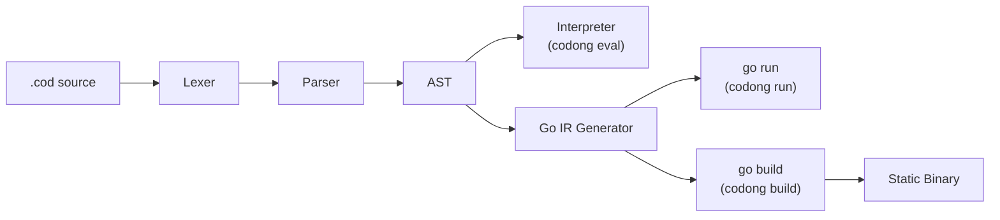
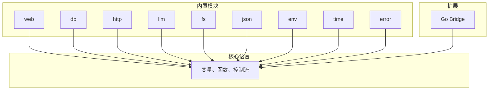
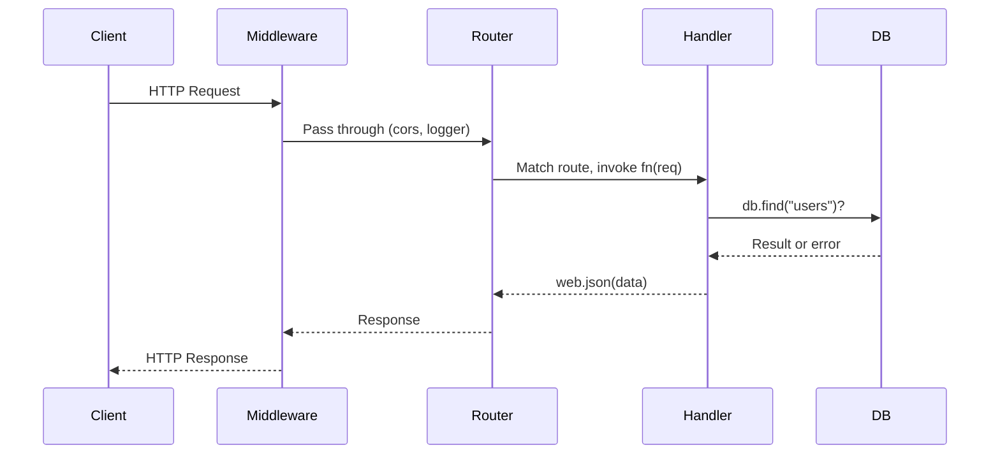
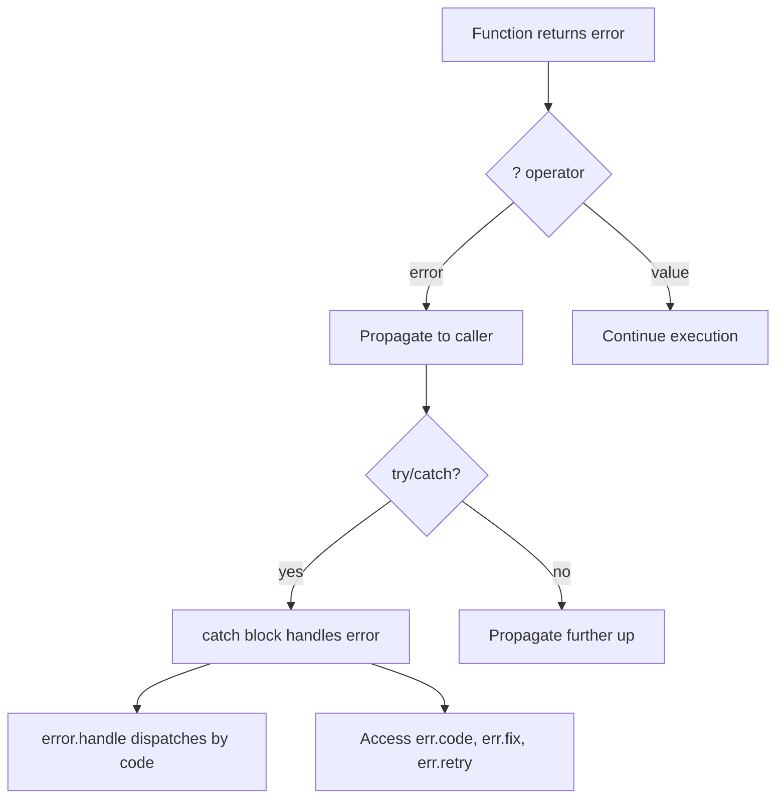

<p align="center">
  <strong>CODONG</strong><br>
  世界首个 AI 原生编程语言
</p>

<p align="center">
  <a href="https://codong.org">官网</a> |
  <a href="https://codong.org/arena/">Arena 竞技场</a> |
  <a href="../SPEC.md">语言规范</a> |
  <a href="../WHITEPAPER.md">白皮书</a> |
  <a href="../SPEC_FOR_AI.md">AI 规范</a>
</p>

<p align="center">
  <a href="../LICENSE"></a>
  
  
  <a href="https://codong.org/arena/"></a>
</p>

<p align="center">
  <a href="../README.md">English</a> |
  <a href="./README_ja.md">日本語</a> |
  <a href="./README_ko.md">한국어</a> |
  <a href="./README_ru.md">Русский</a> |
  <a href="./README_de.md">Deutsch</a>
</p>

---

## Arena 基准测试：Codong 与主流语言对比

当 AI 模型用不同语言编写同一应用程序时，Codong 产生的代码量显著更少、token 消耗更低、完成速度更快。
这些数据来自 [Codong Arena](https://codong.org/arena/)，其中任何模型都用每种语言编写相同的规范，结果自动测量。

| 指标 | Codong | Python | JavaScript | Java | Go |
|------|--------|--------|------------|------|-----|
| 总 Token 数 | **955** | 1,867 | 1,710 | 4,367 | 3,270 |
| 生成时间 | **8.6s** | 15.3s | 13.7s | 37.4s | 26.6s |
| 代码行数 | **10** | 143 | 147 | 337 | 289 |
| 估算成本 | **$0.012** | $0.025 | $0.022 | $0.062 | $0.046 |
| 输出 Token 数 | **722** | 1,597 | 1,439 | 4,096 | 3,001 |
| 与 Codong 对比 | -- | +121% | +99% | +467% | +316% |

运行你自己的基准测试：[codong.org/arena](https://codong.org/arena/)

---

## 30 秒快速开始

```bash
# 1. 下载二进制文件
curl -fsSL https://codong.org/install.sh | sh

# 2. 编写你的第一个程序
echo 'print("Hello, Codong!")' > hello.cod

# 3. 运行
codong eval hello.cod
```

五行代码实现一个 Web API：

```
web.get("/", fn(req) => web.json({message: "Hello from Codong"}))
web.get("/health", fn(req) => web.json({status: "ok"}))
server = web.serve(port: 8080)
```

```bash
codong run server.cod
# curl http://localhost:8080/
```

---

## 让 AI 编写 Codong —— 无需安装

你无需安装 Codong 即可开始使用。将
[`SPEC_FOR_AI.md`](../SPEC_FOR_AI.md) 文件发送给任何 LLM（Claude、GPT、Gemini、LLaMA）
作为系统提示或上下文，AI 就能立即编写正确的 Codong 代码。

**步骤 1.** 复制 [`SPEC_FOR_AI.md`](../SPEC_FOR_AI.md) 的内容（不到 2,000 字）。

**步骤 2.** 将其粘贴到你的 AI 对话中作为上下文：

```
[在此粘贴 SPEC_FOR_AI.md 的内容]

现在编写一个 Codong REST API，实现用户列表的
CRUD 操作和 SQLite 存储。
```

**步骤 3.** AI 生成有效的 Codong 代码：

```
db.connect("sqlite:///users.db")
db.create_table("users", {id: "integer primary key autoincrement", name: "text", email: "text"})
server = web.serve(port: 8080)
server.get("/users", fn(req) { return web.json(db.find("users")) })
server.post("/users", fn(req) { return web.json(db.insert("users", req.body), 201) })
server.get("/users/:id", fn(req) { return web.json(db.find_one("users", {id: to_number(req.param("id"))})) })
server.delete("/users/:id", fn(req) { db.delete("users", {id: to_number(req.param("id"))}); return web.json({}, 204) })
```

这之所以可行，是因为 Codong 为每个操作设计了单一、明确的语法。
AI 不需要在框架、导入方式或竞争性的模式之间做选择。
每件事只有一种正确的写法。

| LLM 提供商 | 方法 |
|------------|------|
| Claude (Anthropic) | 将 SPEC 粘贴到系统提示中，或使用 [Prompt Caching](https://docs.anthropic.com/en/docs/build-with-claude/prompt-caching) 进行重复使用 |
| GPT (OpenAI) | 将 SPEC 作为第一条用户消息或系统指令粘贴 |
| Gemini (Google) | 将 SPEC 作为对话中的上下文粘贴 |
| LLaMA / Ollama | 通过 API 或 Ollama modelfile 将 SPEC 包含在系统提示中 |
| 任何 LLM | 适用于任何接受系统提示或上下文窗口的模型 |

> **自己来测试**：访问 [codong.org/arena](https://codong.org/arena/) 查看
> Codong 与其他语言之间的实时 token 消耗和生成速度对比。

---

## 为什么选择 Codong

大多数编程语言是为人类编写、机器执行而设计的。Codong 是
为 AI 编写、人类审查、机器执行而设计的。它消除了 AI 生成代码中三个最大的摩擦源。

### 问题 1：选择困难浪费 Token

Python 有五种或更多方式发起 HTTP 请求。每次选择都消耗 token 并产生不可预测的输出。
Codong 每件事只有一种方式。

| 任务 | Python 选项 | Codong |
|------|-------------|--------|
| HTTP 请求 | requests, urllib, httpx, aiohttp, http.client | `http.get(url)` |
| Web 服务器 | Flask, FastAPI, Django, Starlette, Tornado | `web.serve(port: N)` |
| 数据库 | SQLAlchemy, psycopg2, pymongo, peewee, Django ORM | `db.connect(url)` |
| JSON 解析 | json.loads, orjson, ujson, simplejson | `json.parse(s)` |

### 问题 2：错误信息对 AI 不可读

堆栈跟踪是为人类设计的。AI 代理需要花费数百个 token 来解析
`Traceback (most recent call last)` 才能尝试修复。在 Codong 中，每个错误都是
结构化的 JSON，带有 `fix` 字段，告诉 AI 确切该怎么做。

```json
{
  "error":   "db.find",
  "code":    "E2001_NOT_FOUND",
  "message": "table 'users' not found",
  "fix":     "run db.migrate() to create the table",
  "retry":   false
}
```

### 问题 3：包选择浪费上下文

在编写业务逻辑之前，AI 必须选择 HTTP 库、数据库驱动、JSON
解析器、解决版本冲突并进行配置。Codong 内置了八个模块，
覆盖 90% 的 AI 工作负载。无需包管理器。

### 结果：节省 70% 以上的 Token

| Token 成本 | Python/JS | Codong | 节省 |
|-----------|-----------|--------|------|
| 选择 HTTP 框架 | ~300 | 0 | 100% |
| 选择数据库 ORM | ~400 | 0 | 100% |
| 解析错误信息 | ~500 | ~50 | 90% |
| 解决包版本 | ~800 | 0 | 100% |
| 编写业务逻辑 | ~800 | ~800 | 0% |
| **总计** | **~2,800** | **~850** | **~70%** |

---

## 语言设计

Codong 故意保持精简。23 个关键字。6 种基本类型。每件事只有一种做法。

### 23 个关键字（Python：35，JavaScript：64，Java：67）

```
fn       return   if       else     for      while    match
break    continue const    import   export   try      catch
go       select   interface type    null     true     false
in       _
```

### 变量

```
name = "Ada"
age = 30
active = true
nothing = null
const MAX_RETRIES = 3
```

没有 `var`、`let` 或 `:=`。赋值始终是 `=`。

### 函数

```
fn greet(name, greeting = "Hello") {
    return "{greeting}, {name}!"
}

print(greet("Ada"))                    // Hello, Ada!
print(greet("Bob", greeting: "Hi"))    // Hi, Bob!

double = fn(x) => x * 2               // 箭头函数
```

### 字符串插值

```
name = "Ada"
print("Hello, {name}!")                      // 变量
print("Total: {items.len()} items")          // 方法调用
print("Sum: {a + b}")                        // 表达式
print("{user.name} joined on {user.date}")   // 成员访问
```

任何表达式都可以放在 `{}` 中。没有反引号、没有 `f"..."`、没有 `${}`。

### 集合

```
items = [1, 2, 3, 4, 5]
doubled = items.map(fn(x) => x * 2)
evens = items.filter(fn(x) => x % 2 == 0)
total = items.reduce(fn(acc, x) => acc + x, 0)

user = {name: "Ada", age: 30}
user.email = "ada@example.com"
print(user.get("phone", "N/A"))        // N/A
```

### 控制流

```
if score >= 90 {
    print("A")
} else if score >= 80 {
    print("B")
} else {
    print("C")
}

for item in items {
    print(item)
}

for i in range(0, 10) {
    print(i)
}

while running {
    data = poll()
}

match status {
    200 => print("ok")
    404 => print("not found")
    _   => print("error: {status}")
}
```

### 使用 `?` 运算符进行错误处理

```
fn divide(a, b) {
    if b == 0 {
        return error.new("E_MATH", "division by zero")
    }
    return a / b
}

fn half_of_division(a, b) {
    result = divide(a, b)?
    return result / 2
}

try {
    half_of_division(10, 0)?
} catch err {
    print(err.code)       // E_MATH
    print(err.message)    // division by zero
}
```

`?` 运算符会自动将错误向上传播到调用栈。没有嵌套的
`if err != nil` 链。没有未检查的异常。

### 紧凑错误格式

切换到紧凑格式以在 AI 管线中节省约 39% 的 token：

```
error.set_format("compact")
// output: err_code:E_MATH|src:divide|fix:check divisor|retry:false
```

---

## 架构

Codong 源文件（`.cod`）通过多阶段管线处理。解释器路径
提供脚本和 REPL 的即时启动。Go IR 路径编译为原生 Go 用于
生产部署。



### 执行模式

| 模式 | 管线 | 启动时间 | 使用场景 |
|------|------|---------|---------|
| `codong eval` | .cod -> AST -> 解释器 | 亚秒级 | 脚本、REPL、Playground |
| `codong run` | .cod -> AST -> Go IR -> `go run` | 0.3-2s | 开发、AI 代理执行 |
| `codong build` | .cod -> AST -> Go IR -> `go build` | N/A（一次编译） | 生产部署 |

```bash
codong eval script.cod    # AST 解释器，即时启动
codong run app.cod        # Go IR，完整标准库，开发模式
codong build app.cod      # 单一静态二进制，生产模式
```

### 与 Go 的关系

Codong 编译为等效的 Go 代码，然后利用 Go 工具链进行执行和
编译。这与 TypeScript -> JavaScript 或 Kotlin -> JVM 字节码是同一模式。

| Codong 提供 | Go 提供 |
|-------------|---------|
| AI 原生语法设计 | 内存管理、垃圾回收 |
| 高约束领域 API | Goroutine 并发调度 |
| 结构化 JSON 错误系统 | 跨平台编译 |
| 8 个内置模块抽象 | 久经考验的运行时（10 年以上） |
| Go Bridge 扩展协议 | 数十万生态系统库 |

---

## 内置模块

Codong 内置八个模块。无需安装、无版本冲突、无需选择。

| 模块 | 用途 | 关键方法 |
|------|------|---------|
| [`web`](#web-模块) | HTTP 服务器、路由、中间件、WebSocket | serve, get, post, put, delete |
| [`db`](#db-模块) | PostgreSQL、MySQL、MongoDB、Redis、SQLite | connect, find, insert, update, delete |
| [`http`](#http-模块) | HTTP 客户端 | get, post, put, delete, patch |
| [`llm`](#llm-模块) | GPT、Claude、Gemini —— 统一接口 | ask, chat, stream, embed |
| [`fs`](#fs-模块) | 文件系统操作 | read, write, list, mkdir, stat |
| [`json`](#json-模块) | JSON 处理 | parse, stringify, valid, merge |
| [`env`](#env-模块) | 环境变量 | get, require, has, all, load |
| [`time`](#time-模块) | 日期、时间、时长 | now, sleep, format, parse, diff |
| [`error`](#error-模块) | 结构化错误创建和处理 | new, wrap, handle, retry |



---

## 代码示例

### Hello World API

```
web.get("/", fn(req) => web.json({message: "Hello from Codong"}))
server = web.serve(port: 8080)
```

### TODO CRUD API

```
db.connect("file:todo.db")
db.query("CREATE TABLE IF NOT EXISTS todos (id INTEGER PRIMARY KEY AUTOINCREMENT, title TEXT, done INTEGER)")

web.get("/todos", fn(req) {
    return web.json(db.find("todos"))
})

web.post("/todos", fn(req) {
    db.insert("todos", {title: req.body.title, done: 0})
    return web.json({created: true})
})

web.put("/todos/{id}", fn(req) {
    db.update("todos", {id: to_number(req.param.id)}, {done: 1})
    return web.json({updated: true})
})

web.delete("/todos/{id}", fn(req) {
    db.delete("todos", {id: to_number(req.param.id)})
    return web.json({deleted: true})
})

server = web.serve(port: 3000)
```

### LLM 驱动的端点

```
web.post("/ask", fn(req) {
    question = req.body.question
    context = db.find("docs", {relevant: true})?
    answer = llm.ask(
        model: "gpt-4o",
        prompt: "Answer using context: {context}\n\nQuestion: {question}",
        format: "json"
    )?
    return web.json(answer)
})

server = web.serve(port: 8080)
```

### 文件处理脚本

```
files = fs.list("./data")
for file in files {
    if fs.extension(file) == ".csv" {
        content = fs.read(file)
        lines = content.split("\n")
        print("{fs.basename(file)}: {lines.len()} lines")
        fs.write("./output/{fs.basename(file)}.processed", content.upper())
    }
}
print("done")
```

### 使用 `?` 运算符进行错误处理

```
fn load_config(path) {
    content = fs.read(path)?
    config = json.parse(content)?
    host = config.get("host", "localhost")
    port = config.get("port", 8080)
    return {host: host, port: port}
}

try {
    config = load_config("config.json")?
    print("Server: {config.host}:{config.port}")
} catch err {
    print("Failed: {err.code} - {err.fix}")
}
```

---

## 完整 API 参考

### 核心语言

#### 数据类型

| 类型 | 示例 | 说明 |
|------|------|------|
| `string` | `"hello"`, `"value is {x}"` | 仅双引号。`{expr}` 插值。 |
| `number` | `42`, `3.14`, `-1` | 64 位浮点数。 |
| `bool` | `true`, `false` | |
| `null` | `null` | 只有 `null` 和 `false` 是假值。 |
| `list` | `[1, 2, 3]` | 从零开始索引。支持负索引。 |
| `map` | `{name: "Ada"}` | 有序。点号和方括号访问。 |

#### 内置函数

| 函数 | 返回值 | 说明 |
|------|--------|------|
| `print(value)` | null | 输出到 stdout。单个参数；多个值使用插值。 |
| `type_of(x)` | string | 返回 `"string"`、`"number"`、`"bool"`、`"null"`、`"list"`、`"map"`、`"fn"`。 |
| `to_string(x)` | string | 将任意值转换为字符串表示。 |
| `to_number(x)` | number/null | 解析为数字。无效则返回 `null`。 |
| `to_bool(x)` | bool | 转换为布尔值。 |
| `range(start, end)` | list | 从 `start` 到 `end - 1` 的整数。 |

#### 运算符

| 优先级 | 运算符 | 说明 |
|--------|--------|------|
| 1 | `()` `[]` `.` `?` | 分组、索引、成员、错误传播 |
| 2 | `!` `-`（一元） | 逻辑非、取负 |
| 3 | `*` `/` `%` | 乘、除、取模 |
| 4 | `+` `-` | 加、减 |
| 5 | `<` `>` `<=` `>=` | 比较 |
| 6 | `==` `!=` | 相等 |
| 7 | `&&` | 逻辑与 |
| 8 | `\|\|` | 逻辑或 |
| 9 | `<-` | Channel 发送/接收 |
| 10 | `=` `+=` `-=` `*=` `/=` | 赋值 |

---

### 字符串方法

17 个方法。全部返回新字符串（字符串不可变）。

| 方法 | 返回值 | 说明 |
|------|--------|------|
| `s.len()` | number | 字符串的字节长度。 |
| `s.upper()` | string | 转换为大写。 |
| `s.lower()` | string | 转换为小写。 |
| `s.trim()` | string | 去除首尾空白字符。 |
| `s.trim_start()` | string | 去除前导空白字符。 |
| `s.trim_end()` | string | 去除尾部空白字符。 |
| `s.split(sep)` | list | 按分隔符拆分为字符串列表。 |
| `s.contains(sub)` | bool | 如果字符串包含子串则返回 `true`。 |
| `s.starts_with(prefix)` | bool | 如果字符串以前缀开头则返回 `true`。 |
| `s.ends_with(suffix)` | bool | 如果字符串以后缀结尾则返回 `true`。 |
| `s.replace(old, new)` | string | 替换所有 `old` 为 `new`。 |
| `s.index_of(sub)` | number | 第一次出现的索引。不存在返回 `-1`。 |
| `s.slice(start, end?)` | string | 提取子串。`end` 可选。 |
| `s.repeat(n)` | string | 重复字符串 `n` 次。 |
| `s.to_number()` | number/null | 解析为数字。无效返回 `null`。 |
| `s.to_bool()` | bool | `"true"` / `"1"` 返回 `true`；其他返回 `false`。 |
| `s.match(pattern)` | list | 正则匹配。返回所有匹配项列表。 |

---

### 列表方法

20 个方法。修改方法会改变原始列表并返回 `self` 用于链式调用。

| 方法 | 是否修改 | 返回值 | 说明 |
|------|----------|--------|------|
| `l.len()` | 否 | number | 元素数量。 |
| `l.push(item)` | **是** | self | 在末尾追加元素。 |
| `l.pop()` | **是** | item | 移除并返回最后一个元素。 |
| `l.shift()` | **是** | item | 移除并返回第一个元素。 |
| `l.unshift(item)` | **是** | self | 在开头插入元素。 |
| `l.sort(fn?)` | **是** | self | 就地排序。可选比较函数。 |
| `l.reverse()` | **是** | self | 就地反转。 |
| `l.slice(start, end?)` | 否 | list | 从 `start` 到 `end` 的新子列表。 |
| `l.map(fn)` | 否 | list | 对每个元素应用 `fn` 后的新列表。 |
| `l.filter(fn)` | 否 | list | `fn` 返回真值的元素组成的新列表。 |
| `l.reduce(fn, init)` | 否 | any | 从 `init` 开始用 `fn(acc, item)` 累积。 |
| `l.find(fn)` | 否 | item/null | `fn` 返回真值的第一个元素。 |
| `l.find_index(fn)` | 否 | number | 第一个匹配的索引。无匹配返回 `-1`。 |
| `l.contains(item)` | 否 | bool | 如果列表包含该元素则返回 `true`。 |
| `l.index_of(item)` | 否 | number | 第一次出现的索引。不存在返回 `-1`。 |
| `l.flat(depth?)` | 否 | list | 新的扁平化列表。默认深度为 1。 |
| `l.unique()` | 否 | list | 去除重复元素的新列表。 |
| `l.join(sep)` | 否 | string | 用分隔符将元素连接为字符串。 |
| `l.first()` | 否 | item/null | 第一个元素，为空返回 `null`。 |
| `l.last()` | 否 | item/null | 最后一个元素，为空返回 `null`。 |

---

### Map 方法

10 个方法。只有 `delete` 会修改原始 map。

| 方法 | 是否修改 | 返回值 | 说明 |
|------|----------|--------|------|
| `m.len()` | 否 | number | 键值对数量。 |
| `m.keys()` | 否 | list | 所有键的列表。 |
| `m.values()` | 否 | list | 所有值的列表。 |
| `m.entries()` | 否 | list | `[key, value]` 对的列表。 |
| `m.has(key)` | 否 | bool | 如果键存在则返回 `true`。 |
| `m.get(key, default?)` | 否 | any | 按键获取值。不存在返回 `default`（或 `null`）。 |
| `m.delete(key)` | **是** | self | 就地删除键值对。 |
| `m.merge(other)` | 否 | map | 将 `other` 合并到 `self` 的新 map。冲突时 `other` 优先。 |
| `m.map_values(fn)` | 否 | map | 对每个值应用 `fn` 后的新 map。 |
| `m.filter(fn)` | 否 | map | `fn(key, value)` 返回真值的条目组成的新 map。 |

---

### web 模块

HTTP 服务器，支持路由、中间件和 WebSocket。

#### 服务器

| 方法 | 说明 |
|------|------|
| `web.serve(port: N)` | 在端口 `N` 启动 HTTP 服务器。返回服务器句柄。 |

#### 路由注册

| 方法 | 说明 |
|------|------|
| `web.get(path, handler)` | 注册 GET 路由。 |
| `web.post(path, handler)` | 注册 POST 路由。 |
| `web.put(path, handler)` | 注册 PUT 路由。 |
| `web.delete(path, handler)` | 注册 DELETE 路由。 |
| `web.patch(path, handler)` | 注册 PATCH 路由。 |

路由处理函数接收请求对象，包含 `req.body`、`req.param`、`req.query`、`req.headers`。

#### 响应辅助方法

| 方法 | 说明 |
|------|------|
| `web.json(data)` | 返回 JSON 响应，`Content-Type: application/json`。 |
| `web.text(string)` | 返回纯文本响应。 |
| `web.html(string)` | 返回 HTML 响应。 |
| `web.redirect(url)` | 返回重定向响应。 |
| `web.response(status, body, headers)` | 返回自定义响应，包含状态码和头部。 |

#### 静态文件和中间件

| 方法 | 说明 |
|------|------|
| `web.static(path, dir)` | 从目录提供静态文件。 |
| `web.middleware(name_or_fn)` | 应用中间件。内置：`"cors"`、`"logger"`、`"recover"`、`"auth_bearer"`。 |
| `web.ws(path, handler)` | 注册 WebSocket 端点。 |

```
// 中间件示例
web.middleware("cors")
web.middleware("logger")
web.middleware(fn(req, next) {
    print("Request: {req.method} {req.path}")
    return next(req)
})
```



---

### db 模块

统一的数据库接口，支持 SQL 和 NoSQL 数据库。

#### 连接

| 方法 | 说明 |
|------|------|
| `db.connect(url)` | 连接数据库。URL 决定驱动：`postgres://`、`mysql://`、`mongodb://`、`redis://`、`file:`（SQLite）。 |

#### Schema

| 方法 | 说明 |
|------|------|
| `db.create_table(name, schema)` | 使用 schema map 创建表。 |
| `db.create_index(table, fields)` | 在指定字段上创建索引。 |

#### CRUD 操作

| 方法 | 说明 |
|------|------|
| `db.insert(table, data)` | 插入单条记录。 |
| `db.insert_batch(table, list)` | 批量插入多条记录。 |
| `db.find(table, filter?)` | 查找所有匹配的记录。返回列表。 |
| `db.find_one(table, filter)` | 查找第一条匹配的记录。返回 map 或 null。 |
| `db.update(table, filter, data)` | 用新数据更新匹配的记录。 |
| `db.delete(table, filter)` | 删除匹配的记录。 |
| `db.upsert(table, filter, data)` | 插入或更新（如果存在）。 |

#### 查询和聚合

| 方法 | 说明 |
|------|------|
| `db.count(table, filter?)` | 计算匹配的记录数。 |
| `db.exists(table, filter)` | 如果有任何记录匹配则返回 `true`。 |
| `db.query(sql, params?)` | 执行原始 SQL 查询。使用 `?` 占位符。 |
| `db.query_one(sql, params?)` | 执行原始 SQL，返回第一个结果。 |
| `db.transaction(fn)` | 在事务中执行函数。 |
| `db.stats()` | 返回连接池统计信息。 |

```
db.connect("file:app.db")
db.insert("users", {name: "Ada", role: "engineer"})
engineers = db.find("users", {role: "engineer"})
db.update("users", {name: "Ada"}, {role: "senior engineer"})
count = db.count("users")
```

---

### http 模块

用于发起外部请求的 HTTP 客户端。

| 方法 | 说明 |
|------|------|
| `http.get(url, options?)` | 发送 GET 请求。返回响应对象。 |
| `http.post(url, body?, options?)` | 发送 POST 请求，可选 JSON 请求体。 |
| `http.put(url, body?, options?)` | 发送 PUT 请求。 |
| `http.delete(url, options?)` | 发送 DELETE 请求。 |
| `http.patch(url, body?, options?)` | 发送 PATCH 请求。 |
| `http.request(method, url, options)` | 使用自定义方法和完整选项发送请求。 |

响应对象：`resp.status`（数字）、`resp.ok`（布尔）、`resp.json()`（解析的 JSON）、
`resp.text()`（原始请求体）、`resp.headers`（map）。

```
resp = http.get("https://api.example.com/users")
if resp.ok {
    users = resp.json()
    print("Found {users.len()} users")
}

resp = http.post("https://api.example.com/users", {
    name: "Ada",
    role: "engineer"
})
```

---

### llm 模块

大语言模型的统一接口。支持 GPT、Claude、Gemini 以及任何
兼容 OpenAI 的 API。

| 方法 | 说明 |
|------|------|
| `llm.ask(prompt, model:, system?:, format?:)` | 单次提示，单次响应。`format: "json"` 返回结构化数据。 |
| `llm.chat(messages, model:)` | 多轮对话。消息格式：`[{role:, content:}]`。 |
| `llm.stream(prompt, model:, on_chunk:)` | 逐 token 流式输出响应。 |
| `llm.embed(text, model:)` | 生成嵌入向量。 |
| `llm.count_tokens(text)` | 估算文本的 token 数量。 |

```
// 单个问题
answer = llm.ask("What is 2+2?", model: "gpt-4o")

// 结构化输出
data = llm.ask("List 3 colors", model: "gpt-4o", format: "json")

// 多轮对话
response = llm.chat([
    {role: "system", content: "You are a helpful assistant."},
    {role: "user", content: "What is Codong?"},
    {role: "assistant", content: "Codong is an AI-native programming language."},
    {role: "user", content: "What makes it special?"}
], model: "claude-sonnet-4-20250514")

// Token 估算
tokens = llm.count_tokens("Hello, this is a test.")
print("Tokens: {tokens}")
```

---

### fs 模块

文件系统操作，用于读写和管理文件及目录。

#### 文件操作

| 方法 | 说明 |
|------|------|
| `fs.read(path)` | 以字符串形式读取整个文件。 |
| `fs.write(path, content)` | 将字符串写入文件（覆盖）。 |
| `fs.append(path, content)` | 将字符串追加到文件。 |
| `fs.delete(path)` | 删除文件。 |
| `fs.copy(src, dst)` | 将文件从 `src` 复制到 `dst`。 |
| `fs.move(src, dst)` | 移动/重命名文件。 |
| `fs.exists(path)` | 如果路径存在则返回 `true`。 |

#### 目录操作

| 方法 | 说明 |
|------|------|
| `fs.list(dir)` | 列出目录中的文件。返回路径列表。 |
| `fs.mkdir(path)` | 创建目录（包括父目录）。 |
| `fs.rmdir(path)` | 删除目录。 |
| `fs.stat(path)` | 返回文件元数据：大小、修改时间、is_dir。 |

#### 结构化 I/O

| 方法 | 说明 |
|------|------|
| `fs.read_json(path)` | 读取并解析 JSON 文件。 |
| `fs.write_json(path, data)` | 将数据写入格式化的 JSON。 |
| `fs.read_lines(path)` | 将文件读取为行列表。 |
| `fs.write_lines(path, lines)` | 将行列表写入文件。 |

#### 路径工具

| 方法 | 说明 |
|------|------|
| `fs.join(parts...)` | 拼接路径片段。 |
| `fs.cwd()` | 返回当前工作目录。 |
| `fs.basename(path)` | 返回路径中的文件名。 |
| `fs.dirname(path)` | 返回路径中的目录。 |
| `fs.extension(path)` | 返回文件扩展名。 |
| `fs.safe_join(base, path)` | 拼接路径并防止目录遍历。 |
| `fs.temp_file(prefix?)` | 创建临时文件。返回路径。 |
| `fs.temp_dir(prefix?)` | 创建临时目录。返回路径。 |

---

### json 模块

JSON 解析、生成和操作。

| 方法 | 说明 |
|------|------|
| `json.parse(string)` | 将 JSON 字符串解析为 Codong 值（map、list 等）。 |
| `json.stringify(value)` | 将 Codong 值转换为 JSON 字符串。 |
| `json.valid(string)` | 如果字符串是有效的 JSON 则返回 `true`。 |
| `json.merge(a, b)` | 深度合并两个 map。冲突时 `b` 优先。 |
| `json.get(value, path)` | 通过点路径获取嵌套值（如 `"user.name"`）。 |
| `json.set(value, path, new_val)` | 通过点路径设置嵌套值。返回新结构。 |
| `json.flatten(value)` | 将嵌套 map 扁平化为点号键。 |
| `json.unflatten(value)` | 将点号键展开为嵌套 map。 |

```
data = json.parse("{\"name\": \"Ada\", \"age\": 30}")
text = json.stringify({name: "Ada", scores: [95, 87, 92]})
name = json.get(data, "name")
```

---

### env 模块

环境变量访问和 `.env` 文件加载。

| 方法 | 说明 |
|------|------|
| `env.get(key, default?)` | 获取环境变量。未设置返回 `default`（或 `null`）。 |
| `env.require(key)` | 获取环境变量。未设置返回错误。 |
| `env.has(key)` | 如果环境变量已设置则返回 `true`。 |
| `env.all()` | 返回所有环境变量的 map。 |
| `env.load(path?)` | 加载 `.env` 文件。默认路径：`.env`。 |

```
env.load()
api_key = env.require("OPENAI_API_KEY")?
db_url = env.get("DATABASE_URL", "file:dev.db")
```

---

### time 模块

日期、时间、时长和调度工具。

| 方法 | 说明 |
|------|------|
| `time.sleep(ms)` | 暂停执行 `ms` 毫秒。 |
| `time.now()` | 当前 Unix 时间戳（毫秒）。 |
| `time.now_iso()` | 当前时间的 ISO 8601 字符串。 |
| `time.format(timestamp, pattern)` | 使用模式格式化时间戳。 |
| `time.parse(string, pattern)` | 将时间字符串解析为时间戳。 |
| `time.diff(a, b)` | 两个时间戳之间的差值（毫秒）。 |
| `time.since(timestamp)` | 从给定时间戳到现在的毫秒数。 |
| `time.until(timestamp)` | 从现在到给定时间戳的毫秒数。 |
| `time.add(timestamp, ms)` | 向时间戳添加毫秒。 |
| `time.is_before(a, b)` | 如果 `a` 在 `b` 之前则返回 `true`。 |
| `time.is_after(a, b)` | 如果 `a` 在 `b` 之后则返回 `true`。 |
| `time.today_start()` | 今天开始的时间戳（00:00:00）。 |
| `time.today_end()` | 今天结束的时间戳（23:59:59）。 |

```
start = time.now()
time.sleep(100)
elapsed = time.since(start)
print("Elapsed: {elapsed}ms")
print("Current time: {time.now_iso()}")
```

---

### error 模块

结构化错误创建、包装、格式化和分发。

| 方法 | 说明 |
|------|------|
| `error.new(code, message, fix?:, retry?:)` | 创建新的结构化错误。 |
| `error.wrap(err, context)` | 为现有错误添加上下文。 |
| `error.is(value)` | 如果值是错误对象则返回 `true`。 |
| `error.unwrap(err)` | 返回包装错误的内部错误。 |
| `error.to_json(err)` | 将错误转换为 JSON 字符串。 |
| `error.to_compact(err)` | 将错误转换为紧凑格式字符串。 |
| `error.from_json(string)` | 将 JSON 字符串解析为错误对象。 |
| `error.from_compact(string)` | 将紧凑格式字符串解析为错误对象。 |
| `error.set_format(fmt)` | 设置全局格式：`"json"`（默认）或 `"compact"`。 |
| `error.handle(result, handlers)` | 按错误代码分发。`code -> fn(err)` 的 map。使用 `"_"` 作为默认。 |
| `error.retry(fn, max_attempts)` | 如果函数返回可重试错误则自动重试。 |

```
err = error.new("E_INVALID", "bad input", fix: "check the value")

result = error.handle(some_result, {
    "E_NOT_FOUND": fn(err) => "Missing: {err.fix}",
    "E_TIMEOUT": fn(err) => "Timed out",
    "_": fn(err) => "Unknown: {err.code}"
})

final = error.retry(fn() {
    return http.get("https://api.example.com/data")
}, 3)
```



---

## 并发

Codong 使用 Go 风格的并发，基于 goroutine 和 channel。

```
// 启动并发执行
go fn() {
    data = fetch_data()
    ch <- data
}()

// Channel
ch = channel()
ch <- "message"           // 发送
msg = <-ch                // 接收

// 带缓冲的 channel
ch = channel(size: 10)

// Select（多路复用）
select {
    msg = <-ch1 {
        handle(msg)
    }
    msg = <-ch2 {
        process(msg)
    }
    <-done {
        break
    }
}
```

---

## Go Bridge

当你需要八个内置模块之外的功能时，Go Bridge 允许人类架构师
将任何 Go 包封装给 AI 使用。AI 只看到函数名和返回值。
权限需显式声明。

### 注册（codong.toml）

```toml
[bridge]
pdf_render = { fn = "bridge.RenderPDF", permissions = ["fs:write:/tmp/output"] }
wechat_pay = { fn = "bridge.WechatPay", permissions = ["net:outbound"] }
hash_md5   = { fn = "bridge.HashMD5", permissions = [] }
```

### 权限类型

| 权限 | 格式 | 作用域 |
|------|------|--------|
| 无 | `[]` | 纯计算，无 I/O |
| 网络 | `["net:outbound"]` | 仅出站 HTTP |
| 文件读取 | `["fs:read:<path>"]` | 从指定目录读取 |
| 文件写入 | `["fs:write:<path>"]` | 写入指定目录 |

### 在 .cod 文件中使用

```
result = pdf_render(html: content, output: "report.pdf")
if result.error {
    print("render failed: {result.error}")
}
```

Bridge 函数中禁止的操作：`os.Exit`、`syscall`、`os/exec`、`net.Listen`、
主机根文件系统访问。

---

## 类型系统

类型注解在所有地方都是可选的，除非使用 `agent.tool` 进行自动
JSON Schema 生成。

```
// 类型声明
type User = {
    name: string,
    age: number,
    email: string,
}

// 接口（结构化类型）
interface Searchable {
    fn search(query: string) => list
}

// 用于 agent.tool 的带注解函数
fn search(query: string, limit: number) {
    return db.find("docs", {q: query}, limit: limit)
}

// agent.tool 读取注解并自动生成 JSON Schema
agent.tool("search", search, "Search the knowledge base")
```

---

## 模块系统

内置模块直接可用。自定义模块使用 `import`/`export`。

```
// math_utils.cod
export fn square(x) { return x * x }
export const PI = 3.14159

// main.cod
import { square, PI } from "./math_utils.cod"
```

第三方包使用作用域名称以防止命名抢注：

```
import { verify } from "@codong/jwt"
import { hash } from "@alice/crypto"
```

`codong.lock` 确保 100% 可复现的构建，锁定到 SHA-256 哈希。

---

## AI 集成

Codong 从第一天起就为 AI 使用而设计。

### 方法 1：SPEC.md 注入（现已可用）

将 [`SPEC_FOR_AI.md`](../SPEC_FOR_AI.md)（不到 2,000 字）注入任何 LLM 系统提示。
模型无需安装任何东西就能立即编写正确的 Codong 代码。

### 方法 2：MCP Server（Claude Desktop）

官方 MCP Server 让 Claude Desktop 编写 Codong、编译并在本地运行。
Codong 是第一个具有原生 AI 物理执行能力的编程语言。

### 方法 3：OpenAI Function Calling

将 Codong 执行器注册为函数。GPT 可以在对话中编写和运行 Codong 代码。

---

## 强制代码风格

| 规则 | 标准 |
|------|------|
| 缩进 | 4 个空格（禁止 tab） |
| 命名 | 变量、函数、模块使用 `snake_case` |
| 类型名 | `PascalCase` |
| 行长度 | 最多 120 个字符 |
| 大括号 | 开括号 `{` 在同一行 |
| 字符串 | 仅双引号 `"`（禁止单引号） |
| 尾逗号 | 多行 list/map 中必须使用 |

`codong fmt` 自动强制执行所有风格规则。

---

## 生态系统兼容性

| 类别 | 支持 |
|------|------|
| AI 模型 | GPT-4o、Claude 3.5、Gemini 1.5 Pro、Llama 3、任何兼容 OpenAI 的 API |
| 数据库 | PostgreSQL、MySQL、MongoDB、Redis、SQLite、Pinecone、Qdrant、Supabase |
| 云平台 | AWS、GCP、Azure、Cloudflare R2、Vercel |
| 消息队列 | Kafka、RabbitMQ、AWS SQS、NATS |
| 容器 | Docker、Kubernetes、Helm、Terraform |
| 扩展 | 通过 Go Bridge 使用任何 Go 库 |

---

## 路线图

| 阶段 | 状态 | 交付物 |
|------|------|--------|
| 0 | 完成 | SPEC.md —— AI 无需编译器即可编写 Codong |
| 1 | 完成 | `codong eval` —— 核心语言、error 模块、CLI |
| 2 | 进行中 | `web`、`db`、`http`、`llm` 模块 |
| 3 | 计划中 | `agent`、`cloud`、`queue`、`cron` 模块 |
| 4 | 计划中 | `codong build` —— 单一静态二进制 |
| 5 | 计划中 | 50 个示例 + 完整文档 |
| 6 | 计划中 | codong.org + 浏览器 Playground（WASM） |
| 7 | 计划中 | VS Code 扩展 + Claude Desktop MCP Server |
| 8 | 计划中 | 包注册表 + `codong.lock` |

---

## 项目结构

```
Codong/
  cmd/              CLI 入口点（codong eval、run、build）
  engine/
    lexer/          词法分析器
    parser/         语法分析器（生成 AST）
    interpreter/    树遍历解释器（codong eval）
    goirgen/        Go IR 代码生成器（codong run/build）
    runner/         Go 工具链运行器
  stdlib/           标准库实现
  examples/         57 个示例程序（01_hello.cod 到 57_llm_module.cod）
  tests/            测试套件
  SPEC.md           完整语言规范
  SPEC_FOR_AI.md    AI 优化规范，包含正确/错误示例
  WHITEPAPER.md     设计原理和架构愿景
```

---

## 语言参考

完整语言规范请参见 [`SPEC.md`](../SPEC.md)。

AI 优化版本（包含每条规则的正确/错误示例）请参见
[`SPEC_FOR_AI.md`](../SPEC_FOR_AI.md)。将其注入任何 LLM 系统提示，即可在不安装
任何东西的情况下生成正确的 Codong 代码。

完整设计原理、架构决策和项目愿景请参见
[`WHITEPAPER.md`](../WHITEPAPER.md)。

---

## 贡献

Codong 采用 MIT 许可证，欢迎贡献。

**开始：**

```bash
git clone https://github.com/brettinhere/Codong.git
cd Codong
go build ./cmd/codong
./codong eval examples/01_hello.cod
```

**贡献方向：**

| 领域 | 影响 | 难度 |
|------|------|------|
| Go IR 生成器（`engine/goirgen/`） | 最高杠杆 | 高级 |
| 标准库模块（`stdlib/`） | 高 | 中级 |
| 示例程序（`examples/`） | 社区增长 | 初学者 |
| Bug 报告和测试用例 | 质量 | 任何级别 |

**指南：**

- 编写代码前请阅读 [`SPEC.md`](../SPEC.md)。
- 运行 `tests/run_examples.sh` 验证所有示例通过。
- 每个 PR 只包含一个功能。
- 遵循强制代码风格（4 个空格、`snake_case`、双引号）。

---

## 链接

| 资源 | URL |
|------|-----|
| 官网 | [codong.org](https://codong.org) |
| Arena（实时基准测试） | [codong.org/arena](https://codong.org/arena/) |
| GitHub | [github.com/brettinhere/Codong](https://github.com/brettinhere/Codong) |
| Arena 仓库 | [github.com/brettinhere/codong-arena](https://github.com/brettinhere/codong-arena) |

---

## 许可证

MIT —— 参见 [LICENSE](../LICENSE)

---

CODONG -- codong.org -- 世界首个 AI 原生编程语言
